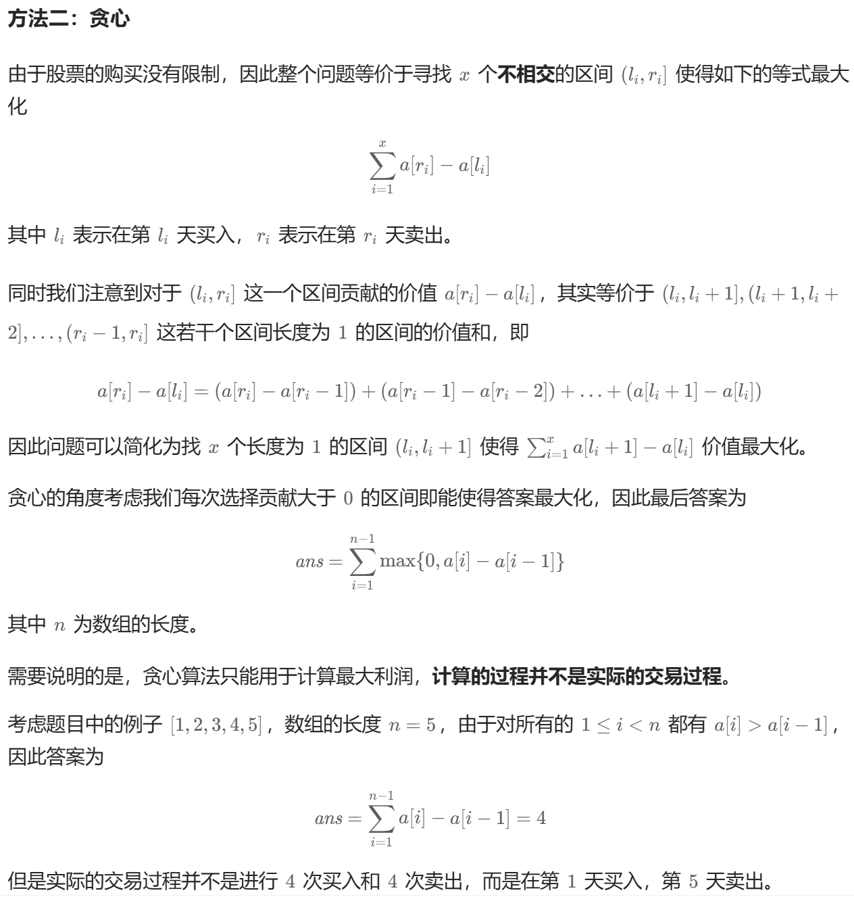

# 题目

给你一个整数数组 `prices` ，其中 `prices[i]` 表示某支股票第 `i` 天的价格。

在每一天，你可以决定是否购买和/或出售股票。你在任何时候 **最多** 只能持有 **一股** 股票。你也可以先购买，然后在 **同一天** 出售。

返回 *你能获得的* **最大** 利润 。

## 示例

1. 示例 1：
输入：prices = [7,1,5,3,6,4]
输出：7
解释：在第 2 天（股票价格 = 1）的时候买入，在第 3 天（股票价格 = 5）的时候卖出, 这笔交易所能获得利润 = 5 - 1 = 4。
随后，在第 4 天（股票价格 = 3）的时候买入，在第 5 天（股票价格 = 6）的时候卖出, 这笔交易所能获得利润 = 6 - 3 = 3。
最大总利润为 4 + 3 = 7 。

2. 示例 2：
输入：prices = [1,2,3,4,5]
输出：4
解释：在第 1 天（股票价格 = 1）的时候买入，在第 5 天 （股票价格 = 5）的时候卖出, 这笔交易所能获得利润 = 5 - 1 = 4。
最大总利润为 4 。

3. 示例 3：
输入：prices = [7,6,4,3,1]
输出：0
解释：在这种情况下, 交易无法获得正利润，所以不参与交易可以获得最大利润，最大利润为 0。

## 解答

### 动态规划

方法一：动态规划
考虑到「不能同时参与多笔交易」，因此每天交易结束后只可能存在手里有一支股票或者没有股票的状态。
定义状态 `dp[i][0]` 表示第 i 天交易完后手里没有股票的最大利润，`dp[i][1]` 表示第 i 天交易完后手里持有一支股票的最大利润（i 从 0 开始）。
考虑 `dp[i][0]` 的转移方程，如果这一天交易完后手里没有股票，那么可能的转移状态为前一天已经没有股票，即 dp`[i−1][0]`，或者前一天结束的时候手里持有一支股票，即 `dp[i−1][1]`，这时候我们要将其卖出，并获得 `prices[i]` 的收益。因此为了收益最大化，我们列出如下的转移方程：
`dp[i][0]=max{dp[i−1][0],dp[i−1][1]+prices[i]}`
再来考虑 `dp[i][1]`，按照同样的方式考虑转移状态，那么可能的转移状态为前一天已经持有一支股票，即 `dp[i−1][1]`，或者前一天结束时还没有股票，即 `dp[i−1][0]`，这时候我们要将其买入，并减少 `prices[i]` 的收益。可以列出如下的转移方程：
`dp[i][1]=max{dp[i−1][1],dp[i−1][0]−prices[i]}`
对于初始状态，根据状态定义我们可以知道第 0 天交易结束的时候 `dp[0][0]=0，dp[0][1]=−prices[0]`。
因此，我们只要从前往后依次计算状态即可。由于全部交易结束后，持有股票的收益一定低于不持有股票的收益，因此这时候 `dp[n−1][0]` 的收益必然是大于 `dp[n−1][1]` 的，最后的答案即为 `dp[n−1][0]`。

```java
class Solution {
    public int maxProfit(int[] prices) {
        int n = prices.length;
        int[][] dp = new int[n][2];
        dp[0][0] = 0;
        dp[0][1] = -prices[0];
        for (int i = 1; i < n; ++i) {
            dp[i][0] = Math.max(dp[i - 1][0], dp[i - 1][1] + prices[i]);
            dp[i][1] = Math.max(dp[i - 1][1], dp[i - 1][0] - prices[i]);
        }
        return dp[n - 1][0];
    }
}
```

### 方法二：贪心



```java
class Solution {
    public int maxProfit(int[] prices) {
        int ans = 0;
        int n = prices.length;
        for (int i = 1; i < n; ++i) {
            ans += Math.max(0, prices[i] - prices[i - 1]);
        }
        return ans;
    }
}
```
