# Java虚拟机——JVM

## JVM概述

### 什么是JVM

JVM 全称是 Java Virtual Machine，中文译名 Java虚拟机。JVM 本质上是一个运行在计算机上的程序，他的职责是运行Java字节码文件。

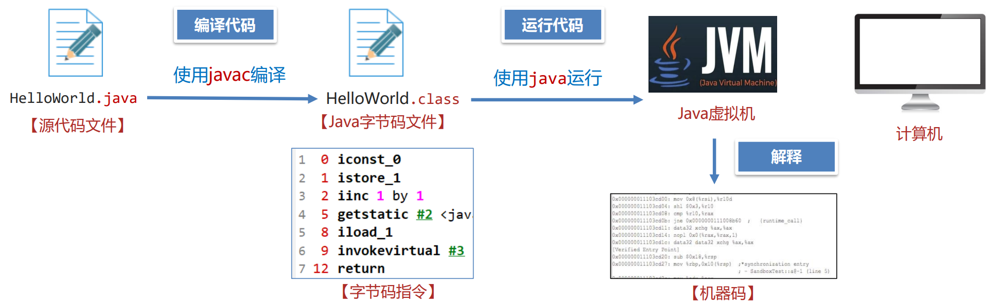

### JVM的功能

1. 解释和运行
    - 对字节码文件中的指令，实时的解释成机器码，让计算机执行
2. 内存管理
    - 自动为对象、方法等分配内存
    - 自动的垃圾回收机制，回收不再使用的对象
3. 即时编译
    - 对热点代码进行优化，提升执行效率
    - Java语言如果不做任何优化，性能不如C、C++等直接运行机器码的语言

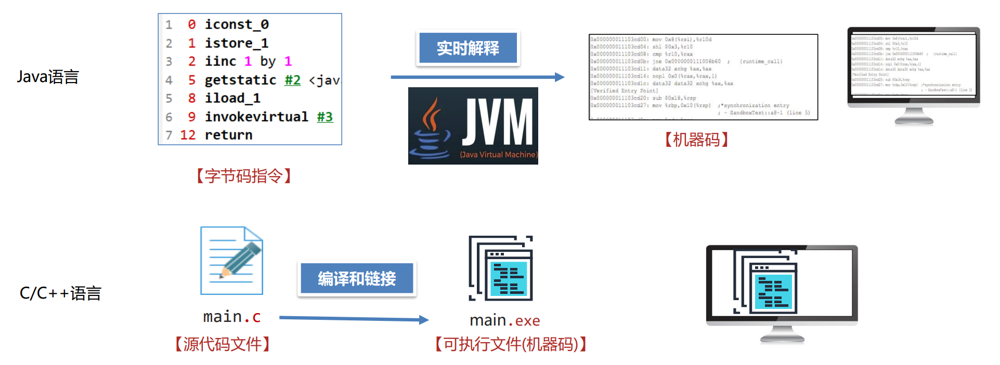

Java需要实时解释，不能一次性全部编译成可执行文件（机器码）后执行，因此性能会有所下降，Java的这种做法主要是为了支持跨平台特性。而即时编译正是为了优化这一问题。

#### 即时编译

JVM提供了即时编译 (Just-In-Time 简称JIT) 进行性能的优化，最终能达到接近C、C++语言的运行性能，甚至在特定场景下实现超越。

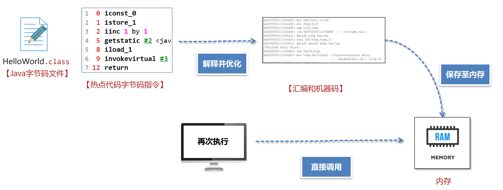

### JVM的设计规范

- 《Java虚拟机规范》由Oracle制定，内容主要包含了Java虚拟机在设计和实现时需要遵守的规范，主
要包含class字节码文件的定义、类和接口的加载和初始化、指令集等内容。
- 《Java虚拟机规范》是对虚拟机设计的要求，而不是对Java设计的要求，也就是说虚拟机可以运行在
其他的语言比如Groovy、Scala生成的class字节码文件之上。

### JVM的组成

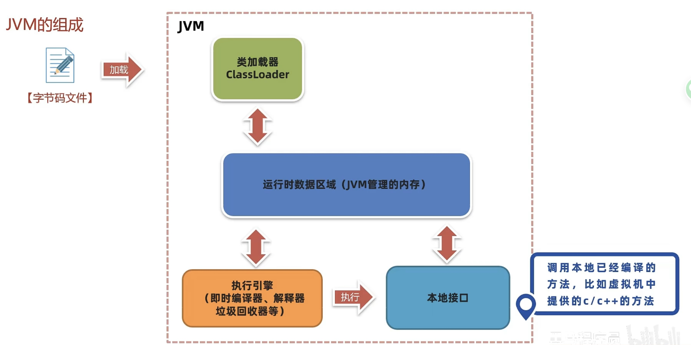

## 字节码文件的组成

字节码文件中保存了源代码编译之后的内容，以二进制的方式存储，无法直接用记事本打开阅读。推荐使用jclasslib工具查看字节码文件。

### 基础信息

#### 魔数、字节码文件对应的Java版本号

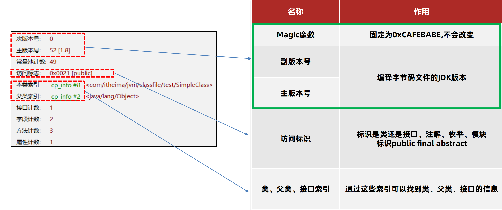

- 魔数
  - 此处(Java字节码文件中)，魔数(magic number)指的是文件的头几个字节(文件头)，固定为`0xCAFEBABE`。
  - 文件是无法通过文件扩展名来确定文件类型的，文件扩展名可以随意修改，不影响文件的内容。
  - 软件使用文件头去校验文件的类型，如果软件不支持该种类型就会出错。
  - 在代码中，魔数有时也指那些没有明确含义的常量值，直接在代码中使用而没有给予解释或定义的数值。
- 字节码文件对应的Java版本号
  - 分为主版本号和次版本号，指的是编译字节码文件的JDK版本号。
  - 主版本号用以识别大版本号，次版本号用以区分同一大版本号的不同版本。一般只需要关心主版本号。
  - 主版本号从46开始，对应1.2版本，此后主版本号每加1都对应1.2版本加0.1
  - 版本号的作用主要是判断当前字节码的版本和运行时的JDK是否兼容

低版本无法直接加载高版本的字节码文件，例如，使用JDK1.6作为运行时环境时，使用了 *字节码文件内版本号为1.8* 的`RandomStringUtils`类，就会报错，形式如下


此时有两种方案：

1. ~~升级JDK版本 (容易引发其他的兼容性问题，且需要大量的测试)~~
2. 将第三方依赖的版本号降低或者更换依赖，以满足JDK版本的要求

### 访问标识(public final等)

略

### 父类和接口

略

### 常量池

常量池中保存了字符串常量、类或接口名、字段名，主要在字节码指令中使用，目的是避免相同的内容重复定义，节省空间。
常量池中的数据都有一个编号，编号从1开始。在字段或者字节码指令中通过编号可以快速找到对应的数据。
在字节码指令中，会通过编号（索引）引用常量池中的项。这种通过编号间接引用的方式称为符号引用。符号引用在编译时生成，在运行时解析为直接引用。

常量池中的条目主要包括以下几种类型：

- UTF-8 字符串：用来表示字符串字面值。
- 整数、浮点数：用来表示数值常量。
- 类、字段、方法的符号引用：这些符号引用在编译时是字符串形式的标识符，运行时通过类加载器解析为具体的内存地址。

符号引用包括以下几种主要类型：

- Class：表示一个类或接口的符号引用。
- Fieldref：表示一个字段的符号引用。
- Methodref：表示一个方法的符号引用。
- InterfaceMethodref：表示一个接口方法的符号引用。

索引（左边一列）：每个常量在常量池中的位置，用 # 符号表示。
内容（右边一列）：每个常量的类型和具体值。

```less
Constant pool:
   #1 = Methodref          #6.#15        // java/lang/System.out:Ljava/io/PrintStream;
   #2 = String             #16           // "Hello, World!"
   #3 = Fieldref           #17.#18       // java/lang/System.out:Ljava/io/PrintStream;
   #4 = Methodref          #19.#20       // java/io/PrintStream.println:(Ljava/lang/String;)V
   #5 = Class              #21           // Example
   #6 = Class              #22           // java/lang/System
  #15 = NameAndType        #23:#24       // out:Ljava/io/PrintStream;
  #16 = Utf8               Hello, World!
  #17 = Class              #25           // java/lang/System
  #18 = NameAndType        #26:#27       // out:Ljava/io/PrintStream;
  #19 = Class              #28           // java/io/PrintStream
  #20 = NameAndType        #29:#30       // println:(Ljava/lang/String;)V
  #21 = Utf8               Example
  #22 = Utf8               java/lang/System
  #23 = Utf8               out
  #24 = Utf8               Ljava/io/PrintStream;
  #25 = Utf8               java/lang/System
  #26 = Utf8               out
  #27 = Utf8               Ljava/io/PrintStream;
  #28 = Utf8               java/io/PrintStream
  #29 = Utf8               println
  #30 = Utf8               (Ljava/lang/String;)V
```

解释举例：

- `#1 = Methodref #6.#15` 表示一个方法引用，指向类 `#6(java/lang/System)` 和名称类型描述符 `#15(out:Ljava/io/PrintStream;)`。
- `#2 = String #16` 表示一个字符串常量，指向 UTF-8 编码的字符串 `#16("Hello, World!")`。

### 字段

当前类或接口声明的字段信息

### 方法

由 *编译器* 将 *当前类或接口声明的方法信息* 转化为的 *字节码指令*

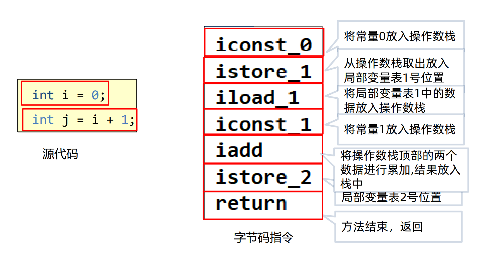

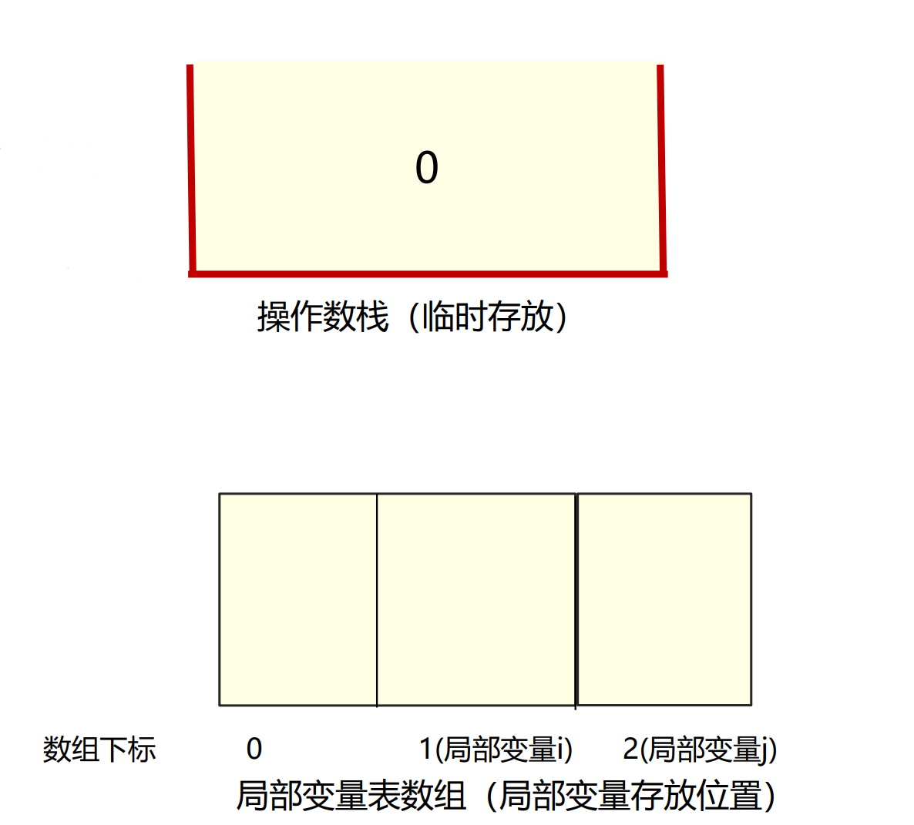

操作数栈：先进先出，用以临时存放操作数

局部变量表数组：就是一个数组。0号为args，从1开始才是要存放的数据。

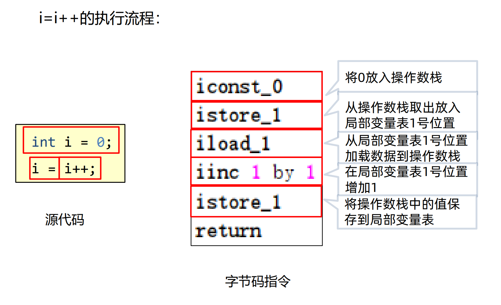

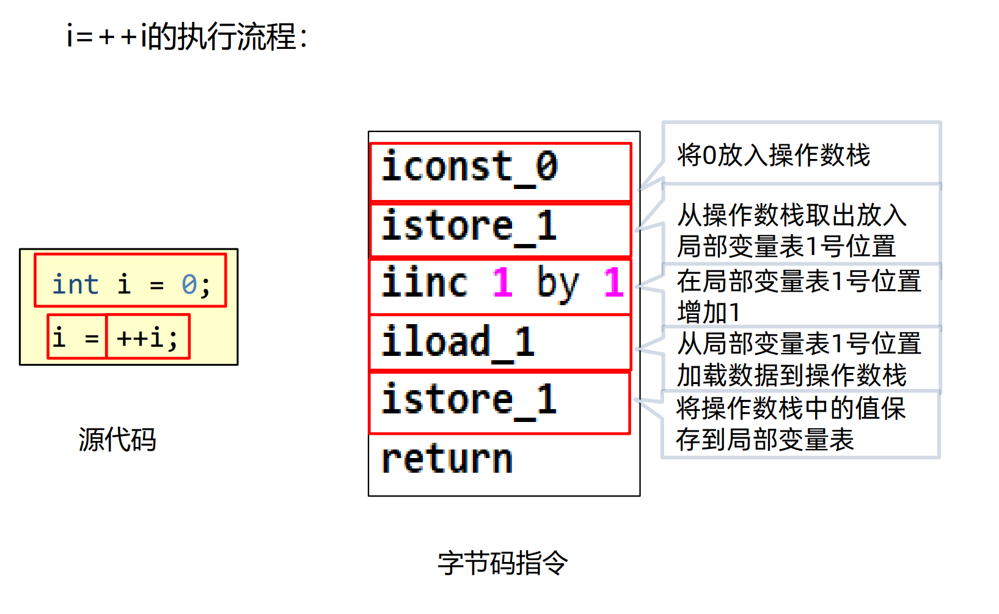

通过字节码文件中的将方法编写成的字节码指令可以从底层分析各种方法的执行，从而找到执行出不同结果的原因。

### 属性

类的属性，比如源码的文件名、内部类的列表等

## 类的生命周期

类的生命周期描述了一个类加载、使用、卸载的整个过程

加载 -> 连接 -> **初始化** -> 使用 -> 卸载

### 加载

1. 类加载器根据类的全限定名通过不同的渠道以二进制流的方式获取字节码信息。程序员可以使用Java代码拓展不同的渠道。
    - 渠道：本地磁盘上的字节码文件、程序运行时使用动态代理生成、通过网络传输
2. 类加载器在加载完类之后，Java虚拟机会将字节码中的信息保存到内存的方法区中，生成一个InstanceKlass对象，保存类的所有信息(具体信息见上文`## 字节码文件的组成`)，除此之外还包含实现特定功能(例如多态)的信息(虚方法表)。
3. 同时，Java虚拟机还会在堆中复制一份与方法区中InstanceKlass中的数据类似的`java.lang.Class`对象，以此可以通过Java代码获取类的信息以及存储静态字段的数据(JDK8及之后)。
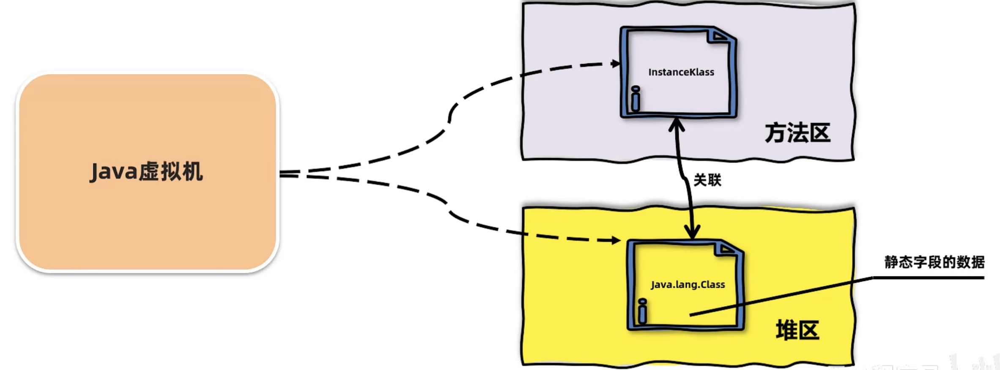
堆中的Class对象中所包含的数据只有字段、方法等在开发过程中需要用到的内容，因此对于开发者来说，只需要访问堆中的Class对象而不需要访问方法区中InstanceKlass所包含的所有信息。因此复制一份删减版的数据到堆中的做法可以让Java虚拟机很好地控制开发者访问数据的范围。


### 连接

1. 验证：验证内容是否满足《Java虚拟机规范》
2. 准备：给静态变量赋初值
3. 解析：将常量池中的符号引用替换成指向内存的直接引用

#### 验证

- 连接（Linking）阶段的第一个环节是验证，验证的主要目的是检测Java字节码文件是否遵守了《Java虚拟机规
范》中的约束。这个阶段一般不需要程序员参与。
- 主要包含如下四部分，具体详见《Java虚拟机规范》：
  1. 文件格式验证，比如文件是否以0xCAFEBABE开头，主次版本号是否满足当前Java虚拟机版本要求。
  2. 元信息验证，例如类必须有父类（super不能为空）。
  3. 验证程序执行指令的语义，比如方法内的指令执行中跳转到不正确的位置。
  4. 符号引用验证，例如是否访问了其他类中private的方法等。

> java中每个类最终都必须有一个父类。如果没有显式地继承其他类，则默认继承自 `java.lang.Object`。
> 单一继承：每个类只能有一个直接父类，但可以有多个间接父类。
> 接口：接口没有父类，接口只能继承接口，但实现接口的类最终也会继承自 `java.lang.Object`。

#### 准备

准备阶段为静态变量(static)在堆中分配内存并设置 **初始值(数据类型的默认值)** ，每一种基本数据类型和引用数据类型都有其初始值。


|数据类型 |初始值|
|---|---|
|int |0|
|long |0L|
|short |0|
|char |'\u0000'|
|byte |0|
|boolean |false|
|double |0.0|
|引用数据类型 |null|

final修饰的基本数据类型的静态变量，准备阶段直接会将 **代码中的值** 进行赋值。

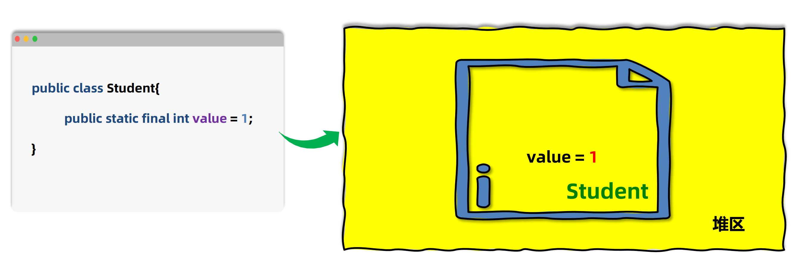

#### 解析

解析阶段主要是将常量池中的符号引用替换为直接引用，直接引用是直接使用运行时的实际内存地址或偏移量。

> 可参考上文 `## 字节码文件的组成 > ### 常量池`

### 初始化

- 初始化阶段会执行静态代码块中的代码，并为静态变量赋值，执行流程与代码流程一致。

  ```java
  static int a = 1;
  static{
    a = 2;
  }
  // 该执行结果为a = 2


  static{
    a = 2;
  }
  static int a = 1;
  // 该执行结果为a = 1
  ```

- 初始化阶段会执行字节码文件中`clinit`部分的字节码指令。
- 以下几种方式会导致类的初始化：
    1. 访问一个类的静态变量或者静态方法，注意变量是final修饰的并且等号右边是常量不会触发初始化。
    2. 调用`Class.forName(String className)`。注意单参数默认初始化类，但有双参数`Class.forName(String className, boolean initialize)`，`initialize`为`false`时不会初始化。
    3. new一个该类的对象时。
    4. 执行Main方法的当前类。
- 以下情况不会生成clinit指令：
    1. 无静态代码块且无静态变量赋值语句。
    2. 有静态变量的声明，但是没有赋值语句。
    3. 静态变量的定义使用`final`关键字，这类变量会在准备阶段直接进行初始化。
- 直接访问父类的静态变量，不会触发子类的初始化。
- 子类的初始化`clinit`调用之前，会先调用父类的`clinit`初始化方法。
- 类数组的创建`Test[] arr = new Test[10]`不会导致数组中元素的类进行初始化。
- final修饰的变量如果赋值的内容需要执行指令才能得出结果，会执行clinit方法进行初始化。`public static final int a = Integer.valueOf(1)`

### 代码块执行顺序

↓  静态代码块：在类加载时执行，只执行一次。
↓  实例代码块：在每次创建对象时执行，且在构造方法之前执行。
→  构造方法：在实例代码块之后执行。

```java
public class Test{
    public static void main(String[] args){
        System.out.println("A");
        new Test;
        new Test;
    }

    // 构造方法
    public Test(){
        System.out.println("B");
    }

    // 实例代码块
    {
        System.out.println("C");
    }

    // 静态代码块
    static{
        System.out.println("D");
    }
}
```

输出为：DACBCB

## 类加载器

类加载器（ClassLoader）是Java虚拟机提供给应用程序去实现获取类和接口字节码数据的技术，它将这些类文件的字节码数据转化为 JVM 可以操作的类对象存入内存。类加载器只参与加载过程中的字节码获取并加载到内存这一部分。

### 两类类加载器

类加载器分为两类，一类是Java代码中实现的，一类是Java虚拟机底层源码实现的。

- 虚拟机底层实现：源代码位于Java虚拟机的源码中，实现语言与虚拟机底层语言一致，比如Hotspot使用C++。这类类加载器用以保证Java程序运行中基础类被正确地加载，比如`java.lang.String`，确保其可靠性。
  - 启动类加载器Bootstrap
    - 启动类加载器（Bootstrap ClassLoader）是由Hotspot虚拟机提供的、使用C++编写的类加载器。默认加载Java安装目录/jre/lib下的类文件，比如rt.jar，tools.jar，resources.jar等。启动类加载器对象无法被java代码获取，尝试获取时会返回`null`。
    - 通过启动类加载器去加载用户jar包：
        1. ~~放入jre/lib下进行扩展：不推荐，尽可能不要去更改JDK安装目录中的内容，即使放进去了，也可能会由于文件名不满足要求而加载失败。~~
        2. 使用参数进行扩展：推荐，使用`-Xbootclasspath/a:{jar包目录/jar包名}`进行扩展
    > 对jar包内的类的引用可以直接用全限名——包名.类名
- Java代码实现：JDK中默认提供了多种处理不同渠道的类加载器，程序员也可以自己根据需求定制，这类类加载器继承自抽象类`ClassLoader`，所有Java中实现的类加载器都需要继承`ClassLoader`这个抽象类。
  - 扩展类加载器和应用程序类加载器都是JDK中提供的、使用Java编写的类加载器。它们的源码都位于sun.misc.Launcher中，是一个静态内部类。继承自URLClassLoader。具备通过目录或者指定jar包将字节码文件加载到内存中。
    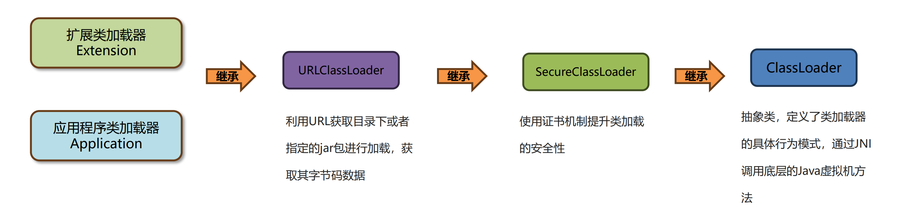
  - 扩展类加载器Extension
    - 默认加载Java安装目录/jre/lib/ext下的类文件
    - 通过扩展类加载器去加载用户jar包：
        1. 放入/jre/lib/ext下进行扩展：不推荐，尽可能不要去更改JDK安装目录中的内容
        2. 使用参数进行扩展：推荐，使用-Djava.ext.dirs=jar包目录 进行扩展,这种方式会覆盖掉原始目录，在Windows上可以用`';'`分隔追加上原始目录(macos/linux用`':'`)
  - 应用程序类加载器Application
    - 加载classpath下的类文件，如项目中的类文件(编译生成的.class文件)和第三方依赖中的类文件

### 双亲委派机制

在类加载的过程中，每个类加载器会先检查是否已经加载了该类，如果已经加载则直接返回，否则会将加载请求委派给父类加载器。类加载器维护一个缓存(如 LoadedClasses)，用于存储已经加载的类。

如下图，上面的是父类，下面的是子类。通过`findLoadedClass(String name)`向上查找是否加载过，向下尝试加载，如果该类所在路径在自己的加载目录中就可以加载。箭头先蓝再红。


- Q：为什么要设计这种机制
- A：如果有人想替换系统级别的类：String.java，篡改它的实现，但在这种机制下这些类已经被Bootstrap classLoader加载过了(因为当一个类需要加载的时候，最先去尝试加载的就是BootstrapClassLoader)，所以其他类加载器并没有机会再去加载。因此这种机制有两个优点：能从一定程度上防止危险代码的植入，并且可以避免同一个类被多次加载。

- Q:在Java中如何使用代码的方式去主动加载一个类呢？
- A:方式1：使用Class.forName方法，使用当前类的类加载器去加载指定的类。
  方式2：获取到类加载器，通过类加载器的loadClass方法指定某个类加载器加载。
