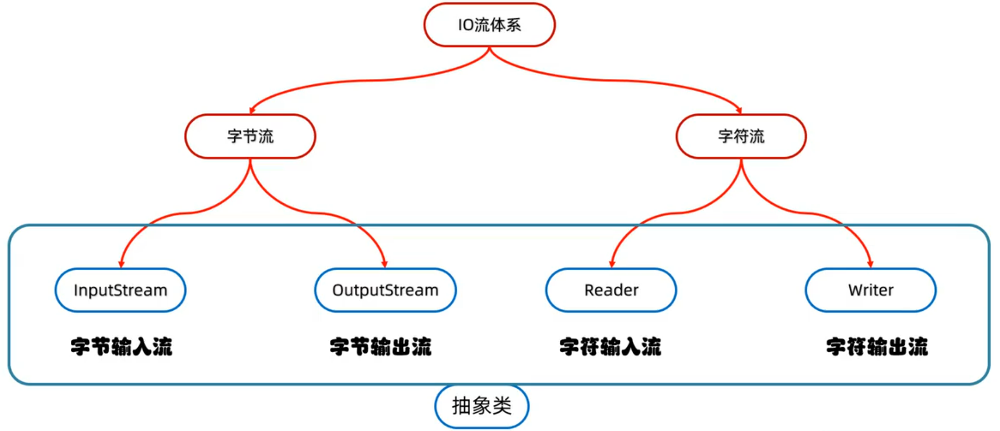
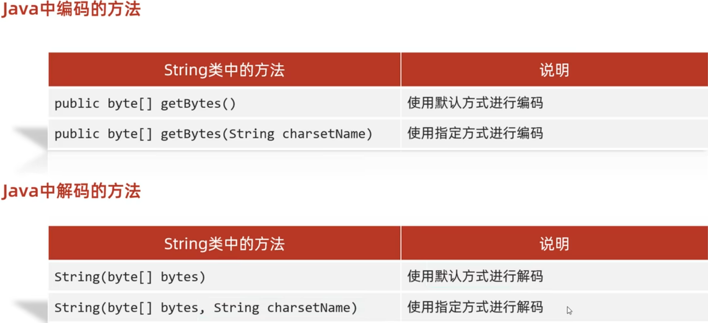
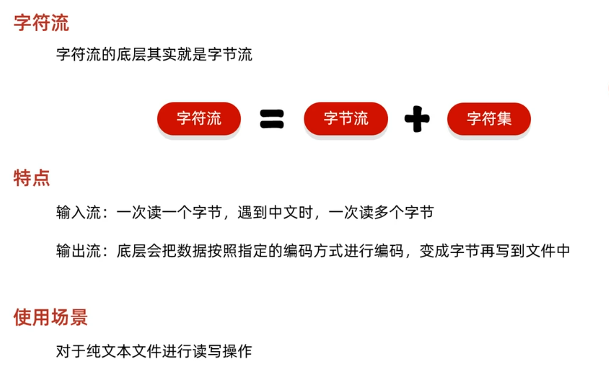
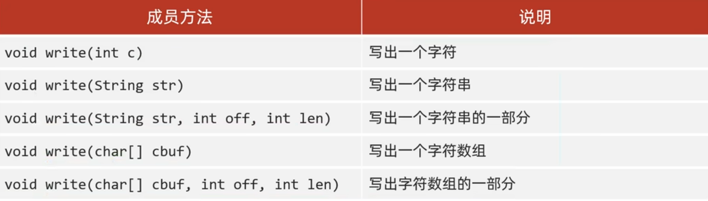

# I/O流



## 字节流

### FileOutputStream

实现步骤：

- 创建字节输出流对象`FileOutputStream fos = new FileOutputStream("file.txt")`
  - 参数可以是字符串表示的路径或File对象`new File("file.txt")`。在底层代码中，如果构造方法的传参是路径字符串，在构造方法内部调用的也是参数为File对象的构造方法。
  - 如果文件不存在则会创建一个新的文件，但是父级路径必须是存在的。
  - 如果文件已经存在，则会清空文件
- 写数据`fos.write(97)`
  - `write()`方法的参数是整数，但是实际上写到本地文件中的是整数在ASCII上对应的字符
- 释放资源`fos.close();`
  - 如果不释放资源，java会一直占用该文件直到程序终止。
  - 对于正在被占用的文件，如果要删除则会被操作系统提示并阻止，如果要修改则必须“另存为”，可以覆盖原文件。

|||
|---|---|
|`void write(int b)`|一次写一个字节数据|
|`void write(byte[] b)`|一次写一个字节数组数据|
|`void write(byte[] b, int off, int len)`|一次写一个字节数组的从`off`索引开始的`len`个数据|

> `String`类中的`getBytes()`方法可以将字符串对象转换成`byte[]`数组并返回
> Windows中换行符是`"\r\n"`，不同操作系统换行符不同，在Windows中，java会将`"\r"`或`"\n"`处理转换成`"\r\n"`，具体可自行百度。
> `public FileOutputStream(File file, boolean append)`是最底层的构造方法，`append`默认为`false`，表示是否要在原文件的基础上续写

### FileInputStream

基本步骤同上

```java{.line-numbers}
package org.xijuangu;

import java.io.FileInputStream;
import java.io.IOException;

public class FileInputDemo {
    public static void main(String[] args) throws IOException {
        // 读文件，file.txt中是"abc"，如果文件不存在则抛出错误
        FileInputStream fis = new FileInputStream("file.txt");

        int b1 = fis.read();      // 一次读一个字节，读出来的是该字节在ASCII上对应的整数
        System.out.println(b1);   // 97
        int b2 = fis.read();
        System.out.println(b2);   // 98
        int b3 = fis.read();
        System.out.println(b3);   // 99

        int b4 = fis.read();
        System.out.println(b4);   // -1，表示没有读到字符

        fis.close();
    }
}
```

或者循环读取：

```java
int b1;
while ((b1 = fis.read()) != -1) {
  System.out.println((char) b1);    // 强转类型为char
}
```

注意不能写成：

```java
while (fis.read() != -1) {    // 每次调用fis.read()都会读取一个字节并移动指针到下一个字节，这样写的话就会一个隔一个地读
  int b1 = fis.read();
  System.out.println((char) b1);
}
```

### 例子：复制文件

小文件复制：

```java{.line-numbers}
package org.xijuangu;

import java.io.FileInputStream;
import java.io.FileOutputStream;
import java.io.IOException;

public class FileTransportDemo {
    public static void main(String[] args) throws IOException {

        FileInputStream fis = new FileInputStream("file.txt");
        FileOutputStream fos = new FileOutputStream("copy.txt");

        int b;
        while((b = fis.read()) != -1){
            fos.write(b);
        }

        fos.close();
        fis.close();
    }
}
```

大文件复制：`public int read(byte[] buffer)`
不同于上面使用的`read()`方法，这个重载的方法一次会读取一个字节数组的数据，根据数组的长度，每次读取尽可能地把这个数组装满。如果读到最后不够读了，只会覆盖前n个元素(n为本次读取到的元素数)，剩下的元素仍然保持为上一次读取到的内容。该方法的返回值为本次读取到多少个数据。

```java{.line-numbers}
package org.xijuangu;

import java.io.FileInputStream;
import java.io.FileOutputStream;
import java.io.IOException;

public class FileTransportDemo {
    public static void main(String[] args) throws IOException {

      long start = System.currentTimeMillis();    // 标记开始时间

      FileInputStream fis = new FileInputStream("file.txt");
      FileOutputStream fos = new FileOutputStream("copytxt");

      byte[] bytes = new byte[2];    // 数组大小为2
      int readNums;                  // 标记本次读到了几个字节
      while((readNums = fis.read(bytes)) != -1){
          fos.write(bytes, 0, readNums);    // 从bytes数组的0号位置开始，写入readNums个字节（前readNums个数组元素）
          System.out.println(new String(bytes, 0, readNums));   // 从bytes数组的0号位置开始，将前readNums个数组元素转换成字符串并输出
      }

      fos.close();
      fis.close();

      long end = System.currentTimeMillis();    // 标记结束时间

      System.out.println("time cost: " + (end - start) + " ms");
    }
}
```

> 计算机中的文件是通过字节序列来表示的。每个文件，无论其类型（文本、图片、视频等），在存储时都是由一系列字节（8位二进制数）组成的。这些字节是数据的最小单位。
一个字节由 8 位（bit）组成。每一位可以是 0 或 1，因此一个字节可以表示的值范围是 0 到 255。
>
> 文件的字节序列：文件在存储时是按字节序列存储的。文件中的每一个字节都表示某种特定的数据，具体含义取决于文件的类型和格式。具体可参考JVM篇的字节码。
>
> 文件类型和字节表示
文本文件：
文本文件通常以 ASCII 或 Unicode 编码存储，每个字符对应一个或多个字节。
例如，ASCII 编码中的每个字符用一个字节表示，Unicode 编码的 UTF-8 可以用 1 到 4 个字节表示一个字符。
二进制文件：
包括图像、音频、视频等文件，直接以二进制数据形式存储。
文件格式定义了字节序列如何解释，例如 BMP 图像文件头部包含文件大小、宽度、高度等信息。

## 字符集

### ASCII编码


ASCII编码以一个字节存储，空位补0，最高位一定是0，因为一共只有0-255共256个字符，最多只能到01111111。

### GBK编码


GBK编码在英文上完全兼容ASCII码，与上面ASCII编码的介绍图完全一致。英文一个字节存储，汉字两个字节存储。对于中文，高位字节规定以1作为开头，所以在GBK编码中，开头是0还是1就是区别英文和中文字节的标志。


> 在Java中，byte类型是8位有符号整数，范围是从 -128 到 127。因此，如果一个字节的最高位（第8位）为1，则它表示一个负数。

### ANSI编码


在 Windows 环境中，ANSI 编码通常指的是系统默认的代码页（Code Page），不同语言和地区使用不同的代码页。例如，Windows-1252 用于西欧语言，Windows-1251 用于西里尔文（如俄语），Windows-936 用于简体中文（GBK）。ANSI 编码字符集通常包括 ASCII 字符（0-127）以及扩展字符（128-255），扩展字符部分根据不同的代码页有不同的定义，因此，ANSI 编码并没有统一的标准，它随地区和语言而变化，同一个字节值在不同的 ANSI 代码页下可能表示不同的字符。

### Unicode


Unicode 标准定义了一个全球通用的字符集合和每个字符的唯一码位（称为码点或代码点），例如：字符 "汉" 的码位是 U+6C49。然后，这些码位可以通过不同的编码形式转化为不同的编码，如 UTF-8(使用1-4个字节保存)、UTF-16(使用2-4个字节保存)、UTF-32(使用固定4个字节保存)，其中最常见的是UTF-8，英文1个字节，中文3个字节，如下图。图中左下角的表表示各个字节数的转换规则，其中规定了各个字节数的开头必须满足的条件。"汉"字查询Unicode码位是U+6C49，转换为10进制是27721，转换为2进制为01101100 01001001，根据左下角的规则，转换为：**1110**0110 **10**110001 **10**001001


### 乱码

出现乱码有两个可能的原因，一个是读取时未读取完整个汉字，或其他需要多个字节编码的文字符号未被读取完整；另一个是编码和解码的方式不统一。

### Java中编码和解码的方法



## 字符流



遇到中文时一次读多个字节，具体读几个字节就由选定的字符集决定。

### FileReader

构造方法同上`FileInputStream`

- `public FileReader(File file)`
- `public FileReader(String pathName)`

`read()`方法也大致同上`FileInputStream`

- `public int read()`
  读取字符，非中文字符读取一个字节，中文字符一次读多个字节，读取后解码，返回一个整数。读到文件末尾返回-1。读取到字符后，方法底层还会解码并将读取到的数据转换成十进制并返回。
- `public int read(char[] buffer)`
  一次读取多个**字符**，而不是`FileInputStream`中的字节，因此是`char[]`类型的数组。读取到一个字符后，会同时解码并转换为字符存入buffer字符数组中。方法的返回值为读取到的字符的个数。
- 第一个返回得到了什么，第二个返回得到了几个

```java
package org.xijuangu;

import java.io.FileReader;
import java.io.IOException;

public class FileReaderDemo {
    public static void main(String[] args) throws IOException {
        FileReader fr = new FileReader("reader.txt");
        int ch;
        while((ch = fr.read()) != -1){
            System.out.print((char)ch);
        }
        fr.close();
    }
}
```

```java
package org.xijuangu;

import java.io.FileReader;
import java.io.IOException;

public class FileReaderDemo {
    public static void main(String[] args) throws IOException {
        FileReader fr = new FileReader("reader.txt");
        int len;
        char[] chars = new char[2];
        while((len = fr.read(chars)) != -1){
            System.out.print(new String(chars, 0, len));
        }
        fr.close();
    }
}
```

### FileWriter




```java
package org.xijuangu;

import java.io.FileReader;
import java.io.FileWriter;
import java.io.IOException;

public class FileReaderDemo {
    public static void main(String[] args) throws IOException {
        FileReader fr = new FileReader("reader.txt");
        FileWriter fw = new FileWriter("writer.txt");
        int len;
        char[] chars = new char[2];
        while((len = fr.read(chars)) != -1){
            fw.write(chars, 0, len);
        }
        fr.close();
        fw.close();
    }
}
```
