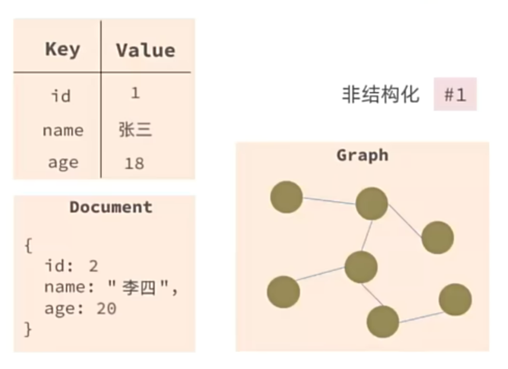
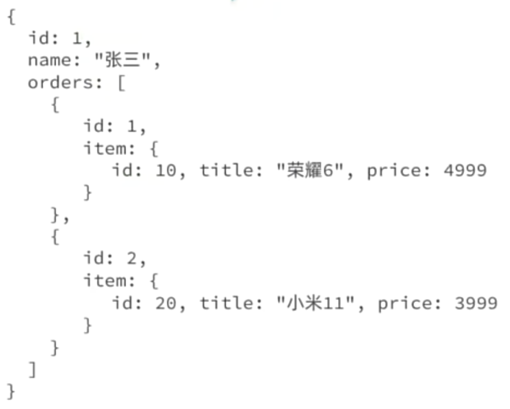
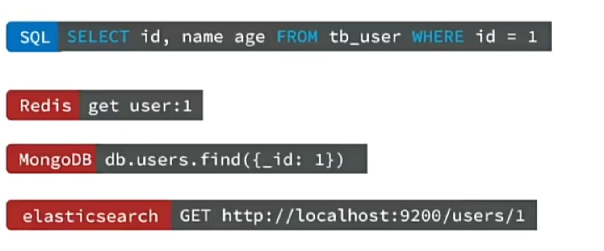
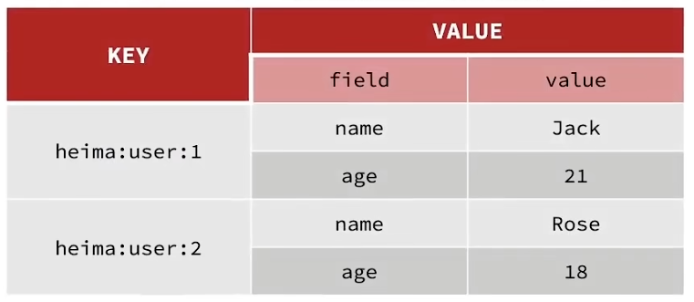

# Redis

Redis是一种键值型的数据库 —— NoSQL。

## 初识Redis

### 认识 NoSQL

- SQL —— 关系型数据库
  - S —— Structured，存入SQL的数据都是结构化的数据，要有一定的格式要求。一般要在创建时就确定好表的各种约束（结构），因为一旦开始使用就不便修改。当表在使用中并达到了一定数据量的规模，一个字段的修改就可能造成很大影响，并且表的变化可能导致业务也需要修改，非常麻烦。
  
  - 关系型，主要体现在外键，数据库会维护这些外键关系，因为只需要记录对应的主键作为字段值，不需要记录一整个元组，所以常常比较节省存储空间。
  
  - SQL查询(Structured Query Language结构化查询语句)，只要是关系型数据库，都可以用相同的语句进行查询。
  - ACID，原子性 (Atomicity)、 一致性(Consistency)、隔离性(Isolation) 和 持久性(Durability)。
  - 存储在磁盘，性能较低。
  - 垂直扩展性：数据存储在本机，影响性能的只有本机这台服务器的性能。MySQL的分布式只是主从关系，机器的数量增加了，宏观上提升了读写的速度，但主和从存储的数据是完全一致的，因此并没有提升数据的存储上限。
- NoSQL —— 非关系型数据库
  - NoS —— No Structure，非结构化，它对数据的结构没有这么严格的约束，例如Redis，就是一种键值型的NoSQL数据库，对Key和Value的类型都可以自定义。还有一种NoSQL是文档型的，其中的数据以JSON分隔，在SQL中的一行数据就对应一个JSON，每个JSON中的字段都可以是任意的。还有图类型的NoSQL，多用于社交APP，每一个对象都是一个结点，结点与结点之间以联系来连接，例如存储人的信息，人与人之间的联系就构成结点间的一条条边。另外还有一种列类型的NoSQL，如下图。
  
  
  - 非关系型，当需要记录二者的关系时，常常直接将对方的一整个JSON对象存入自己的JSON体中。如果也想实现SQL中类似的外键形式的关系，就需要程序员自己进行维护。例如下图中，也可以略去item中的id以外的属性值，但这就需要程序员自己维护另一个Document中手机型号的id不能重复。
  
  - 非SQL查询，没有固定的语法格式，不统一。
  
  - BASE
    - 1.基本可用（Basically Available）:
      NoSQL允许分布式系统中某些部分出现故障，那么系统的其余部分依然可用。它不会像ACID那样，在系统出现故障时，进行强制拒绝，NoSQL允许在这种情况下继续部分访问。
    - 2.软状态（Soft State）:
      NoSQL在数据处理过程中，允许该过程存在数据状态暂时不一致的情况。但经过纠错处理，最终会一致的。
    - 3.最终一致性（Eventually Consistent）：
      NoSQL的软状态允许数据处理过程的暂时不一致，但是最终处理结果将是一致的，说明 NoSQL 对数据处理过程可以有短暂的时间间隔，也允许分更细的步骤一个一个地处理，最好数据达到一致即可。这在互联网上进行分布式应用具有其明显的优势。
  - 存储在内存，性能较高。
  - 水平扩展性：NoSQL 在插入数据时往往会基于数据的id或唯一的标识做哈希运算，判断出该数据应该存储在哪一个结点上，从而实现数据量的拆分，提高了数据的存储上限，实现了水平的扩展。
- 因此 SQL 更适合数据结构稳定、相关业务对数据安全性、一致性要求较高的场景；NoSQL 更适合数据结构不稳定、对一致性、安全性要求不高、对性能有更大需求的场景。

## 认识Redis

Redis诞生于2009年，全称是**Re**mote **Di**ctionary **S**erver —— 远程词典服务器，是一个基于内存的键值型NoSQL数据库。

- 键值(key-value)型，value 支持多种不同数据结构，功能丰富
- 单线程，每个命令具备原子性
- 低延迟，速度快（基于内存、IO多路复用、良好的编码）
- 支持数据持久化
- 支持主从集群、分片集群
  - 主从集群是指备节点会备份主节点的数据，可以从多个节点获取同样的数据
  - 分片集群是指把一整份数据拆分到多个节点上，每个数据只存在于单个节点，即水平扩展

- 支持多语言客户端

## 部署redis

我是通过docker部署的8.4版本的redis，在xijuangulecoo上，没有改任何配置，后续有需要改的话要在这个基础上去找办法，仅做备忘

## Redis数据结构

## Redis 常用通用指令

[Redis命令查询官网](http://redis.io/commands)
或在Redis命令行中使用 `help @<group>` 命令查询对应的数据类型下的操作命令，如 `help @generic` 查询所有数据类型通用的命令，`help @String` 查询操作 String 类型的命令。

1. KEYS：查看符合模板 pattern 的所有 key，效率较低不建议在生产环境使用。一旦在大量数据下使用，由于是单线程，很容易阻塞。
   - 查看帮助：`help keys`
   - 用法示例：
     - `KEYS h?llo`
     - `KEYS he*`
     - `KEYS h[ae]llo`
     - `KEYS h[^e]llo`
     - `KEYS h[a-c]llo`
2. DEL：删除一个指定的 key
   - 用法示例：`DEL k1 k2 k3`
   - 只删除存在的 key，删除成功后会返回一个整数，表示删除了几个键值对
3. EXISTS：判断 key 是否存在
   - 用法示例：`EXISTS hello name age`
   - 返回一个自然数，key 列表中有几个存在就返回几
4. EXPIRE：给一个 key 设置有效期，有效期到期时会自动删除
   - 用法示例：`EXPIRE hello 10`
   - 设置 key 为 hello 的键值对的有效期为 10 秒，成功则返回 1
5. TTL：查看一个 key 的剩余有效期，-1 为永久，-2 为已删除
   - 用法示例：`TTL hello`
   - 返回一个正整数表示剩余秒数，或 -1，或 -2

### String 类型相关指令

String 类型，也就是字符串类型，是 Redis 中最简单的存储类型。其 value 是字符串，不过根据字符串的格式不同，又可以分为3类:

- string: 普通字符串
- int: 整数类型，可以做自增、自减操作
- float: 浮点类型，可以做自增、自减操作

不论哪种格式，底层都以字节数组形式存储，只是编码方式会有所不同。例如，数值类型的字符串会直接转换成二进制的形式再作为字节去存储，这样一个字节就可以表示一个很大的数字，更节省空间；而普通字符串就只能在某一指定的编码规则下转换成对应的字节码进行存储，占用的空间更大。

举例说明：整数 123 与字符串 123，整数 123 会转换成 01111011，作为字节存储就是 0x7B，一个字节就可以存下，而字符串 123 就要分别给 1、2、3 进行编码，假设使用 UTF-8 编码得到 0x31、0x32、0x33，要三个字节才能存下。

字符串类型的最大空间不能超过512M。

string 的常见命令有:

- SET : 添加或者修改已经存在的一个 String 类型的键值对
- GET : 根据 key 获取 String 类型的 value
- MSET : 批量添加多个 String 类型的键值对
  - 用法示例：`MSET k1 v1 k2 v2 k3 v3`
  - 返回值为 OK
- MGET : 根据多个 key 获取多个 String 类型的 value
  - 用法示例：`MGET k1 k2 k3`
  - 按顺序返回对应 key 的值
- INCR : 让一个 value 为整型的 key 的 value 自增 1
  - 用法示例：`incr num`
  - 返回 value 的当前值
- INCRBY : 让一个 value 为整型的 key 的 value 自增并指定步长，并可指定步长为负。
  - 用法示例：`incrby num -2`
  - 让 num 所对应的值自减 2，返回 value 的当前值
- INCRBYFLOAT : 让一个浮点类型的数字自增并指定步长，浮点类型没有默认步长的自增方法
  - 用法示例：`incrbyfloat floatkey -1.1`
  - 让 floatkey 所对应的值自减 1.1，返回 value 的当前值
- SETNX : 添加一个 String 类型的键值对，前提是这个 key 不存在，否则不执行。也即，只新增，不修改。
  - 用法示例：`SETNX floatkey 3.14`
  - 若不存在 floatkey，返回 1，否则返回 0
- SETEX : 添加或修改一个 String 类型的键值对，并且指定有效期
  - 用法示例：`SETEX floatkey 10 3.14`
  - 添加/修改 floatkey 的值为 3.14，有效期为 10 秒，返回 OK

### Key 的层级格式

Redis 没有表的概念，那么我们该如何区分不同类型的 key 呢？例如，同样都是 ("id", 10086)，怎么区分这个 id 是 user 的 id 还是 product 的 id 呢？

redis 的 key 允许有多个单词形成层级结构，多个单词之间用 ":" 隔开，一般格式如下：``项目名:业务名:类型:id``，格式并非固定，可以根据自己的需求来添加或删除词条。例如 key 为 ``60s:daily-news:news-data:10086``，然后 value 为 ``'{"id":10086, "date":2003-08-21, "week":"monday"}'``

### Hash 类型相关指令

Hash 类型，也叫散列，其 value 是一个无序字典，类似于 HashMap 的结构。String 虽然也能写成一行 JSON 的格式，但它无法修改其中的某个字段，只能全部重写；Hash 结构则可以将 JSON 中的每个字段独立存储，可以针对单个字段 CRUD

Hash 类型的常见命令有：

- HSET key field value [field value...]：创建或修改键为 key、值为 value 的键值对
  - 用法示例：`HSET 60s:daily-news:news-data:1 id 1 date "2003-08-21" week "Monday"`
  - 创建了几个就返回几，若都是修改则返回 0
- HGET key field
  - 用法示例：`HGET 60s:daily-news:news-data:1 id`
- HMSET key field value [field value...]
  - 用法示例：`HMSET 60s:daily-news:news-data:1 id 1 date "2003-08-21" week "Monday"`
  - 创建了几个就返回几，若都是修改则返回 0
  - 经查证，此方法已被 HSET 完全覆盖，已被废弃
- HMGET key field [field...]
  - 用法示例：`HMGET 60s:daily-news:news-data:1 id date week`
- HGETALL key
  - 用法示例：``HGETALL 60s:daily-news:news-data:1``
  - 依次返回每一个 field 与其 value
- HEKYS key
  - 用法示例：`HEKYS 60s:daily-news:news-data:1`
  - 依次返回每一个 field
- HVALS
  - 用法示例：`HVALS 60s:daily-news:news-data:1`
  - 依次返回每一个 value
- HINCRBY key field increment
  - 用法示例：`HINCRBY 60s:daily-news:news-data:1 id 1`
  - 返回该 field 的现值
- HSETNX key field value
  - 用法示例：`HSETNX 60s:daily-news:news-data:1 temp test`
  - 若有新增则返回 1，否则返回 0

### List 类型相关指令

redis 中的 List 类型可以看作是一个双向链表结构，和 Java 中的 LinkedList 类似，既支持正向检索也支持反向检索，特征也和 LinkedList 类似：

- 有序
- 元素可重复
- 插入和删除快
- 查询速度一般

常用来存储一个有序数据，例如：朋友圈点赞列表、评论列表等

List 类型的常用指令有：

- LPUSH key element [element ...]：向列表头插入一个或多个元素
  - 用法示例：``LPUSH users 1 2 3``
  - 这里注意，是按顺序推入的，先推 1，再推 2、3，因此在列表中第三个元素才是 1
- LPOP key [count]：移除并返回列表头的前 count 个元素，没有则返回 nil
  - 用法示例：``LPOP users 3``
  - 依次返回 3 2 1 并将其删除
- RPUSH key element [element ...]：向列表尾插入一个或多个元素
- RPOP key [count]：移除并返回列表尾的第一个元素，没有则返回 nil
- LRANGE key start stop：返回一段角标范围内的所有元素
  - 用法示例：``LRANGE users 0 2``
  - 注意，这里的角标也是从 0 开始的，如果 stop 的值超过了列表长度，则直接返回到最后一个元素
  - 如果范围内没有元素，则返回 empty array
- BLPOP key [key ...] timeout：与 LPOP 类似，只不过在没有元素时会等待指定的时间，而不是直接返回 nil
  - 用法示例：``BLPOP users 100``
  - 依次返回 key 和移除的元素，如果不是立即成功的话还会返回等待时间（秒），如果等待也失败了就会返回 nil 与等待时间
- BRPOP key [key ...] timeout：与 RPOP 类似，只不过在没有元素时会等待指定的时间，而不是直接返回 nil

### Set 类型相关指令

redis 中的 Set 类型可以看作是 value 为 null、只有 key 和 field 的 Hash，和 Java 中的 HashSet 类似，特征也和 HashSet 类似：

- 无序
- 元素不可重复
- 查找快
- 支持交集、并集、差集等功能，这是 java HashSet 中没有的

Set 类型的常用指令有：

- **SADD key member [member ...]**：向集合中添加一个或多个元素，**自动去重**
  - 用法示例：`SADD tags "redis" "database" "cache" "redis"`
  - 注意，即使重复添加 `"redis"`，集合中也只保留一个；返回值为**实际新增的元素数量**（本例返回 `3`）
- **SREM key member [member ...]**：从集合中移除一个或多个指定元素
  - 用法示例：`SREM tags "cache" "search"`
  - 返回值为**成功移除的元素数量**（若 `"search"` 不存在，则只移除 `"cache"`，返回 `1`）
- **SCARD key**：返回集合中**元素的总数量**（Set Cardinality）
  - 用法示例：`SCARD tags`
  - 若集合不存在，返回 `0`；否则返回整数
- **SISMEMBER key member**：判断指定元素是否存在于集合中
  - 用法示例：`SISMEMBER tags "redis"`
  - 存在返回 `1`，不存在返回 `0`
- **SMEMBERS key**：返回集合中**所有元素**
  - 用法示例：`SMEMBERS tags`
  - 返回结果是无序的；若集合为空或不存在，返回 empty array
- **SINTER key [key ...]**：返回**多个集合的交集**（同时存在于所有集合中的元素）
  - 用法示例：`SINTER set1 set2 set3`
  - 若任意一个集合不存在，交集结果为空
- **SDIFF key [key ...]**：返回**第一个集合与其他集合的差集**（存在于第一个集合但不在后续任一集合中的元素）
  - 用法示例：`SDIFF setA setB setC`
  - 等价于：`setA - (setB ∪ setC)`
- **SUNION key [key ...]**：返回**多个集合的并集**（所有集合中不重复的元素合集）
  - 用法示例：`SUNION group1 group2`
  - 自动去重，结果无序

### SortedSet 类型相关指令

Redis 的 SortedSet 是一个可排序的 set 集合，与 Java 中的 TreeSet 有些类似，但底层数据结构却差别很大。SortedSet 中的每一个元素都带有一个 score 属性，可以基于 score 属性对元素排序，底层的实现是一个跳表（SkipList）加 hash 表。SortedSet 具备下列特性：

- 可排序
- 元素不重复
- 查询速度快

因为SortedSet的可排序特性，经常被用来实现排行榜这样的功能。

SortedSet 的常见命令有：

- **ZADD key score member [score member ...]**：添加一个或多个元素到有序集合（Sorted Set），每个元素关联一个 `score`（分数）用于排序；**如果成员已存在，则更新其 `score` 值并重新排序**
  - 用法示例：`ZADD leaderboard 100 "Alice" 95 "Bob" 100 "Charlie"`
  - 注意：相同 `score` 的成员按字典序（lexicographical order）排列；返回值为**新增成员的数量**（本例中若全为新成员，返回 `3`）
- **ZREM key member [member ...]**：从有序集合中删除一个或多个指定成员
  - 用法示例：`ZREM leaderboard "Bob" "David"`
  - 返回值为**成功删除的成员数量**（若 `"David"` 不存在，则只删除 `"Bob"`，返回 `1`）
- **ZSCORE key member**：获取有序集合中指定成员的 `score` 值
  - 用法示例：`ZSCORE leaderboard "Alice"`
  - 若成员存在，返回其分数（如 `"100"`）；若不存在，返回 `(nil)`
- **ZRANK key member**：获取有序集合中指定成员的**正向排名**（从低分到高分，**从 0 开始计数**）
  - 用法示例：`ZRANK leaderboard "Bob"`
  - 假设排序后为 `[Bob(95), Alice(100), Charlie(100)]`，则 `ZRANK` 返回 `0`（Bob 排第 0 名）；若成员不存在，返回 `(nil)`
- **ZCARD key**：获取有序集合中**成员的总数量**
  - 用法示例：`ZCARD leaderboard`
  - 若集合不存在，返回 `0`；否则返回整数（如 `3`）
- **ZCOUNT key min max**：统计 `score` 值在指定范围 `[min, max]` 内的成员数量（**包含边界**）
  - 用法示例：`ZCOUNT leaderboard 90 100`
  - 支持特殊值：`-inf`（负无穷）、`+inf`（正无穷），如 `ZCOUNT leaderboard 95 +inf` 表示 ≥95 分的人数
- **ZINCRBY key increment member**：将有序集合中指定成员的 `score` 值**增加**（或减少，若 `increment` 为负）指定步长
  - 用法示例：`ZINCRBY leaderboard 5 "Alice"`
  - 若 `"Alice"` 原分数为 `100`，执行后变为 `105`；若成员不存在，则先创建（初始 `score=0`）再增加
- **ZRANGE key start stop [WITHSCORES]**：按 `score` **升序**（从小到大）返回指定**排名范围**内的成员（**索引从 0 开始**）
  - 用法示例：`ZRANGE leaderboard 0 2 WITHSCORES`
  - 返回前 3 名成员及其分数；`stop` 可用 `-1` 表示到最后（如 `ZRANGE key 0 -1` 获取全部）；加上 `WITHSCORES` 会同时返回分数
- **ZRANGEBYSCORE key min max [WITHSCORES] [LIMIT offset count]**：按 `score` **升序**返回指定**分数范围**内的成员
  - 用法示例：`ZRANGEBYSCORE leaderboard 95 100 WITHSCORES`
  - 支持开区间：`(95` 表示 >95（不包含 95），如 `ZRANGEBYSCORE key (95 100`；常用于“分页查询高分用户”
- **ZDIFF、ZINTER、ZUNION**：分别对多个有序集合执行**差集、交集、并集**运算，并可指定聚合方式（默认取 `score` 之和）
  - 用法示例：
    - `ZUNION 2 setA setB WEIGHTS 1 2 AGGREGATE SUM` → 并集，setB 的分数 ×2 后相加
    - `ZINTER 2 group1 group2` → 交集，仅保留同时存在于两个集合的成员
  - 这些命令通常配合 `STORE` 使用（如 `ZUNIONSTORE dest 2 A B`）将结果存入新 key；也可直接返回结果（Redis 6.2+）
