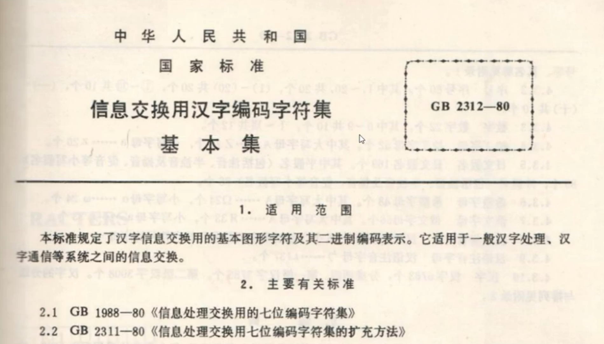
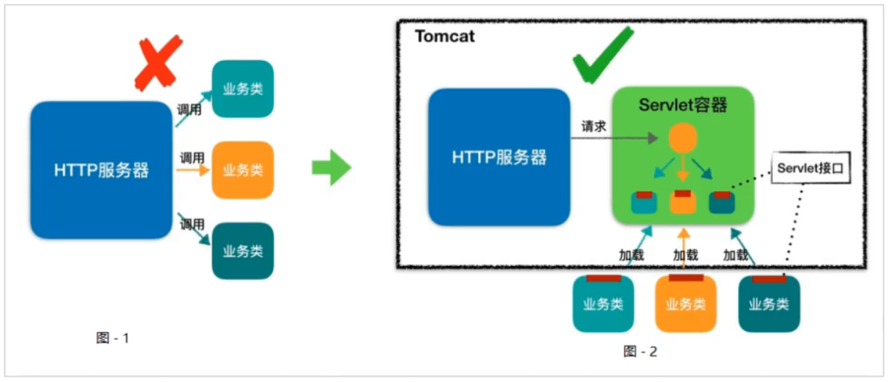
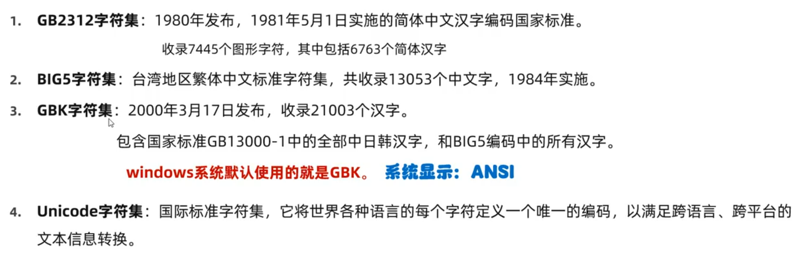
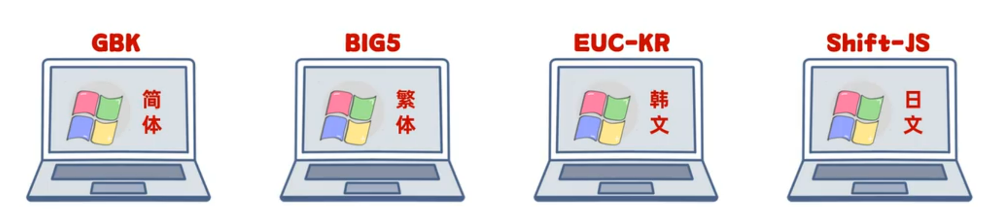
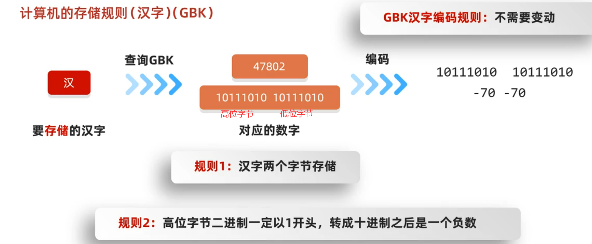
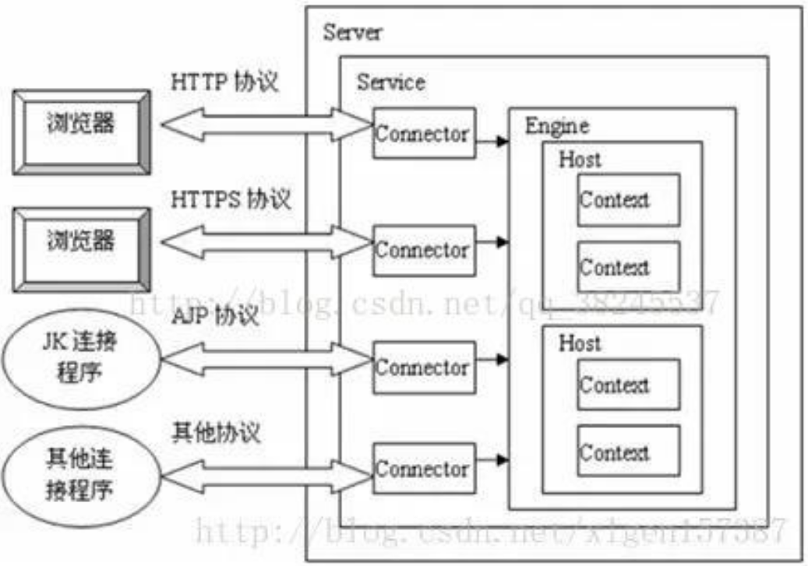

# Tomcat原理

## HTTP 协议工作原理

HTTP协议是浏览器与服务器之间的数据传送协议。作为应用层协议，HTTP是基于TCP/IP协议来传递数据的(HTML文件、图片、查询结果等)，HTTP协议不涉及数据包(Packet)传输，主要规定了客户端(浏览器)和服务器之间的通信格式。


1. 用户请求
   - 用户在浏览器中输入一个 URL，如 `http://www.baidu.com`，然后浏览器就将访问这个域名，使用DNS解析域名找到服务器的IP地址，由IP定位到要请求的服务器。
2. 浏览器发起TCP连接请求
3. 服务器持续监听特定端口，接收到请求后建立连接，此处涉及三次握手
4. 三次握手后客户端确认连接建立，就可以开始根据HTTP协议封装用户的请求，生成HTTP格式的数据包
5. 客户端向服务器通过TCP协议发送该格式的数据包
6. 服务器按HTTP格式解析该数据包
   - 服务器在该过程中会接收到由TCP协议封装并传输的、HTTP格式的数据包
   
7. 服务器执行请求
8. 服务器根据执行结果生成包含结果的HTTP格式的数据包
9. 服务器向客户端发送响应数据包
10. 客户端解析该HTTP格式的数据包
    - 浏览器只能解析静态资源如图片、CSS、JS、HTML文件等，而不能解析动态资源如Servlet、PHP、ASP、JSP等。
    - 因此服务器响应的数据只能是静态资源
11. 浏览器向用户呈现HTML响应与样式

## HTTP 服务器请求处理

浏览器发给服务端的是一个HTTP格式的请求，HTTP服务器收到这个请求后,需要调用服务端程序来处理,所谓的服务端程序就是你写的Java类，一般来说不同的请求需要由不同的Java类来处理。



图-1 表示HTTP服务器直接调用具体业务类，需要很多if语句来决定调用的类，耦合过于紧密
图-2 表示HTTP服务器不直接调用业务类，而是把请求交给容器来处理，如果要调用的业务类还未加载，就先加载 *(初始化，执行该类的静态代码块)* 该业务类。容器会通过Servlet接口调用业务类，所有的业务类都要实现Servlet接口，接口中有一个service方法，在service方法中进行相关的逻辑。
有了Servlet接口和Servlet容器，HTTP服务器与业务类就得以解耦。而Servlet接口和Servlet容器的规范就是Servlet规范。
Tomcat按照Servlet规范的要求实现了Servlet容器，同时它们也具有HTTP服务器的功能。作为Java程序员，如果我们要实现新的业务功能，只需要实现一个Servlet，并把它注册到Tomcat(Servlet容器)中，剩下的事情就由Tomcat帮我们处理了。

## Servlet 容器工作流程

当用户请求某个资源时，HTTP服务器会用一个servletRequest对象把客户的请求信息封装起来，servlet容器拿到请求后，根据请求的URL和servlet的映射关系，找到相应的servlet，如果servlet还没有被加载，就用反射机制创建这个servlet，并调用servlet的init方法来完成初始化，接着调用servlet的service方法来处理请求，把servletResponse对象返回给HTTP服务器，HTTP服务器会把响应发送给客户端。



## Tomcat 整体架构

根据上面所述，我们已知Tomcat需要的功能：

1. 处理Socket连接，通过Socket接收到数据后要负责将网络字节流转化为ServletRequest和ServletResponse对象。
   > Socket套接字是TCP/IP协议栈中用于在网络上进行通信的编程接口，它可以绑定并监听某个端口，等待客户端的连接请求，接受客户端的连接请求，建立通信通道，然后发送或接收数据。当Tomcat启动时，它会启动一个或多个Connector，每个Connector都通过Socket绑定到特定的IP地址和端口（例如默认的8080端口）。这个过程会调用ServerSocket类中的bind()方法，监听端口的连接请求。
2. 加载和管理Servlet，以及具体处理Request请求。

因此Tomcat设计了两个核心组件连接器(connector)和容器(container)来分别做这两件事情。连接器负责对外交流，容器负责内部处理。



一个Tomcat服务器可能有多个Service，每个Service中有多个Connector对应一个Container。



各个组件介绍：

1. Connector（连接器）
   - 作用：Connector 是 Tomcat 中负责接收客户端请求的组件。它处理底层的通信协议，如 HTTP 或 AJP，并将请求转换成 Tomcat 能处理的格式。
   - 工作流程：
      - 客户端（如浏览器）发送请求到服务器的某个端口（例如，`http://localhost:8080/myapp/hello`）。
      - Connector 监听该端口，接收到请求后，解析请求内容，如 HTTP 方法、URL、请求头等。
      - 然后，它将请求包装成一个 Request 对象，并将其传递给下一级组件：Container。
2. Container（容器）
   - 作用：在 Tomcat 中，Container 是所有处理请求的组件的父类。Engine、Host、Context 和 Wrapper 都是 Container 的不同类型。
   - 工作流程：
     - Connector 将请求交给顶层的 Container 进行处理，通常会直接交给 Engine。
     - Container 接收请求，并逐步将请求传递给下级 Container，直到找到处理请求的具体 Servlet。
3. Engine（引擎）
   - 作用：Engine 是 Service 的核心组件，负责管理多个虚拟主机（Host）和将请求路由到正确的 Host。
   - 工作流程：
     - Engine 作为第一个接收请求的容器，它根据请求中的 域名 或 IP 地址，将请求分发到对应的 Host。
     > 在实际部署中，多个域名可以共用同一个IP地址。这个机制通常称为虚拟主机或基于名称的虚拟主机。浏览器在发送HTTP请求时，会在请求头中包含Host字段，Tomcat利用该字段来确定应该使用哪个虚拟主机。例如：
      `http://example1.com` 和 `http://example2.com` 解析为相同的IP地址。
      Tomcat通过解析请求头的Host字段，确定该请求是要访问`example1.com`，还是要访问`example2.com`，并将请求转发给相应的虚拟主机处理。
     - 如果请求中的域名未匹配到特定的 Host，则使用 Engine 的 默认主机（defaultHost） 处理请求。
4. Host（虚拟主机）
   - 作用：Host 表示一个虚拟主机，允许在同一个 Tomcat 实例中运行多个站点。每个 Host 可以处理不同的域名。
   - 工作流程：
     - Engine 根据域名将请求传递给相应的 Host，例如 localhost 或 example.com。
     - Host 负责在它所管理的多个 Context（Web 应用）中找到与请求路径匹配的 Context。
5. Context（上下文 / Web 应用）
   - 作用：Context 代表一个具体的 Web 应用程序，通常对应一个部署在 Tomcat 中的 .war 文件或目录。每个 Context 都有一个唯一的上下文路径（如 /myapp）。
   - 工作流程：
     - Host 将请求中的 路径部分 与各个 Context 的上下文路径进行匹配。比如 /myapp 对应到 myapp 应用，也就是 myapp 所指向的业务类。
     - 匹配到正确的 Context 后，Context 将继续查找匹配的资源（如 Servlet 或静态文件）。
6. Wrapper（Servlet 包装器）
   - 作用：Wrapper 是对每个 Servlet 的包装，它负责管理和调用具体的 Servlet 实例，也即业务类。
   - 工作流程：
     - Context 通过 URL 的 剩余路径（上下文路径之后的部分）来查找与请求路径匹配的 Servlet。
     - 例如，URL 为 /myapp/hello，上下文路径 /myapp 后面的 /hello 部分用于匹配具体的 Servlet。
     - 找到合适的 Servlet 后，Context 将请求交给 Wrapper，Wrapper 决定是否创建一个新的 Servlet 实例，或复用已有实例。
7. Servlet（业务处理逻辑）
   - 作用：Servlet 是 Java EE 中用于处理客户端请求并生成响应的组件。它接收 Wrapper 传递的请求，执行业务逻辑，并生成响应数据。
   - 工作流程：
     - Wrapper 将 Request 和 Response 对象传递给具体的 Servlet 实例。
     - Servlet 执行相应的业务逻辑（如处理表单数据、查询数据库、生成动态 HTML 等）。
     - 处理完成后，Servlet 将结果写入 Response 对象中（如 `HTTP.success` 等），生成响应数据（如 HTML、JSON、文件等）。
     - 最终，Response 被返回到客户端。
8. 将响应返回给客户端
   - 工作流程：
     - Servlet 处理完业务逻辑后，将生成的响应通过 Response 对象返回给 Wrapper。
     - Wrapper 再将 Response 传回给 Context、Host、Engine，最终通过 Connector 返回给客户端。
     - 客户端接收到 HTTP 响应，浏览器解析并显示结果。

Tomcat工作全流程详细如下 ***（别看了也不知道对不对，看到上面应该就够了）***：

1. 客户端请求
   - 客户端（如浏览器） 发起一个 HTTP 请求，输入一个 URL 或点击一个链接，如 `http://localhost:8080/myapp/hello`
   - DNS 解析 URL 将域名转换为服务器的 IP 地址。
   - TCP 连接 建立客户端与服务器之间的连接，通过 IP 地址和端口号（默认 8080）进行通信。
2. 服务器接收请求
   - Apache Tomcat 服务器 监听特定端口（如 8080），接收客户端发来的 HTTP 请求。
   - Tomcat 内的 Connector 组件解析请求的 HTTP 协议，并将请求封装成 HttpServletRequest 对象，同时创建 HttpServletResponse 对象。
3. 请求分发
   - Mapper 组件负责将请求的 URL **一步步** 映射到具体的 Context，然后再映射到具体的 Servlet 或 JSP，它决定了请求将由哪个 Web 应用的哪个资源来处理。下面的每一步都涉及 Mapper 对 URL 的解析，而不是一次性全部解析之后再逐级调用，是因为逐步解析的过程确保了每个层级都能正确地解析和映射 URL，并将请求路由到正确的位置。
   - 首先确定 Engine。Engine 是 Tomcat 的顶层容器组件，它管理多个虚拟主机（Host）。每个 Engine 只能有一个服务，并且一个服务中可以有多个虚拟主机。Connector 接收到请求后，Mapper 会找到其中的 Host 信息（例如，请求 `http://localhost:8080/myapp/hello` 中的 Host 就是 localhost），然后根据 Host 来匹配对应的 Engine。
   - Host 表示一个虚拟主机，它对应一个域名（如 localhost）。一个 Host 组件可以包含多个 Web 应用（Context）。不同的虚拟主机可以在同一个 Tomcat 实例中运行，允许一个 Tomcat 服务器托管多个网站。Host 组件接收到请求后，会根据请求的 Context Path 选择对应的 Context 组件。例如，请求 `http://localhost:8080/myapp/hello` 中的 Context Path 就是 /myapp。Host 使用 Mapper 组件根据请求的 Context Path 找到对应的 Context。
   - 然后确定 Context，Context 表示一个 Web 应用（如 /myapp）。Context 是 Tomcat 中最重要的组件，它负责管理 Web 应用的所有资源，包括 Servlet、JSP、静态文件（如 HTML、CSS、JS）等。每个 Web 应用都有一个唯一的 Context Path。Context 组件接收到请求后，Mapper 组件会根据请求的路径信息进一步解析，确定具体的资源（Servlet 或 JSP）。例如，请求 `http://localhost:8080/myapp/hello` 中的路径 /hello 就对应一个 Servlet HelloServlet。
4. Servlet 处理请求
   - Servlet 容器负责加载、初始化和执行 Servlet。
   - Servlet 是一个 Java 类，它实现了 javax.servlet.Servlet 接口，用于处理 HTTP 请求和生成响应。
   - 一旦 Mapper 组件确定了请求的目标 Servlet，Tomcat 会调用 Servlet 容器加载并初始化这个 Servlet（如果尚未加载）。然后，调用 Servlet 的 service 方法（通常是 doGet 或 doPost 方法）来处理请求。
   - Servlet 的功能是处理请求并生成响应，将响应内容写入 HttpServletResponse 对象。Connector 组件将 HttpServletResponse 转换为 HTTP 响应报文，并通过网络发送回客户端。
   - Servlet 生命周期
        - 加载和实例化：当第一次请求 Servlet 时，Tomcat 加载 Servlet 类并创建实例。
        - 初始化：调用 init(ServletConfig config) 方法初始化 Servlet，只执行一次。
        - 请求处理：每次请求到达时，调用 service(HttpServletRequest request, HttpServletResponse response) 方法，实际处理请求的是 doGet 或 doPost 等方法。
        - 销毁：当服务器关闭或 Servlet 被卸载时，调用 destroy() 方法销毁 Servlet。

        ```java
        @WebServlet("/hello")
        public class HelloServlet extends HttpServlet {
            protected void doGet(HttpServletRequest request, HttpServletResponse response) throws ServletException, IOException {
                response.setContentType("text/html;charset=UTF-8");
                PrintWriter out = response.getWriter();
                out.println("<html><body>");
                out.println("<h1>Hello, World!</h1>");
                out.println("</body></html>");
            }
        }
        ```

    如果确定的资源是 JSP：
   - JSP（JavaServer Pages） 是一种用于生成动态网页的技术，本质上是一个带有特定标记和脚本的 HTML 页面。
   - JSP 转换和编译：第一次请求 JSP 时，Tomcat 会将 JSP 文件转换为 Servlet（Java 源代码），然后编译成字节码（.class 文件）。
   - Servlet 执行：JSP 编译后的 Servlet 按照 Servlet 的处理流程处理请求，生成响应。
   - 一旦 Mapper 组件确定了请求的目标 JSP 文件，Tomcat 会调用 JSP 容器来处理该请求。如果 JSP 文件尚未编译，Tomcat 会先将 JSP 文件转换为 Servlet 并进行编译。然后 Tomcat 再会调用生成的 Servlet 的 service 方法（通常是 doGet 或 doPost 方法）来处理请求。然后 JSP 文件中的 Java 代码被执行，生成动态内容，并将结果写入 HttpServletResponse 对象。Connector 组件将 HttpServletResponse 转换为 HTTP 响应报文，并通过网络发送回客户端。

   - hello.jsp 文件：

        ```jsp
        <%@ page contentType="text/html;charset=UTF-8" language="java" %>
        <html>
        <body>
            <h1>Hello, World!</h1>
        </body>
        </html>
        ```

        > Q: 可见，上面无论是JSP，还是servlet，最后返回的都是一个html页面。为什么前端会需要返回一个html页面呢，前端需要html不是应该自己写吗？
        >
        > A: 首先，在传统的Web应用开发框架中，前后端是不分离的，一个应用内既有请求处理、业务逻辑，也有前端的页面，客户端在请求时会接收到一整个（包含 CSS 的）HTML 页面，然后显示在客户端中。
        >
        > 但是在现代前后端分离架构中，常常不会选择这种做法。前端应用（通常使用框架如React、Angular或Vue）与后端应用会通过API进行通信，前端负责所有视图和交互逻辑，后端只提供数据和业务逻辑。在这种情况下，Servlet 返回的一般就是包含前端所需要的信息的 JSON 格式的数据。
5. 生成响应
   - Servlet 或 JSP 处理请求后，生成 HTML、JSON 或其他格式的响应内容，通过 HttpServletResponse 对象写入响应。
   - Connector 组件将响应转换为 HTTP 响应报文，发送回客户端。
6. 客户端接收响应
   - 浏览器 接收服务器返回的 HTTP 响应，解析响应内容（如 HTML），并呈现给用户。



