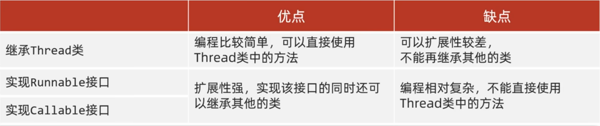
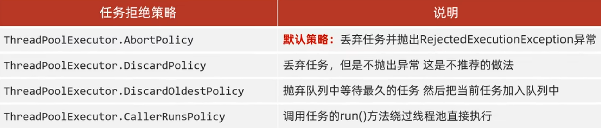

# Java 多线程

## 线程

充分利用程序的等待时间，让CPU在多个程序中进行切换，充分利用CPU，从而提高程序的运行效率。

并发（Concurrency）
定义：并发是指多个任务在同一时间段内交替执行，但在某一时刻只能有一个任务在执行。
特点：并发主要是通过时间片轮转的方式实现，看起来像同时执行。

并行（Parallelism）
定义：并行是指多个任务在同一时刻同时执行。
特点：并行需要多核处理器，多个任务真正地同时运行。

### 线程的生命周期

- 新建状态:
使用 `new` 关键字和 `Thread` 类或其子类建立一个线程对象后，该线程对象就处于新建状态。它保持这个状态直到程序 `start()` 这个线程。
- 就绪状态:
当线程对象调用了`start()`方法之后，该线程就进入就绪状态。就绪状态的线程处于就绪队列中，要等待JVM里线程调度器的调度。
- 运行状态:
如果就绪状态的线程获取 CPU 资源，就可以执行 `run()`，此时线程便处于运行状态。处于运行状态的线程最为复杂，它可以变为阻塞状态、就绪状态和死亡状态。
- 阻塞状态:
  如果一个线程执行了睡眠`sleep`、挂起`suspend`等方法，失去所占用资源之后，该线程就从运行状态进入阻塞状态。在睡眠时间已到或获得设备资源后可以重新进入就绪状态。可以分为三种：
  - 等待阻塞：运行状态中的线程执行 `wait()` 方法，使线程进入到等待阻塞状态。
  - 同步阻塞：线程在获取 `synchronized` 同步锁失败(因为同步锁被其他线程占用)。
  - 其他阻塞：通过调用线程的 `sleep()` 或 `join()` 发出了 I/O 请求时，线程就会进入到阻塞状态。当`sleep()` 状态超时，`join()` 等待线程终止或超时，或者 I/O 处理完毕，线程重新转入就绪状态。
- 死亡状态:
一个运行状态的线程完成任务或者其他终止条件发生时，该线程就切换到终止状态。

### 线程的优先级

每一个 Java 线程都有一个优先级，这样有助于操作系统确定线程的调度顺序。

Java 线程的优先级是一个整数，其取值范围是 `1 (Thread.MIN_PRIORITY ) - 10 (Thread.MAX_PRIORITY)`。

默认情况下，每一个线程都会分配一个优先级 `NORM_PRIORITY(5)`。

具有较高优先级的线程对程序更重要，并且应该在低优先级的线程之前分配处理器资源。但是，线程优先级不能保证线程执行的顺序，而且非常依赖于平台。

## 多线程的实现方式

### 继承Thread

1. 定义一个继承Thread的类，其中是要执行的任务
2. 重写run()方法
3. 创建子类的对象，并start()启动线程

```java{.line-numbers}
package org.xijuangu;

class MyThread extends Thread {     // 定义一个继承Thread的类，其中是要执行的任务
    @Override
    public void run(){              // 重写run()方法
        for(int i = 0; i < 100; i++){
            System.out.println(super.getName() + " is running");    // 此处不用super应该也行，只是表明这是父类Thread的方法。这里相当于在类内部调用类内的方法，不需要对象来调用
        }
    }
}

public class TestThread2 {
    public static void main(String[] args) {
        MyThread t1 = new MyThread();   // 可简单理解为创建任务对象
        MyThread t2 = new MyThread();

        t1.setName("Thread-1");     // 父类Thread中的setName方法
        t2.setName("Thread-2");

        t1.start();                 // start()才是启动线程
        t2.start();

        // 程序会随机在Thread-1与Thread-2中并发交替执行
    }
}
```

> 在Java中，含参构造方法不能被自动继承，因此上面继承了Thread类的`MyThread`不能调用父类Thread的含参构造方法: `MyThread t1 = new MyThread("Thread-1")`，因此想调用该含参构造方法需要在子类中重写。但无参构造方法可以被调用，是因为编译器会自动提供一个默认的无参构造方法：`public MyThread() { super(); }`，隐式调用父类的构造方法。注意此处是`super()`，而不是`super.Thread()`。

### 实现Runnable接口

1. 定义一个实现Runnable的类，表示要执行的任务
2. 重写run()方法
3. 创建自己类的对象
4. 创建一个Thread对象，并start()启动线程

```java{.line-numbers}
package org.xijuangu;

class MyRun implements Runnable {

    // 此处可以声明构造方法，以传入参数令不同线程执行不同功能

    @Override
    public void run() {
        Thread t = Thread.currentThread();  // 静态方法获取并引用到当前线程对象
        for (int i = 0; i < 100; i++) {
            System.out.println(t.getName() + ": Hello World");    // 这里getName()就不能算是调用类内方法了，需要对象来调用
        }
    }
}

public class TestThread {
    public static void main(String[] args) {
        MyRun myRun = new MyRun();  // 可理解为创建任务对象

        // 创建Thread对象并同时设置任务与线程名
        Thread t1 = new Thread(myRun, "Thread-1");
        Thread t2 = new Thread(myRun, "Thread-2");

        t1.start();
        t2.start();
    }
}
```

### 实现Callable接口

前两种方法都重写了run()方法，但它的返回值是void，因此我们无法获取多线程运行的结果。这里第三种方法就补充了这种需求。

1. 创建一个实现`Callable`接口的类
2. 重写 `call()` (是有返回值的，表示多线程运行的结果)
3. 创建`MyCallable`的对象(表示多线程要执行的任务)
4. 创建`FutureTask`的对象
5. 创建`Thread`类的对象并启动线程

> `FutureTask`：
> 异步任务：`FutureTask` 可以用来提交一个任务，任务会在另一个线程中执行，主线程可以继续执行其他任务，而不用等待子任务完成。
> 结果获取：任务执行完毕后，可以通过 `FutureTask` 的 `get()` 方法获取任务的执行结果。如果任务还没有完成，`get()` 方法会阻塞直到任务完成。
> 取消任务：可以通过 `cancel` 方法取消任务的执行。
> 任务状态检查：可以通过 `isDone` 方法检查任务是否完成，通过 `isCancelled` 方法检查任务是否被取消。

```java{.line-numbers}
package org.xijuangu;

import java.util.concurrent.Callable;
import java.util.concurrent.ExecutionException;
import java.util.concurrent.FutureTask;

class MyCallable implements Callable<Integer> {     // Callable类有泛型，类型为要返回的数据的类型
    @Override
    public Integer call() throws Exception {        // 注意返回类型
        int sum = 0;
        for(int i = 1; i <= 100; i++){
            sum += i;
        }
        return sum;
    }
}

public class TestThread3 {
    public static void main(String[] args) throws ExecutionException, InterruptedException {    // FutureTask的get()方法有抛出必须处理的异常
        MyCallable mc = new MyCallable();   // 创建任务对象
        FutureTask<Integer> ft = new FutureTask<>(mc);  // 创建FutureTask对象并设置任务
        new Thread(ft).start();             // 将FutureTask用以提交任务
        System.out.println(ft.get());       // FutureTask的get()方法获取call()返回的数据
    }
}
```

### 三种方式对比



### Thread常见的成员方法

|方法|说明|
|---|---|
|String getName()|返回此线程的名称，默认为Thread-X，X为从0开始的序号|
|void setName(String name)|设置线程名(构造方法中也可以同时设置)|
|static Thread currentThread()|获取当前线程的对象|
|static void sleep(long time)|令当前正在执行的线程暂停，单位为毫秒|
|setPriority(int newPriority)|设置线程的优先级|
|final int getPriority()|获取线程的优先级|
|final void setDaemon(boolean on)|设置为守护线程|
|public static void yield()|令当前线程让出资源，由运行状态转为就绪状态|
|public static void join()|线程插队|

> 1. JVM虚拟机启动后会自动开启多条线程，其中有一条线程名就是main，它会调用main方法并执行里面的代码。我们写的所有的代码其实都运行在main线程中。
> 因此当没有创建线程时去调用`currentThread()`就会返回main线程对象。
>
> 2. 当一个线程调用 `Thread.sleep(long millis)` 方法时，它会进入休眠状态。这个状态表示该线程在指定的时间内不会运行，并 ***让出CPU资源给其他线程*** ，其他线程可以抢占该线程的资源。休眠结束后，该线程会进入 ***就绪状态***。
> 该方法会抛出异常`InterruptedException`。注意在重写不能抛出该异常的方法中调用该方法时需要`try-catch`。
>
> 3. Java中的调度方式是抢占式调度，也即，每一个线程会随机地获得CPU的分配。优先级越高的线程抢占到的概率就越大，不是绝对的优先级高就一定先分配。
>
> 4. 守护线程通常用于执行后台任务或辅助性工作，例如垃圾收集、日志记录等，通常具有较低的优先级。当所有的非守护线程（即用户线程）都执行完毕后，JVM 会自动退出，此时所有仍在运行的守护线程也会被终止。守护线程不会再继续执行，即使它们尚未完成。
>
> 5. `yield()`方法可用于平衡几个线程的进行进度。例如，你可以在每个线程执行一轮循环后`yield`一下让出CPU，强制让该线程和其他线程一起重新抢夺，这样就可以减少同一线程在一段时间内一直占有CPU导致任务执行进度差距过大的问题。但是，虽然`yield`会让该线程让出CPU，但不代表CPU一定会选择别的线程继续执行，甚至很多情况下，CPU会倾向于继续执行原来的线程。
>
> 6. `t.join()`表示t线程在该代码所在的线程中插队占用，等待 t 线程执行完毕后该线程才能进入 ***就绪状态***，准备执行。

## 线程安全问题

CPU的执行权随时可能被其他线程抢走，当几个线程在短时间内同时开始执行(一个线程未执行完毕就被抢占，可能连续被抢占)时，就很可能会发生错误。

### 同步代码块

```java
// 锁对象，可以是任意对象，但必须是唯一且共享的，所以要static，最好还要final，保证锁对象的引用不能被修改
// 锁默认打开，有一个线程进去了，锁自动关闭；
// 同步代码块里面的代码全部执行完毕，线程出来，锁自动打开。
static final Object lock = new Object();  


// 下面为重写run方法内的公式
@Override
public void run(){
    while(true){               // 先写循环
        // 同步代码块，这部分代码同时只能有一个线程执行
        // 注意不能锁里面嵌套锁！可能导致死锁！
        synchronized(lock){    
            if(){ ... }        // 判断共享数据是否到了末尾
            else{ ... }        // 如果没到末尾，执行核心逻辑
        }
    }

}
```

**注意不能锁里面嵌套锁！可能导致死锁！**

```java{.line-numbers}
package org.xijuangu;

class MyThread5 extends Thread {
    static int counter = 100;
    static final Object lock = new Object();    // final是防止变量引用被改变引用到其他对象

    @Override
    public void run() {
        while(true){
            synchronized (lock) {       // 注意同步代码块要在while里面，如果在while外面的话，在只能有一个线程能进入while的情况下，第一个线程进入while后，其他线程都不能开始循环了，不能开始循环也就不能争夺CPU，因此也就只有第一个线程在真正执行
                if(counter == 0){
                    System.out.println(Thread.currentThread().getName() + ": sold out");
                    break;
                }
                else {
                    counter--;
                    System.out.println(Thread.currentThread().getName() + ": " + counter + " tickets left");
                }
                Thread.yield();
            }
        }
    }
}

public class ThreadSafe2 {
    public static void main(String[] args) {
        MyThread5 t1 = new MyThread5();
        MyThread5 t2 = new MyThread5();
        MyThread5 t3 = new MyThread5();

        t1.start();
        t2.start();
        t3.start();
    }
}
```

### 同步方法

将synchronized直接写在修饰符后面。同步方法会锁住方法里所有的代码，并且这里的锁对象不能自己指定。非静态的方法会被Java自动指定为this，即当前方法的调用者，静态方法会自动指定为当前类的字节码文件对象

```java{.line-numbers}
package org.xijuangu;

class MyRunnable implements Runnable {
    int count = 100;    // 不需要static，因为前面extends Thread需要static是因为可能会创建多个Thread对象
                        // 这里的MyRunnable只会创建一个对象，所以不需要static

    @Override
    public void run() {
        while(true){
            if (SellTickets()) break;
            Thread.yield();
        }

    }
    // 先写同步代码块，然后ctrl+alt+m直接将同步代码块提取成同步方法
    private synchronized boolean SellTickets() {
        if(count > 0){
            count--;
            System.out.println(Thread.currentThread().getName() + ": 剩余" + count);
        } else{
            System.out.println(Thread.currentThread().getName() + ": SOLD OUT!");
            return true;
        }
        return false;
    }
}

public class ThreadSafe3 {
    public static void main(String[] args) {
        MyRunnable mr = new MyRunnable();
        Thread t1 = new Thread(mr, "t1");
        Thread t2 = new Thread(mr, "t2");
        Thread t3 = new Thread(mr, "t3");

        t1.start();
        t2.start();
        t3.start();
    }
}
```

> 这里说回`StringBuffer`和`StringBuilder`的区别，`StringBuffer`中所有的方法都是`synchronized`的，`StringBuilder`中的方法都不是`synchronized`的，因此前者是线程安全的，在多线程中使用`StringBuffer`更安全，但效率会低一些，因此单线程还是更倾向于使用`StringBuilder`。

### Lock锁

虽然我们可以理解同步代码块和同步方法的锁对象问题，但是我们并没有直接看到在哪里加上了锁，在哪里释放了锁。为了更清晰的表达如何加锁和释放锁，JDK5以后提供了一个新的锁对象Lock
与传统的 synchronized 关键字相比，Lock 接口提供了更丰富的锁操作方法，能够更好地控制锁的获取和释放。

```java
// 手动上锁、手动释放锁：
void lock()     //获得锁
void unlock()   //释放锁
```

Lock是接口，不能直接实例化。Lock 接口的常用实现类是 ReentrantLock。ReentrantLock 是一种可重入的互斥锁，具有与 synchronized 相同的基本行为和语义，但提供了更强大的功能。

```java
lock()                  // 获取锁。如果锁已经被其他线程获取，则当前线程将等待。
unlock()                // 释放锁。
tryLock()               // 尝试获取锁，如果锁可用则立即获取锁并返回 true，否则返回 false。
tryLock(long timeout, TimeUnit unit)    // 在指定的时间内尝试获取锁。
lockInterruptibly()     // 获取锁，但可以在等待期间被中断。
```

```java{.line-numbers}
package org.xijuangu;

import java.util.concurrent.locks.Lock;
import java.util.concurrent.locks.ReentrantLock;

class MyThread6 extends Thread {
    static Lock lock = new ReentrantLock();
    static int counter = 100;

    @Override
    public void run() {
        while(true){
            try{
                lock.lock();        // 手动上锁
                if (counter == 0) {
                    System.out.println(Thread.currentThread().getName() + ": sold out");
                    break;
                } else {
                    counter--;
                    System.out.println(Thread.currentThread().getName() + ": " + counter + " tickets left");
                }
                Thread.yield();
            }finally {      // finally中的代码块无论如何一定会被执行，除非虚拟机关闭。需要和try一起使用
                lock.unlock();      // 手动解锁
            }
            
            //lock.unlock();        // 不能在这里解锁，详细见下

        }
    }
}

public class LockSafe {
    public static void main(String[] args) {
        MyThread6 t1 = new MyThread6();
        MyThread6 t2 = new MyThread6();
        MyThread6 t3 = new MyThread6();

        t1.start();
        t2.start();
        t3.start();
    }
}
```

> 上面23行为什么要用`finally`呢？
> 是因为如果不用`finally`，把`unlock`正常放在`while`代码块的最后的话，在最后一个`while`循环中`counter == 0`，这时会直接`break`跳出循环，就没有解锁了，而此时其他进程可能还在等待解锁进入同步代码块，就会造成"阻塞"，进程无法结束。

## 等待唤醒机制

上面所介绍的方法只能实现随机地执行线程，并不能控制几个进程按指定的规律顺序执行。

```java
void wait();        // 使用锁对象调用，使当前占用这把锁的线程等待，直到被其他线程唤醒

void notify();      // 使用锁对象随机唤醒单个线程(占用了这把锁之后wait在这把锁上的线程)

void notifyAll();   // 使用锁对象唤醒所有线程(占用了这把锁之后wait在这把锁上的线程)，一般用notifyAll()而不是notify()
```

## 阻塞队列

阻塞队列的继承结构：Iterable -- Collection -- Queue -- BlockingQueue，实现类有ArrayBlockingQueue和LinkedBlockingQueue，前者底层数据结构为数组，有界，后者底层为链表，无界，上限为Integer.MAX_VALUE
> 有Iterable，则说明可使用迭代器

```java{.line-numbers}
package org.xijuangu;

import java.util.concurrent.ArrayBlockingQueue;

class Cook extends Thread {
    ArrayBlockingQueue<String> queue;
    public Cook(ArrayBlockingQueue<String> queue) {
        this.queue = queue;
    }
    @Override
    public void run() {
        while(true){
            try{
                System.out.println("做了一碗面条");
                queue.put("面条");            // ArrayBlockingQueue类中的方法底层有同步锁，所以这里不要synchronized
            } catch (InterruptedException e) {
                throw new RuntimeException(e);
            }
        }
    }
}

class Foodie extends Thread {
    ArrayBlockingQueue<String> queue;
    public Foodie(ArrayBlockingQueue<String> queue) {
        this.queue = queue;
    }
    @Override
    public void run() {
        while(true){
            try {
                String food = queue.take();     // 同样无需synchronized
                System.out.println(food);
            } catch (InterruptedException e) {
                throw new RuntimeException(e);
            }
        }
    }
}

public class BlockingDemo {
    public static void main(String[] args) {
        ArrayBlockingQueue<String> queue = new ArrayBlockingQueue<>(3);
        Foodie foodie = new Foodie(queue);
        Cook cook = new Cook(queue);
        cook.start();
        foodie.start();

    }
}
```

## 线程池

前面的方法在创建线程后，线程一旦完成任务就会被销毁，不能被重复使用，如果需要新的线程就必须重新创建，很浪费资源。

如果能使用一个容器来存放运行完成的线程，下一次需要使用时再去该容器中取出，就能解决这个问题。这个容器就是线程池。

首先创建一个线程池，线程池最开始是空的，当需要线程来执行某任务时，就将该任务提交给线程池，此时就会创建一个线程来完成该任务。任务完成后，该线程会归还给线程池并储存，以备复用。如果在任务还未完成时就提交新任务，线程池会再创建新线程以供分配。线程池内可创建的线程数有限，并可自定义，超出数量的任务需要排队等待。

### 代码实现

1. 创建线程池
2. 提交任务
3. 所有任务执行完毕，关闭线程池(一般不关闭，因为在实际生产中，服务一般不会关闭)

#### 创建线程池

`public static ExecutorService newCachedThreadPool()`: 类`Executors`中的静态方法，创建一个没有上限的线程池(实际上限为`Integer.MAX_VALUE`，但到不了上限就会爆，所以可以视为无上限)
`public static ExecutorService newFixedThreadPool(int nThreads)`: 类`Executors`中的静态方法，创建有上限的线程池

```java
package org.xijuangu;
import java.util.concurrent.ExecutorService;
import java.util.concurrent.Executors;
class MyRunnable2 implements Runnable{     // 实现Runnable接口以创建任务
    public void run() {
        System.out.println(Thread.currentThread().getName());
    }
}
public class ThreadPoolDemo{
    public static void main(String[] args) {
        try (ExecutorService pool1 = Executors.newFixedThreadPool(3)) {     // 在try()内创建线程池pool1
            pool1.submit(new MyRunnable2());  // 提交任务给线程池pool1
            pool1.submit(new MyRunnable2());
            pool1.submit(new MyRunnable2());
            pool1.submit(new MyRunnable2());
            pool1.submit(new MyRunnable2());
            //pool1.shutdown();   // 因为自动关闭，不需要再shutdown
        }
    }
}
```

#### 自定义线程池

下面是ThreadPoolExecutor最完整的构造方法

```java
public ThreadPoolExecutor(
    int corePoolSize,       // 核心线程数。即使没有任务需要执行，核心线程也会一直存活，而根据需求新创建的临时线程可能被销毁。
    int maximumPoolSize,    // 最大线程数。线程池中允许的最大线程数。
    long keepAliveTime,     // 临时线程的最大空闲时间。当线程空闲时间超过这个时间时，它将被销毁。
    TimeUnit unit,          // 时间单位。指定keepAliveTime参数的时间单位。
    BlockingQueue<Runnable> workQueue,  // 任务队列。用于存放等待执行的任务。
    ThreadFactory threadFactory,        // 线程工厂。用于创建新线程的工厂。
    RejectedExecutionHandler handler    // 拒绝策略。当线程池和队列都满了，无法处理新任务时，如何处理被拒绝的任务。
)
```



上面的newCachedThreadPool()与newFixedThreadPool(int nThreads)底层都是调用了ThreadPoolExecutor的其他构造方法。

设有线程池的核心线程数为3，最大线程数为6，任务队列的长度为3。假设有十个任务要处理，那么前三个任务会先直接交给已经存在的核心线程处理，4、5、6号任务则进入任务队列等待，队列满后，为7、8、9号任务依次创建临时线程并分配，此时剩下的10号任务就会被执行拒绝策略。

```java
ThreadPoolExecutor pool = new ThreadPoolExecutor(
                    3,
                    6,
                    60,
                    TimeUnit.SECONDS,
                    new new ArrayBlockingQueue<>(3), //或LinkedBlockingQueue<>()，无长度限制
                    Executors.defaultThreadFactory(),
                    new ThreadPoolExecutor.AbortPolicy()
                );
pool.submit(new MyRunnable2());
```
