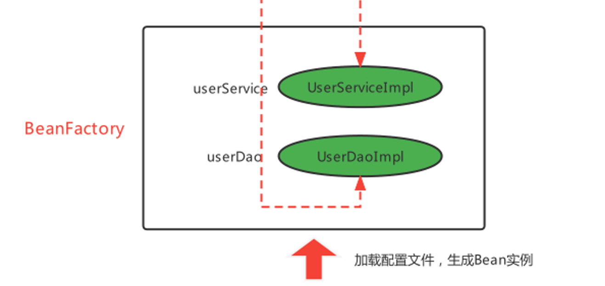

# 第一部分  IoC基础容器

## Javaweb开发及其解决方案

### 传统Javaweb开发困惑及解决方案

1. 层与层之间紧密耦合在一起，接口与具体实现紧密耦合在一起。如果我后面想切换某一个接口的实现，就必须修改多处源代码。
   - 解决方案：程序代码中不要手动new对象，第三方根据要求为程序员提供需要的Bean对象
  
    ```java
    UserDao userDao = new UserDaoImpl();    // 如果有多个Impl1、Impl2...用于多种实现方式，则每次切换实现方式都要修改此处的代码
    userDao.updateUserInfo(user);
    ```

2. 通用的事务功能与日志功能耦合在业务代码中
   - 事务功能：事务功能是指在一个需要对数据库进行操作的功能中，要确保一组操作要么全部成功，要么全部失败，以保持数据一致性和完整性。例如实现一个简单的银行转账功能，从账户A转账100元到账户B。这个操作涉及两个数据库操作：从账户A中扣除100元、向账户B中添加100元。这两个操作必须同时成功或者同时失败，否则会导致数据不一致。通过事务管理可以确保这一点。
  
        ```java
        @Service
        public class BankService {

            @Autowired
            private JdbcTemplate jdbcTemplate;

            @Transactional
            public void transfer(String fromAccount, String toAccount, double amount) {
                jdbcTemplate.update("UPDATE accounts SET balance = balance - ? WHERE account_number = ?", amount, fromAccount);
                jdbcTemplate.update("UPDATE accounts SET balance = balance + ? WHERE account_number = ?", amount, toAccount);
            }
        }
        ```

   - 日志功能：日志功能是记录应用程序运行时的信息，包括普通信息、警告、错误等，以便于调试和监控。假设你要记录一个方法调用的开始和结束时间，就可以使用日志功能来记录这些信息：

        ```java
        @Service
        public class LoggingService {
            private static final Logger logger = LoggerFactory.getLogger(LoggingService.class);

            public void performTask() {
                logger.info("Starting task...");
                logger.info("Task completed.");
            }
        }
        ```

   - 解决方案：程序代码中不要手动new对象，第三方根据要求为程序提供需要的 **Bean对象的代理对象**
   - Bean对象的代理对象：
     - 当Spring容器启动时，会扫描所有配置的bean并进行实例化。
     - 在bean实例化之后但在属性注入之前，Spring会通过BeanPostProcessor接口的实现类来检查该bean是否需要代理。
     - 如果需要代理，Spring会创建该bean的代理对象，并将代理对象注册到Spring容器中，替换原始的bean。代理对象可以说是升级版的bean对象，比普通的bean对象功能更强大一些。

## Ioc、DI和AOP思想的提出和框架概念

### IoC

Inversion of Control 控制反转，是将程序创建Bean的权利反转给第三方。  
例如：原来在程序中手动的去``new UserServiceImpl()``，手动的去``new UserDaoImpl()``，而根据IoC思想的指导，寻求一个第三方去创建``UserServiceImpl``对象和``UserDaoImpl``对象，这样程序与具体对象就失去的直接联系，降低了耦合性。

Q1：谁去充当第三方角色呢？

> 工厂设计模式，BeanFactory来充当第三方的角色，来产生Bean实例

Q2：BeanFactory怎么知道产生哪些Bean实例呢？

> 使用配置文件配置Bean的基本信息，BeanFactory根据配置文件来生产Bean实例

### DI

Dependency Injection 依赖注入，某个完整Bean需要依赖于其他Bean（或属性）的注入。

上面使用BeanFactory的方式已经实现的"控制反转"，将Bean的创建权交给了BeanFactory，如果我们想将UserDao的创建权也反转给BeanFactory，与此同时UserService内部还需要用到UserDao实例对象，那应该怎样操作呢？

1) 在程序中，通过BeanFactory获得UserService
2) 在程序中，通过BeanFactory获得UserDao
3) 在程序中，将UserDao设置给UserService

```java
public static void main(String[] args){
    //创建BeanFactory并读取、加载bean配置文件
    BeanFactory beanFactory = new BeanFactory("beans.xml");
    //获取Bean实例对象
    UserService userService = (UserService) beanFactory.getBean("userService");
    UserDao userDao = (UserDao) beanFactory.getBean("userDao");
    //此处在程序中将UserDao设置给UserService
    userService.setUserDao(userDao);
}
```

看下图可以发现，UserService存在于BeanFactory中，UserDao也存在于BeanFactory中，那么可以直接在BeanFactory内部进行结合。将UserDao在BeanFactory内部设置给UserService的过程叫做“注入”，而UserService需要依赖UserDao的注入才能正常工作，这个过程叫做“依赖注入”



Q3：
> IoC： Inversion of Control，控制反转，将Bean的创建权由原来程序反转给第三方  
DI：Dependency Injection，依赖注入，某个Bean的完整创建依赖于其他Bean（或普通参数）的注入  
IoC强调的是Bean创建权的反转，而DI强调的是Bean的依赖关系，认为不是一回事

### AOP

IoC和DI思想主要是解决前面我们的困惑一，困惑二还没有解决

```md
困惑一：层与层之间紧密耦合在了一起，接口与具体实现紧密耦合在了一起
解决思路：程序代码中不要手动new对象，第三方根据要求为程序提供需要的Bean对象

困惑二：通用的事务功能耦合在业务代码中，通用的日志功能耦合在业务代码中
解决思路：程序代码中不要手动new对象，第三方根据要求为程序提供需要的Bean对象的代理对象，代理对象内部动态结合业务和通用功能
```

困惑二的解决方案是，借助于IoC思想，将Bean的创建权反转给BeanFactory，而BeanFactory生产的Bean是目标Bean的代理对象，这样就可以在代理对象中对目标对象方法进行相应的增强。

AOP，Aspect Oriented Programming，面向切面编程，是对面向对象编程OOP的升华。OOP是纵向对一个事物的抽象，一个对象包括静态的属性信息，包括动态的方法信息等。而AOP是横向的对不同事物的抽象，属性与属性、方法与方法、对象与对象都可以组成一个切面，旨在提高软件模块化性。它主要关注的是横切关注点（cross-cutting concerns），这些关注点是指那些贯穿多个模块的功能，比如日志记录、安全性、事务管理等。传统的面向对象编程（Object-Oriented Programming，OOP）中，这些横切关注点往往会导致代码的重复和分散，难以维护。

举个例子：

在OOP中实现一个日志的功能：

```java
package com.example.service;

public class MyService {

    public void performOperation1() {
        System.out.println("Logging before performOperation1");
        System.out.println("Performing operation 1");
        System.out.println("Logging after performOperation1");
    }

    public void performOperation2() {
        System.out.println("Logging before performOperation2");
        System.out.println("Performing operation 2");
        System.out.println("Logging after performOperation2");
    }

    public void performOperation3() {
        System.out.println("Logging before performOperation3");
        System.out.println("Performing operation 3");
        System.out.println("Logging after performOperation3");
    }
}
```

可以看出OOP模式下的日志功能的实现造成了很大的代码冗余，且相关的代码非常分散，难以维护，不易扩展。而以下是AOP模式下的实现：

```java
@Aspect
@Component
public class LoggingAspect {        // 日志功能的实现

    @Before("execution(* com.example.service.*.*(..))")
    public void logBefore() {
        System.out.println("Logging before method execution");
    }

    @After("execution(* com.example.service.*.*(..))")
    public void logAfter() {
        System.out.println("Logging after method execution");
    }
}
```

```java
@Service
public class MyService {            // 服务类的实现

    public void performOperation1() {
        System.out.println("Performing operation 1");
    }

    public void performOperation2() {
        System.out.println("Performing operation 2");
    }

    public void performOperation3() {
        System.out.println("Performing operation 3");
    }
}
```

```java
public class AopTest {
    // 测试代码
    public static void main(String[] args) {        
        ApplicationContext context = new ClassPathXmlApplicationContext("applicationContext.xml");
        MyService myService = context.getBean(MyService.class);
        myService.performOperation1();
        myService.performOperation2();
        myService.performOperation3();
    }
}
```

差距一目了然。通过AOP的方式将日志功能与业务逻辑分离，使代码更加清晰、模块化、易于维护和扩展。

## Spring框架的诞生

框架的基本特点：

- 框架（Framework），是基于基础技术之上，从众多业务中抽取出的通用解决方案；
- 框架是一个半成品，使用框架规定的语法开发可以提高开发效率，可以用简单的代码就能完成复杂的基础
业务；
- 框架内部使用大量的设计模式、算法、底层代码操作技术，如反射、内省、xml解析、注解解析等；
- 框架一般都具备扩展性；
- 有了框架，我们可以将精力尽可能的投入在纯业务开发上而不用去费心技术实现以及一些辅助业务。

不同语言，不同领域都有属于自己的框架，使用框架开发是作为程序员的最基础的底线。Java语言中的框架，可以分为基础框架和服务框架：

- 基础框架：完成基本业务操作的框架，如MyBatis、***Spring***、SpringMVC、Struts2、Hibernate等
- 服务框架：特定领域的框架，一般还可以对外提供服务框架，如MQ、ES、Nacos

## BeanFactory版本的快速入门

程序代码 => 第三方 => 配置清单 => Bean类

实现步骤：

1. 导入Spring的jar包或Maven坐标；
2. 定义UserService接口及其实现类；
3. 创建beans.xml配置文件，将UserServiceImpl的信息配置到该xml中；
4. 编写测试代码，创建BeanFactory，加载配置文件，获取UserService实例对象。

### 导入Spring的jar包或Maven坐标

```xml
<!--Spring核心-->
<dependency>
<groupId>org.springframework</groupId>
<artifactId>spring-context</artifactId>
<version>5.3.7</version>
</dependency>
```

### 定义UserService接口及其UserServiceImpl实现类

```java
public interface UserService {}
```

```java
public class UserServiceImpl implements UserService {}
```

### 创建beans.xml配置文件，将UserServiceImpl的信息配置到该xml中

```xml
<bean id="userService" class="com.itheima.service.impl.UserServiceImpl"></bean>
```

> ``bean id``任意选择，自己定义

### 编写测试代码，创建BeanFactory，加载配置文件，获取UserService实例对象

```java
//创建BeanFactory工厂对象
DefaultListableBeanFactory beanFactory = new DefaultListableBeanFactory();

//创建读取器（xml文件），让BeanFactory工厂对象读取
XmlBeanDefinitionReader reader = new XmlBeanDefinitionReader(beanFactory);

//读取配置文件给工厂
reader.loadBeanDefinitions("beans.xml");

//根据bean id获取Bean实例对象
UserService userService = (UserService) beanFactory.getBean("userService");

//打印地址，测试是否成功创建对象
System.out.println(userService);
```
