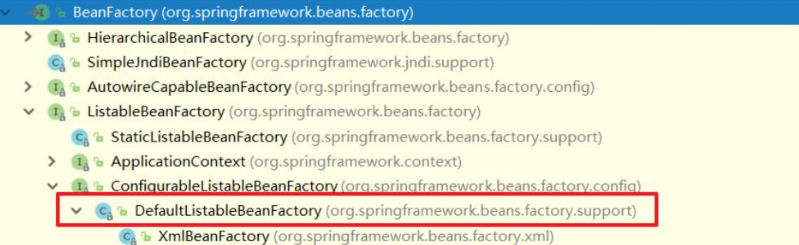
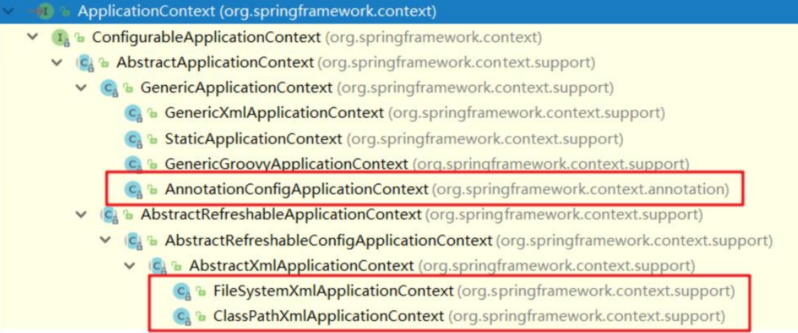
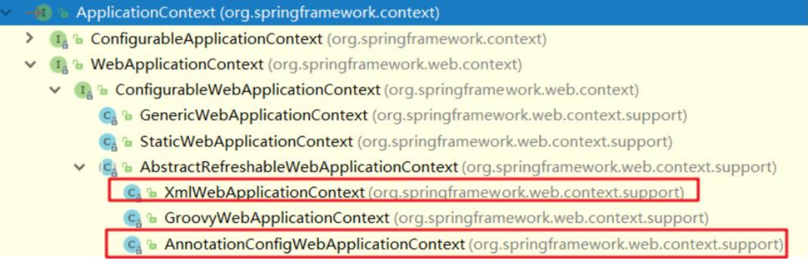
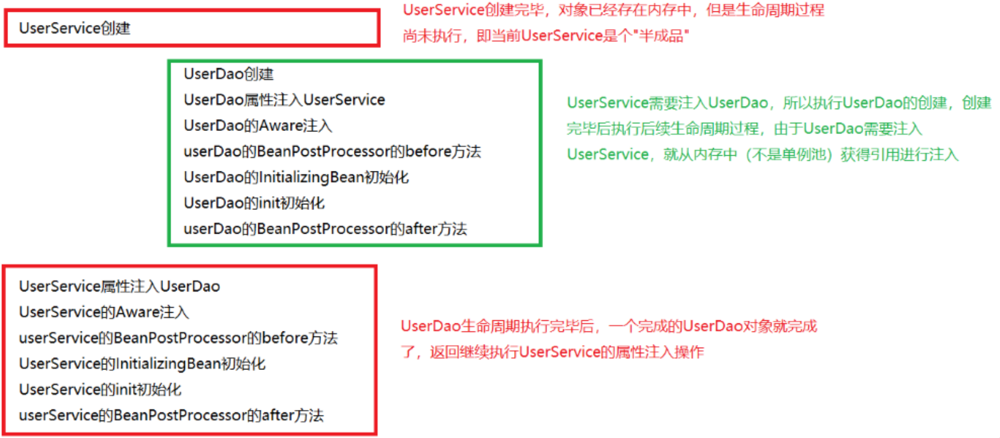
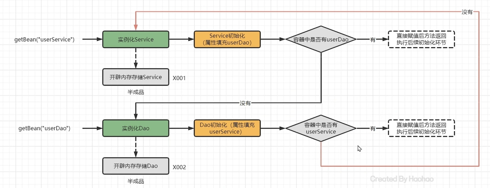
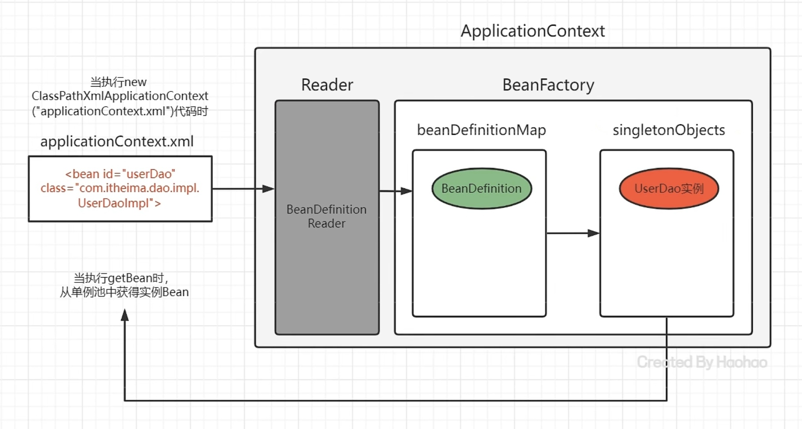
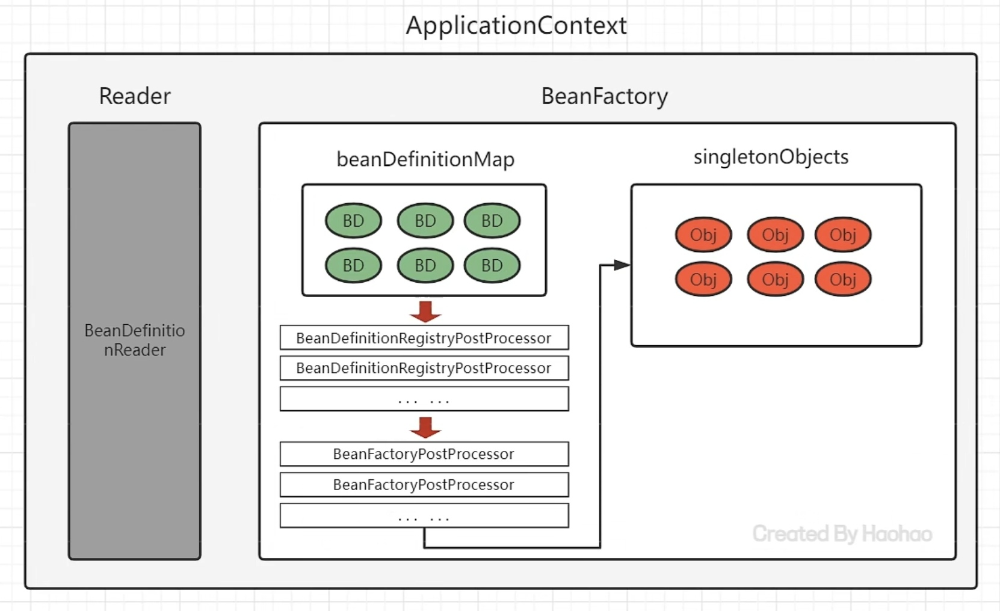
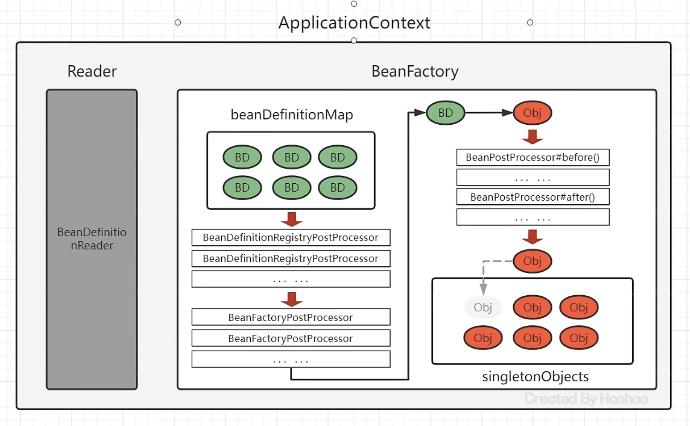
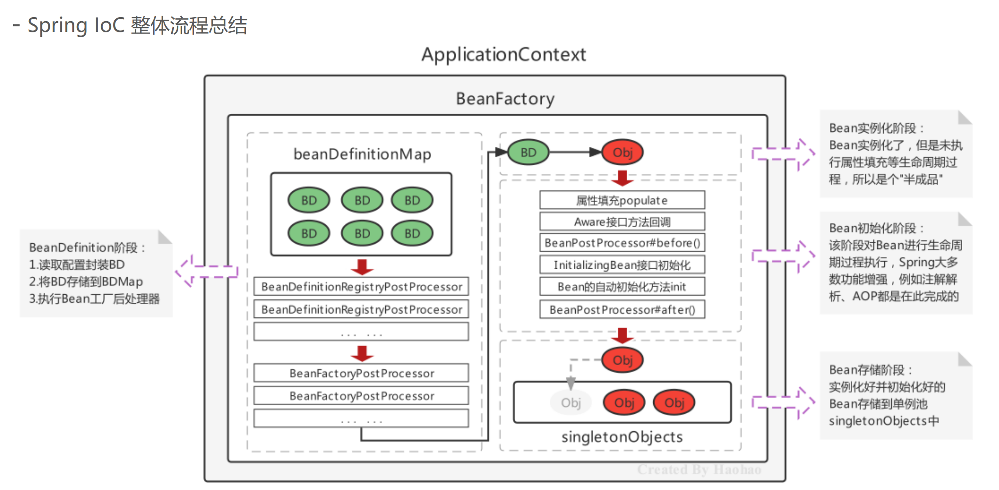

# 第一部分  IoC基础容器

## Javaweb开发及其解决方案

### 传统Javaweb开发困惑及解决方案

1. 层与层之间紧密耦合在一起，接口与具体实现紧密耦合在一起。如果我后面想切换某一个接口的实现，就必须修改多处源代码。
   - 解决方案：程序代码中不要手动new对象，第三方根据要求为程序员提供需要的Bean对象
  
    ```java
    UserDao userDao = new UserDaoImpl();    // 如果有多个Impl1、Impl2...用于多种实现方式，则每次切换实现方式都要修改此处的代码
    userDao.updateUserInfo(user);
    ```

2. 通用的事务功能与日志功能耦合在业务代码中
   - 事务功能：事务功能是指在一个需要对数据库进行操作的功能中，要确保一组操作要么全部成功，要么全部失败，以保持数据一致性和完整性。例如实现一个简单的银行转账功能，从账户A转账100元到账户B。这个操作涉及两个数据库操作：从账户A中扣除100元、向账户B中添加100元。这两个操作必须同时成功或者同时失败，否则会导致数据不一致。通过事务管理可以确保这一点。
  
        ```java
        @Service
        public class BankService {

            @Autowired
            private JdbcTemplate jdbcTemplate;

            @Transactional
            public void transfer(String fromAccount, String toAccount, double amount) {
                jdbcTemplate.update("UPDATE accounts SET balance = balance - ? WHERE account_number = ?", amount, fromAccount);
                jdbcTemplate.update("UPDATE accounts SET balance = balance + ? WHERE account_number = ?", amount, toAccount);
            }
        }
        ```

   - 日志功能：日志功能是记录应用程序运行时的信息，包括普通信息、警告、错误等，以便于调试和监控。假设你要记录一个方法调用的开始和结束时间，就可以使用日志功能来记录这些信息：

        ```java
        @Service
        public class LoggingService {
            private static final Logger logger = LoggerFactory.getLogger(LoggingService.class);

            public void performTask() {
                logger.info("Starting task...");
                logger.info("Task completed.");
            }
        }
        ```

   - 解决方案：程序代码中不要手动new对象，第三方根据要求为程序提供需要的 **Bean对象的代理对象**
   - Bean对象的代理对象：
     - 当Spring容器启动时，会扫描所有配置的bean并进行实例化。
     - 在bean实例化之后但在属性注入之前，Spring会通过BeanPostProcessor接口的实现类来检查该bean是否需要代理。
     - 如果需要代理，Spring会创建该bean的代理对象，并将代理对象注册到Spring容器中，替换原始的bean。代理对象可以说是升级版的bean对象，比普通的bean对象功能更强大一些。

## Ioc、DI和AOP思想的提出和框架概念

### IoC

Inversion of Control 控制反转，是将程序创建Bean的权利反转给第三方。  
例如：原来在程序中手动的去``new UserServiceImpl()``，手动的去``new UserDaoImpl()``，而根据IoC思想的指导，寻求一个第三方去创建``UserServiceImpl``对象和``UserDaoImpl``对象，这样程序与具体对象就失去的直接联系，降低了耦合性。

Q1：谁去充当第三方角色呢？

> 工厂设计模式，BeanFactory来充当第三方的角色，来产生Bean实例

Q2：BeanFactory怎么知道产生哪些Bean实例呢？

> 使用配置文件配置Bean的基本信息，BeanFactory根据配置文件来生产Bean实例

### DI

Dependency Injection 依赖注入，某个完整Bean需要依赖于其他Bean（或属性）的注入。

上面使用BeanFactory的方式已经实现的"控制反转"，将Bean的创建权交给了BeanFactory，如果我们想将UserDao的创建权也反转给BeanFactory，与此同时UserService内部还需要用到UserDao实例对象，那应该怎样操作呢？

1) 在程序中，通过BeanFactory获得UserService
2) 在程序中，通过BeanFactory获得UserDao
3) 在程序中，将UserDao设置给UserService

```java
public static void main(String[] args){
    //创建BeanFactory并读取、加载bean配置文件
    BeanFactory beanFactory = new BeanFactory("beans.xml");
    //获取Bean实例对象
    UserService userService = (UserService) beanFactory.getBean("userService");
    UserDao userDao = (UserDao) beanFactory.getBean("userDao");
    //此处在程序中将UserDao设置给UserService
    userService.setUserDao(userDao);
}
```

<h4 id="BeanFactory内部注入">
    BeanFactory内部注入
</h4>

看下图可以发现，UserService存在于BeanFactory中，UserDao也存在于BeanFactory中，那么可以直接在BeanFactory内部进行结合。将UserDao在BeanFactory内部设置给UserService的过程叫做“注入”，而UserService需要依赖UserDao的注入才能正常工作，这个过程叫做“依赖注入”


Q3：IoC与DI之间的区别是什么？（面试真题）
> IoC： Inversion of Control，控制反转，将Bean的创建权由原来程序反转给第三方  
DI：Dependency Injection，依赖注入，某个Bean的完整创建依赖于其他Bean（或普通参数）的注入  
IoC强调的是Bean创建权的反转，而DI强调的是Bean的依赖关系，认为不是一回事

### AOP

IoC和DI思想主要是解决前面我们的困惑一，困惑二还没有解决

```md
困惑一：层与层之间紧密耦合在了一起，接口与具体实现紧密耦合在了一起
解决思路：程序代码中不要手动new对象，第三方根据要求为程序提供需要的Bean对象

困惑二：通用的事务功能耦合在业务代码中，通用的日志功能耦合在业务代码中
解决思路：程序代码中不要手动new对象，第三方根据要求为程序提供需要的Bean对象的代理对象，代理对象内部动态结合业务和通用功能
```

困惑二的解决方案是，借助于IoC思想，将Bean的创建权反转给BeanFactory，而BeanFactory生产的Bean是目标Bean的代理对象，这样就可以在代理对象中对目标对象方法进行相应的增强。

AOP，Aspect Oriented Programming，面向切面编程，是对面向对象编程OOP的升华。OOP是纵向对一个事物的抽象，一个对象包括静态的属性信息，包括动态的方法信息等。而AOP是横向的对不同事物的抽象，属性与属性、方法与方法、对象与对象都可以组成一个切面，旨在提高软件模块化性。它主要关注的是横切关注点（cross-cutting concerns），这些关注点是指那些贯穿多个模块的功能，比如日志记录、安全性、事务管理等。传统的面向对象编程（Object-Oriented Programming，OOP）中，这些横切关注点往往会导致代码的重复和分散，难以维护。

举个例子：

在OOP中实现一个日志的功能：

```java
package com.example.service;

public class MyService {

    public void performOperation1() {
        System.out.println("Logging before performOperation1");
        System.out.println("Performing operation 1");
        System.out.println("Logging after performOperation1");
    }

    public void performOperation2() {
        System.out.println("Logging before performOperation2");
        System.out.println("Performing operation 2");
        System.out.println("Logging after performOperation2");
    }

    public void performOperation3() {
        System.out.println("Logging before performOperation3");
        System.out.println("Performing operation 3");
        System.out.println("Logging after performOperation3");
    }
}
```

可以看出OOP模式下的日志功能的实现造成了很大的代码冗余，且相关的代码非常分散，难以维护，不易扩展。而以下是AOP模式下的实现：

```java
@Aspect
@Component
public class LoggingAspect {        // 日志功能的实现

    @Before("execution(* com.example.service.*.*(..))")
    public void logBefore() {
        System.out.println("Logging before method execution");
    }

    @After("execution(* com.example.service.*.*(..))")
    public void logAfter() {
        System.out.println("Logging after method execution");
    }
}
```

```java
@Service
public class MyService {            // 服务类的实现

    public void performOperation1() {
        System.out.println("Performing operation 1");
    }

    public void performOperation2() {
        System.out.println("Performing operation 2");
    }

    public void performOperation3() {
        System.out.println("Performing operation 3");
    }
}
```

```java
public class AopTest {
    // 测试代码
    public static void main(String[] args) {        
        ApplicationContext context = new ClassPathXmlApplicationContext("applicationContext.xml");
        MyService myService = context.getBean(MyService.class);
        myService.performOperation1();
        myService.performOperation2();
        myService.performOperation3();
    }
}
```

差距一目了然。通过AOP的方式将日志功能与业务逻辑分离，使代码更加清晰、模块化、易于维护和扩展。

## Spring框架的诞生

框架的基本特点：

- 框架（Framework），是基于基础技术之上，从众多业务中抽取出的通用解决方案；
- 框架是一个半成品，使用框架规定的语法开发可以提高开发效率，可以用简单的代码就能完成复杂的基础
业务；
- 框架内部使用大量的设计模式、算法、底层代码操作技术，如反射、内省、xml解析、注解解析等；
- 框架一般都具备扩展性；
- 有了框架，我们可以将精力尽可能的投入在纯业务开发上而不用去费心技术实现以及一些辅助业务。

不同语言，不同领域都有属于自己的框架，使用框架开发是作为程序员的最基础的底线。Java语言中的框架，可以分为基础框架和服务框架：

- 基础框架：完成基本业务操作的框架，如MyBatis、***Spring***、SpringMVC、Struts2、Hibernate等
- 服务框架：特定领域的框架，一般还可以对外提供服务框架，如MQ、ES、Nacos

## BeanFactory版本的快速入门

程序代码 => 第三方 => 配置清单 => Bean类

实现步骤：

1. 导入Spring的jar包或Maven坐标；
2. 定义UserService接口及其实现类；
3. 创建beans.xml配置文件，将UserServiceImpl的信息配置到该xml中；
4. 编写测试代码，创建BeanFactory，加载配置文件，获取UserService实例对象。

### 导入Spring的jar包或Maven坐标

```xml
<!--Spring核心-->
<dependency>
<groupId>org.springframework</groupId>
<artifactId>spring-context</artifactId>
<version>5.3.7</version>
</dependency>
```

### 定义UserService接口及其UserServiceImpl实现类

```java
public interface UserService {}
```

```java
public class UserServiceImpl implements UserService {}
```

### 创建beans.xml配置文件，将UserServiceImpl的信息配置到该xml中

```xml
<bean id="userService" class="com.itheima.service.impl.UserServiceImpl"></bean>
```

> ``bean id``任意选择，自己定义

### 编写测试代码，创建BeanFactory，加载配置文件，获取UserService实例对象

```java
//创建BeanFactory工厂对象
DefaultListableBeanFactory beanFactory = new DefaultListableBeanFactory();

//创建读取器（xml文件），让BeanFactory工厂对象读取
XmlBeanDefinitionReader reader = new XmlBeanDefinitionReader(beanFactory);

//读取配置文件给工厂
reader.loadBeanDefinitions("beans.xml");

//根据bean id获取Bean实例对象
UserService userService = (UserService) beanFactory.getBean("userService");

//打印地址，测试是否成功创建对象
System.out.println(userService);
```

### 注入

当我们在一个类中使用其他类的对象时(例如，在UserService中使用UserDao)，UserService中就必然需要维护UserDao，比如说设置一个setDao方法，把UserDao对象给set进去。但是上面我们提到过，使用DI思想可以直接在BeanFactory内部，将UserDao注入UserService

> [点击跳转到"BeanFactory内部注入"](#BeanFactory内部注入)

实现举例：

1. 定义UserDao接口与UserDaoImpl实现类

    ```java
    public interface UserDao {}
    ```

    ```java
    public class UserDaoImpl implements UserDao {}
    ```

2. 修改UserServiceImpl代码，添加一个setUserDao(UserDao userDao)用于接收注入的对象

   ```java
    public class UserServiceImpl implements UserService {
        private UserDao userDao;

        public void setUserDao(UserDao userDao) {
        System.out.println("BeanFactory自动调用该方法" + userDao);
        this.userDao = userDao;
        }
    }
   ```

3. 定义UserDao接口及其UserDaoImpl实现类

    ```xml
    <bean id="userService" class="com.itheima.service.impl.UserServiceImpl">
    <property name="userDao" ref="userDao"></property>
    <!--property name是上面UserService中setUserDao方法后面的"userDao"，首字母要小写。property ref是引用，在当前容器中找到对应的bean，也就是下面的id为userDao的bean.
    -->
    <!--把当前容器中找到的名为userDao的bean设置给UserServiceImpl中的名字为setUserDao的方法。-->
    <!--命名与规则是约定好的，不可随意修改-->
    </bean>

    <bean id="userDao" class="com.itheima.dao.impl.UserDaoImpl"></bean>
    ```

4. 编写测试代码，创建BeanFactory，加载配置文件，获取UserService实例对象

    ```java
    DefaultListableBeanFactory beanFactory = new DefaultListableBeanFactory();
    XmlBeanDefinitionReader reader = new XmlBeanDefinitionReader(beanFactory);
    reader.loadBeanDefinitions("beans.xml");

    UserService userService = (UserService) beanFactory.getBean("userService");
    ```

## ApplicationContext快速入门

ApplicationContext 称为Spring容器，内部封装了BeanFactory，比BeanFactory功能更丰富更强大，使用 ApplicationContext 进行开发时，xml配置文件的名称习惯写成applicationContext.xml

```java
//创建ApplicationContext,加载配置文件，实例化容器
ApplicationContext applicationContext = 
new ClassPathxmlApplicationContext("applicationContext.xml");
//根据beanName获得容器中的Bean实例
UserService userService = (UserService) applicationContext.getBean("userService");
System.out.println(userService);
```

### ApplicationContext与BeanFactory的关系

1. BeanFactory是Spring的早期接口，称为Spring的Bean工厂，ApplicationContext是后期更高级接口，称之为Spring 容器；
2. ApplicationContext在BeanFactory基础上对功能进行了扩展，例如：监听功能、国际化功能等。BeanFactory的API更偏向底层，ApplicationContext的API大多数是对这些底层API的封装；
3. Bean创建的主要逻辑和功能都被封装在BeanFactory中，ApplicationContext不仅继承了BeanFactory，而且
ApplicationContext内部还维护着BeanFactory的引用，所以，ApplicationContext与BeanFactory既有继承关系，又有融合关系。
4. Bean的初始化时机不同，原始BeanFactory是在首次调用getBean时才进行Bean的创建，而ApplicationContext则是配置文件加载，容器一创建就将Bean都实例化并初始化好。

### BeanFactory的继承体系

BeanFactory是核心接口，项目运行过程中肯定有具体实现参与，这个具体实现就是DefaultListableBeanFactory，而ApplicationContext内部维护的Beanfactory的实现类也是它。



### ApplicationContext的继承体系

- 只在Spring基础环境下，即只导入spring-context坐标时，此时ApplicationContext的继承体系

    

    |实现类|功能描述|
    |---|---|
    |ClassPathXmlApplicationContext |加载类路径下的xml配置的ApplicationContext|
    |FileSystemXmlApplicationContext |加载磁盘路径下的xml配置的ApplicationContext|
    |AnnotationConfigApplicationContext |加载**注解**配置类的ApplicationContext|

- 如果Spring基础环境中加入了其他组件解决方案，如web层解决方案，即导入spring-web坐标，此时ApplicationContext的继承体系

    ```xml
    <dependency>
    <groupId>org.springframework</groupId>
    <artifactId>spring-web</artifactId>
    <version>5.3.7</version>
    </dependency>
    ```

    

    |实现类|功能描述|
    |---|---|
    |XmlWebApplicationContext |web环境下，加载类路径下的xml配置的ApplicationContext|
    |AnnotationConfigWebApplicationContext |web环境下，加载注解配置类的ApplicationContext|

## 基于xml的Spring应用

### Bean的常用配置一览

|序号|xml配置方式|功能描述|
|---|---|---|
|1|`<bean id="" class="">` |Bean的id和全限定名配置|
|2|`<bean name="">` |通过name设置Bean的别名(id的别名)，通过别名也能直接获取到Bean实例|
|3|`<bean scope="">` |Bean的作用范围，BeanFactory作为容器时取值singleton和prototype|
|4|`<bean lazy-init="">` |Bean的实例化时机，是否延迟加载。BeanFactory作为容器时无效|
|5|`<bean init-method="">` |Bean实例化后自动执行的初始化方法，method指定方法名|
|6|`<bean destroy-method="">` |Bean实例销毁前的方法，method指定方法名|
|7|`<bean autowire="byType">` |设置自动注入模式，常用的有按照类型byType，按照名字byName|
|8|`<bean factory-bean="" factory-method=""/>` |指定哪个工厂Bean的哪个方法完成Bean的创建|

### Bean的基础配置

```xml
<bean id="userService" class="com.itheima.service.impl.UserServiceImpl">
    <property name="userDao" ref="userDao"></property>
</bean>

<bean id="userDao" class="com.itheima.dao.impl.UserDaoImpl"></bean>
```

- id为**配置文件中**唯一标识符，不可重复，但在容器内会把bean对象的id转化为beanName进行存储。如果不配置id，则beanName会默认设置为**全限定名**存储在容器中
  > 全限定名：形如`com.itheima.service.impl.UserServiceImpl`
- `getBean()`方法中的参数为beanName

### Bean的别名

可以为当前Bean指定多个别名，别名在容器外单独存储，在aliasMap中分别指向对应的beanName。根据别名也可以获得Bean对象：

```xml
<bean id="userDao" name="aaa,bbb" class="com.itheima.dao.impl.UserDaoImpl"/>
```

此时多个名称都可以获得UserDaoImpl实例对象

```java
applicationContext.getBean("userDao");
applicationContext.getBean("aaa");
applicationContext.getBean("bbb");
```

若不配置id，只配置别名name，则默认选择第一个别名作为beanName

```xml
<bean name="aaa,bbb" class="com.itheima.dao.impl.UserDaoImpl"/>
<!--此时aaa默认为beanName-->
```

### Bean的作用范围

默认情况下，**基础的**Spring环境Bean的作用范围有两个：singleton和prototype：`<bean scope="prototype">`

- singleton：单例，默认值，Spring容器创建的时候，就会进行Bean的实例化，并存储到容器内部的单例池中，每次getBean时都是从单例池中获取 ***同一个*** Bean实例；
- prototype：原型，Spring容器初始化时不会创建Bean实例，当调用getBean时才会实例化Bean，每次getBean都会创建一个新的Bean实例，用完就销毁。

### Bean的延迟加载

***在ApplicationContext中*** ，当lazy-init设置为true时为延迟加载，也即，当Spring容器创建时，不会立即创建Bean实例，而是等待调用`getBean()`时再创建并存入单例池中，后续再使用该Bean时将直接从单例池中获取，本质上该Bean还是单例的。

在BeanFactory中无效，因为它本来就是在调用时再创建的，而ApplicationContext默认在创建容器时就创建Bean实例。

```xml
<bean id="userDao" class="com.itheima.dao.impl.UserDaoImpl" lazy-init="true"/>
```

### Bean的初始化和销毁方法配置

Bean在被实例化后，可以执行指定的初始化方法完成一些初始化的操作，Bean在销毁之前也可以执行指定的销毁方法完成一些操作。

```xml
<bean id="userDao" class="com.itheima.dao.impl.UserDaoImpl" init-method="init" destroy-method="destroy"/>
```

```java {.line-numbers}
public class UserDaoImpl implements UserDao {
    public UserDaoImpl() { 
        System.out.println("UserDaoImpl创建了..."); 
    }
    public void init(){ 
        System.out.println("初始化方法..."); 
    }
    public void destroy(){ 
        System.out.println("销毁方法..."); 
    }
}
```

> 程序在执行完成后，需要显式地关闭容器才会在销毁bean的同时调用销毁方法。如果正常地结束进程或杀死进程，容器和bean也会被销毁，只是不会调用销毁方法，因为容器还没有来得及调用它们，进程就结束了。
>
> `ApplicationContext`不提供关闭容器的方法，但它的实现类`ClassPathXmlApplicationContext`和`AnnotationConfigApplicationContext`提供了`close()`方法。

扩展：除此之外，我们还可以通过实现 InitializingBean 接口，完成一些Bean的初始化操作，如下：

```java {.line-numbers}
public class UserDaoImpl implements UserDao, InitializingBean {
    public UserDaoImpl() {
        System.out.println("UserDaoImpl创建了...");
    }
    public void init(){
        System.out.println("初始化方法...");
    }
    public void destroy(){
        System.out.println("销毁方法...");
    }

    //执行时机早于init-method配置的方法
    @Override
    public void afterPropertiesSet() throws Exception {
        System.out.println("InitializingBean..."); 
    }
}
```

### Bean的实例化配置

Spring的实例化方式主要如下两种：

- 构造方式实例化：底层通过构造方法对Bean进行实例化
- 工厂方式实例化：底层通过调用自定义的工厂方法对Bean进行实例化

#### 构造方式实例化

构造方式实例化Bean又分为无参构造方法实例化和有参构造方法实例化，Spring中配置的`<bean>`几乎都是无参构造该方式，此处不再赘述。下面介绍有参构造方法实例化Bean

```java
public UserDaoImpl(){}
public UserDaoImpl(String name, int age){}
```

有参构造在实例化Bean时，需要参数的注入，通过`<constructor-arg>`标签，嵌入在`<bean>`标签内部提供构造参数，如下：

```xml
<bean id="userDao" class="com.itheima.dao.impl.UserDaoImpl">
<constructor-arg name="name" value="xijuangu"/>
<constructor-arg name="age" value="21"/>
</bean>
```

#### 工厂方式实例化

工厂方式实例化Bean又分为以下三种：

- 静态工厂方法实例化Bean
- 实例工厂方法实例化Bean
- 实现FactoryBean规范延迟实例化Bean

静态工厂方法不需要先创建工厂对象，而是直接调用**自定义的**工厂内部的静态方法来创建所需的对象。 ~~实例工厂方法中，工厂内部的方法是非静态的，实需要先创建工厂对象，然后通过该对象来调用工厂方法。~~

> 自定义的工厂类：实现相对简单，通常只是一个普通的类，其中包含创建其他对象的方法（静态或非静态）。

##### 静态工厂方法实例化Bean

对工厂类的配置和普通bean一样

```xml
<!-- 
1.静态工厂(不需要创建工厂本身)factory 
2.factory-method 指定哪个方法是工厂方法
3.class：指定静态工厂全类名-->
<bean id="userDao" class="com.itheima.factory.UserDaoFactoryBean" factory-method="getUserDao">
<!-- 为方法指定参数-->
<constructor-arg name="name" value="xijuangu"/>
</bean>
```

```java
//工厂类
public class UserDaoFactoryBean {
    //静态工厂方法
    public static UserDao getUserDao(String name){
        //可以在此编写一些其他逻辑代码
        return new UserDaoImpl();
    }
}
```

```java
ApplicationContext applicationContext =
new ClassPathxmlApplicationContext("applicationContext.xml");
Object userDao = applicationContext.getBean("userDao");
System.out.println(userDao);
```

原先是Spring容器通过全限定名反射创建对象放到容器中：  
`<bean id="userDao1" class="com.itheima.factory.UserDaoFactoryBean"/>`，返回的对象类型为`UserDaoFactoryBean`
而现在是Spring容器调用类的静态方法，将返回的对象存储到容器中：
`<bean id="userDao1" class="com.itheima.factory.UserDaoFactoryBean" factory-method="userDao"/>`，返回的对象类型为静态方法`userDao`的返回值类型`UserDaoImpl`
用这种方式创建Bean对象不仅能灵活选择想要创建的对象类型，也能在创建对象前后进行其他业务逻辑操作，这个操作将与创建该对象的操作绑死。原本的方式则做不到这一点。  
另外，有些工具包会通过静态工厂方式创建bean，也即，在方法中创建bean，这种bean也可以通过这种方法交由Spring管理。

##### 实例工厂方法实例化Bean

~~静态工厂方法不需要先创建工厂对象，而是直接调用**自定义的**工厂内部的静态方法来创建所需的对象。~~ 实例工厂方法中，工厂内部的方法是非静态的，需要先创建工厂对象，然后通过该对象来调用工厂方法。
所以要先配置工厂对象，然后配置工厂对象中的方法

```xml
<!-- 配置实例工厂Bean -->
<bean id="userDaoFactoryBean2" class="com.itheima.factory.UserDaoFactoryBean2"/>
<!-- 配置实例工厂Bean的哪个方法作为工厂方法 -->
<bean id="userDao" factory-bean="userDaoFactoryBean2" factory-method="getUserDao">
<constructor-arg name="name" value="xijuangu"/>
</bean>
```

这样配置会先自动创建一个工厂类，然后调用该工厂类的方法。
用这种方式创建Bean对象不仅能灵活选择想要创建的对象类型，也能在创建对象前后进行其他业务逻辑操作，这个操作将与创建该对象的操作绑死。原本的方式则做不到这一点。  
另外，有些工具包会通过动态工厂方式创建bean，也即，在方法中创建bean，这种bean也可以通过这种方法交由Spring管理。

### Bean的生命周期

Spring Bean的生命周期是从 Bean 实例化之后，即通过 **反射** 创建出对象之后，到Bean成为一个完整对象，最终存储到单例池中，这个过程被称为Spring Bean的生命周期。Spring Bean的生命周期大体上分为三个阶段：

- Bean的实例化阶段：Spring框架会取出BeanDefinition的信息进行判断当前Bean的范围是否是singleton的，是否是延迟加载的，是否是FactoryBean等，最终将一个普通的singleton的Bean通过反射进行实例化；
- Bean的初始化阶段 **(重点)**：Bean创建之后还仅仅是个"半成品"，还需要对Bean实例的属性进行填充、执行一些Aware接口方法、执行BeanPostProcessor方法、执行InitializingBean接口的初始化方法、执行自定义初始化init方法等。该阶段是Spring **最具技术含量和复杂度的阶段**，Aop增强功能，后面要学习的Spring的注解功能等、spring高频面试题Bean的循环引用问题都是在这个阶段体现的；
- Bean的完成阶段：经过初始化阶段，Bean就成为了一个完整的Spring Bean，被存储到单例池singletonObjects的Map中去了，即完成了Spring Bean的整个生命周期。

> 反射：
> 反射是一种在运行时（而不是编译时）动态获取类的信息并操作类和对象的机制。通过反射，程序可以在运行时检查类的属性、方法、构造函数等信息，并对其进行操作。
> 动态获取类信息：可以在运行时获取类的结构信息，如类名、方法、属性等。
> 动态调用方法：可以在运行时调用对象的方法，而不需要在编译时确定。
> 动态创建对象：可以在运行时创建对象，而不需要在编译时确定要创建的类。
> 动态修改属性：可以在运行时修改对象的属性值，即使这些属性是私有的。
>
> 获取类的信息：
>
> ```java
> // 通过类的全限定名获取 Class 对象
> Class<?> clazz = Class.forName("com.example.ExampleBean");
>
> // 通过类的实例获取 Class 对象
> ExampleBean example = new ExampleBean();
> Class<?> clazz2 = example.getClass();
>
> // 通过类名获取 Class 对象
> Class<?> clazz3 = ExampleBean.class;
>
> // 获取类的名称
> String className = clazz.getName();
> System.out.println("Class Name: " + className);
> ```
>
> 获取构造方法：
>
> ```java
> //使用getDeclaredConstructor()获取一个类中的所有构造函数
> Constructor[] constructors = obj.getDeclaredConstructors();
>
> for(Constructor c : constructors) {
>   //获取构造函数的名称
>   System.out.println("构造函数名称： " + c.getName());
>
>   //获取构造函数的访问修饰符
>   int modifier = c.getModifiers();
>   System.out.println("修饰符： " + Modifier.toString(modifier));
>
>   //获取构造函数中的参数数量
>   System.out.println("参数个数： " + c.getParameterCount());
> }
> ```
>
> 获取与调用类的方法
>
> ```java
>  // 获取所有方法
>  Method[] methods = clazz.getDeclaredMethods();
>  for (Method method : methods) {
>      System.out.println("Method Name: " + method.getName());
>  }
>
>   // 获取特定方法并调用
>   Method setMethod = clazz.getDeclaredMethod("setPropertyName", String.class);
>   setMethod.invoke(instance, "new value");
>   System.out.println("Updated Instance: " + instance);
>
>   // 获取特定方法并调用（包含返回值）
>   Method getMethod = clazz.getDeclaredMethod("getPropertyName");
>   Object returnValue = getMethod.invoke(instance);
>   System.out.println("Return Value: " + returnValue);
>   ```
>
> 获取与修改属性
>
> ```java
>    // 获取所有属性
>    Field[] fields = clazz.getDeclaredFields();
>    for (Field field : fields) {
>        System.out.println("Field Name: " + field.getName());
>    }
>
>    // 获取特定属性并修改
>    Field field = clazz.getDeclaredField("propertyName");
>    field.setAccessible(true); // 允许访问私有属性
>    field.set(instance, "new value");
>    System.out.println("Updated Instance: " + instance);
>
>    // 获取属性值
>    Object fieldValue = field.get(instance);
>    System.out.println("Field Value: " + fieldValue);
> ```
>
### bean的初始化过程

- bean实例的属性填充 *
- Bean实例的属性填充
- Aware接口属性注入
- BeanPostProcessor的before()方法回调
- InitializingBean接口的初始化方法回调
- 自定义初始化方法init回调
- BeanPostProcessor的after()方法回调

#### bean实例的属性填充

1. Spring 在解析配置文件时，会将每个Bean的定义信息（如类名、作用域、属性等）封装到一个 BeanDefinition 对象中，BeanDefinition 对象包含了所有需要创建和配置该 Bean 的信息。PropertyValues 是 BeanDefinition 的一个属性，用于存储该 Bean 的所有属性信息，包括属性值和引用。当 Spring 容器需要创建一个 Bean 时，它首先会根据 BeanDefinition 实例化该 Bean 的对象。容器通过反射调用 Bean 类的构造方法来创建 Bean 实例。创建 Bean 实例后，Spring 容器会检查 BeanDefinition 中的 PropertyValues，以确定是否有需要注入的属性。如果 PropertyValues 中包含属性注入信息，Spring 容器会通过反射调用相应的 setter 方法，将属性值或引用注入到 Bean 实例中。
2. 注入的属性类型有普通属性、对象引用、集合。
   - 注入普通属性，String、int或存储基本类型的集合时，直接通过set方法的反射设置进去；
   - 注入单向对象引用属性时，从容器中getBean获取后通过set方法反射设置进去，如果容器中没有，则先创建被注入对象Bean实例（完成整个生命周期）后，再进行注入操作；
   - 注入双向对象引用属性时，就比较复杂了，涉及了循环引用（循环依赖）问题。（重难点）

> 引用：
>
> ```xml
> <beans>
>    <bean id="accountService" class="com.example.service.AccountServiceImpl">
>         <!-- 将引用注入到AccountDao对象 -->
>         <property name="accountDao" ref="accountDao"/>
>     </bean>
>     <bean id="accountDao" class="com.example.dao.AccountDaoImpl"/>
> </beans>
> ```

##### 循环引用

循环引用：多个实体之间相互依赖并形成闭环的情况就叫做"循环依赖"，也叫做"循环引用"

```java
public class UserServiceImpl implements UserService{
    public void setUserDao(UserDao userDao) {}
}
public class UserDaoImpl implements UserDao{
    public void setUserService(UserService userService){}
}
```

```xml
<bean id="userService" class="com.itheima.service.impl.UserServiceImpl">
    <property name="userDao" ref="userDao"/>
</bean>
<bean id="userDao" class="com.itheima.dao.impl.UserDaoImpl">
    <property name="userService" ref="userService"/>
</bean>
```

一般情况下，UserService与UserDao实例化与初始化的顺序如下：



只有完整的Bean对象才会被存入单例池并被引用。因此，按上面的方法，如果是在循环引用的情况下，就会发生：UserService创建->在单例池中找UserDao以引用->没找到->UserDao创建->在单例池中找UserService以引用->没找到->UserService创建-> ...... 进入死循环



###### 解决方案：三级缓存

Spring提供了三级缓存存储 完整Bean实例 和 半成品Bean实例 ，用于解决循环引用问题
在DefaultListableBeanFactory的上四级父类DefaultSingletonBeanRegistry中提供如下三个Map：

```java
public class DefaultSingletonBeanRegistry ... {
    //一级缓存
    //最终存储单例Bean成品的容器，即实例化和初始化都完成的Bean
    Map<String, Object> singletonObjects = new ConcurrentHashMap(256);
    //二级缓存
    //早期Bean单例池，缓存半成品对象，且当前对象已经被其他对象引用了
    Map<String, Object> earlySingletonObjects = new ConcurrentHashMap(16);
    //三级缓存
    //单例Bean的工厂池，缓存半成品对象，对象未被引用，使用时在通过工厂创建Bean
    Map<String, ObjectFactory<?>> singletonFactories = new HashMap(16);
}
```


- 三级缓存：在上图第一步"实例化Service"时，为该半成品Service对象创建一个对应的ObjectFactory，在ObjectFactory的getObject()方法中再return该半成品Service对象，相当于在这个半成品对象外面套了个壳子存起来，需要用时调用ObjectFactory的getObject()方法。
- 在上图中，接下来还要依次从一级、二级、三级缓存中找UserDao，如果都没有，再用如上方法创建一个UserDao存入三级缓存。
- 然后还要再找容器中是否有UserService，在三级缓存中找到了它，然后注入：先把UserService从三级缓存中移除，再存入二级缓存中。然后就可以继续执行最后一步"直接赋值后方法返回，执行后续初始化环节"。

##### 常用的Aware接口

Aware接口是一种框架辅助属性注入的一种思想，其他框架中也可以看到类似的接口。框架具备高度封装性，我们接触到的一般都是业务代码，一个底层功能API不能轻易的获取到，但是这不意味着永远用不到这些对象，如果用到了，就可以使用框架提供的类似Aware的接口，让框架给我们注入该对象。
|Aware接口 |回调方法 |作用|
|---|---|---|
|ServletContextAware |setServletContext(ServletContext context) |Spring框架回调方法注入ServletContext对象，web环境下才生效|
|BeanFactoryAware |setBeanFactory(BeanFactory factory) |Spring框架回调方法注入beanFactory对象|
|BeanNameAware |setBeanName(String beanName) |Spring框架回调方法注入当前Bean在容器中的beanName|
|ApplicationContextAware |setApplicationContext(ApplicationContext applicationContext) |Spring框架回调方法注入applicationContext对象|

```java
public class UserServiceImpl implements UserService, BeanNameAware{
    ...

    @Override
    public void setBeanName(String beanName){
        System.out.println(beanName);
    }
}
```

通过上面这种方式，实现对应的属性注入。换句话说，在一个普通的UserServiceImpl Bean中想要去获取对应的BeanFactory、BeanName、ApplicationContext等属性，只能通过这种方法。

## IoC总结








