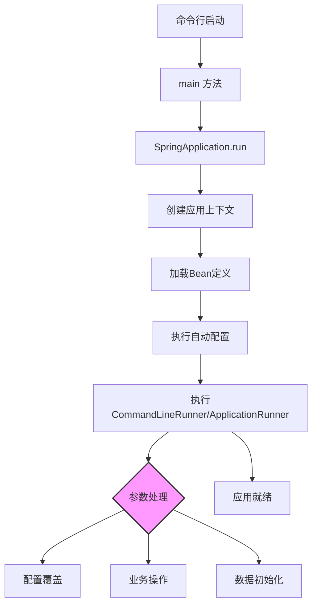

# Spring Boot 启动过程与命令行参数（`args`）全面解析

## 一、核心启动流程

### 1. 启动入口：`main` 方法
```java
public static void main(String[] args) {
    SpringApplication.run(Application.class, args);
}
```
- **`String[] args`**：命令行参数入口，接收用户输入
- **`SpringApplication.run()`**：Spring Boot 启动核心方法
- **执行顺序**：
  1. 创建 Spring 应用上下文
  2. 加载所有 Bean 定义
  3. 执行自动配置
  4. **执行所有 `CommandLineRunner` 和 `ApplicationRunner`**
  5. 启动内嵌服务器（Web 应用）

## 二、命令行参数 (`args`) 详解

### 1. 参数来源与格式
```bash
java -jar app.jar arg1 arg2 --option1=value1 --option2=value2
```
- **原始参数**：`["arg1", "arg2", "--option1=value1", "--option2=value2"]`
- **参数类型**：
  - 位置参数：`arg1`, `arg2`
  - 选项参数：`--option1=value1`
  - JVM 参数：`-Dkey=value`（不包含在 `args` 中）

### 2. Spring 中的参数处理方式

| 方式                           | 获取方法                                              | 特点             | 适用场景              |
| ------------------------------ | ----------------------------------------------------- | ---------------- | --------------------- |
| **原始数组**                   | `String[] args`                                       | 直接访问原始参数 | 简单参数处理          |
| **`ApplicationArguments`**     | `args.getOptionValues()`<br>`args.getNonOptionArgs()` | 结构化解析参数   | 需要区分选项/位置参数 |
| **`@Value` 注入**              | `@Value("${option1}")`                                | 与配置系统集成   | 生产环境配置          |
| **`@ConfigurationProperties`** | 绑定到配置类                                          | 类型安全配置     | 复杂配置管理          |

## 三、启动后执行机制

### 1. `CommandLineRunner`（命令行运行器）
```java
@Bean
public CommandLineRunner myRunner() {
    return args -> {
        // 直接访问原始参数数组
        System.out.println("接收参数: " + Arrays.toString(args));
    };
}
```
- **特点**：
  - 接收原始 `String[] args`
  - 简单直接
  - 执行顺序：通过 `@Order` 控制

### 2. `ApplicationRunner`（应用运行器）
```java
@Bean
public ApplicationRunner appRunner() {
    return args -> {
        System.out.println("选项参数: " + args.getOptionValues("option1"));
        System.out.println("位置参数: " + args.getNonOptionArgs());
    };
}
```
- **特点**：
  - 接收 `ApplicationArguments` 对象
  - 提供结构化参数访问
  - 自动解析选项参数（`--key=value`）

### 3. 执行规则
- **触发时机**：在 Spring 上下文完全初始化后
- **执行顺序**：
  1. `@PostConstruct` 方法
  2. `InitializingBean.afterPropertiesSet()`
  3. `ApplicationRunner` 和 `CommandLineRunner`
  4. `@EventListener(ApplicationReadyEvent)`
- **顺序控制**：
  ```java
  @Bean
  @Order(1) // 数字越小优先级越高
  public CommandLineRunner firstRunner() {
      return args -> System.out.println("最先执行");
  }
  ```

## 四、其他启动扩展点

### 1. 生命周期回调
```java
@Component
public class LifecycleCallbacks {
    @PostConstruct
    public void init() {
        System.out.println("Bean初始化后执行");
    }
    
    @EventListener(ApplicationReadyEvent.class)
    public void onReady() {
        System.out.println("应用完全启动后执行");
    }
}
```

### 2. 高级扩展：`SpringApplicationRunListener`
```java
public class CustomRunListener implements SpringApplicationRunListener {
    @Override
    public void starting() {
        System.out.println("应用即将启动");
    }
    
    @Override
    public void environmentPrepared(ConfigurableEnvironment env) {
        System.out.println("环境准备完成");
    }
    
    // 其他生命周期方法...
}
```
**注册方式**：`META-INF/spring.factories`
```
org.springframework.boot.SpringApplicationRunListener=com.example.CustomRunListener
```

## 五、参数处理最佳实践

### 1. 参数类型处理建议
| 参数类型 | 推荐处理方式                           | 示例                         |
| -------- | -------------------------------------- | ---------------------------- |
| 配置参数 | `@Value` 或 `@ConfigurationProperties` | `--server.port=8080`         |
| 操作指令 | `CommandLineRunner`                    | `backup`, `restore`          |
| 文件路径 | `ApplicationRunner`                    | `process-file=/path/to/file` |
| 复杂选项 | `ApplicationArguments`                 | `--format=json --compress`   |

### 2. 完整参数处理示例
```java
@Bean
@Order(1)
public ApplicationRunner paramProcessor() {
    return args -> {
        // 1. 获取位置参数
        List<String> files = args.getNonOptionArgs();
        if (!files.isEmpty()) {
            processFiles(files);
        }
        
        // 2. 获取选项参数
        if (args.containsOption("verbose")) {
            enableVerboseLogging();
        }
        
        // 3. 获取参数值
        List<String> modes = args.getOptionValues("mode");
        String mode = modes != null ? modes.get(0) : "default";
    };
}

@Bean
@Order(2)
public CommandLineRunner finalCheck() {
    return args -> {
        System.out.println("所有参数处理完成");
    };
}
```

## 六、典型应用场景

### 1. 配置覆盖
```bash
java -jar app.jar --server.port=9090 --spring.datasource.url=jdbc:mysql://new-host/db
```

### 2. 操作模式切换
```bash
java -jar cli-tool.jar --env=prod import --file=data.csv
```

### 3. 批量处理
```bash
java -jar processor.jar file1.txt file2.txt --output-dir=results
```

### 4. 调试与测试
```bash
java -jar app.jar --debug --spring.profiles.active=test
```

## 七、重要注意事项

1. **参数解析规则**：
   - 以 `--` 开头的参数被视为选项参数
   - 空格分隔的参数值需加引号：`--name="John Doe"`
   - 布尔标志可直接使用：`--enable-feature`

2. **执行环境差异**：
   - IDE 运行：通过运行配置设置参数
   - 命令行运行：直接附加参数
   - Docker 容器：通过 `CMD` 或 `ENTRYPOINT` 传递

3. **安全考虑**：
   - 敏感参数应使用环境变量或配置服务器
   - 避免在日志中打印敏感参数
   - 使用 `@ConfigurationProperties` 进行类型安全绑定

4. **错误处理**：
   ```java
   @Bean
   public CommandLineRunner safeRunner() {
       return args -> {
           try {
               // 业务逻辑
           } catch (Exception ex) {
               System.err.println("执行失败: " + ex.getMessage());
               // 优雅退出
               System.exit(1);
           }
       };
   }
   ```

## 总结图解



通过以上全面解析，您应该能够：
1. 理解 Spring Boot 启动过程的完整生命周期
2. 掌握命令行参数的各种处理方式及适用场景
3. 合理选择不同扩展点实现启动逻辑
4. 设计健壮的命令行参数处理方案
5. 避免常见的参数处理陷阱和安全问题