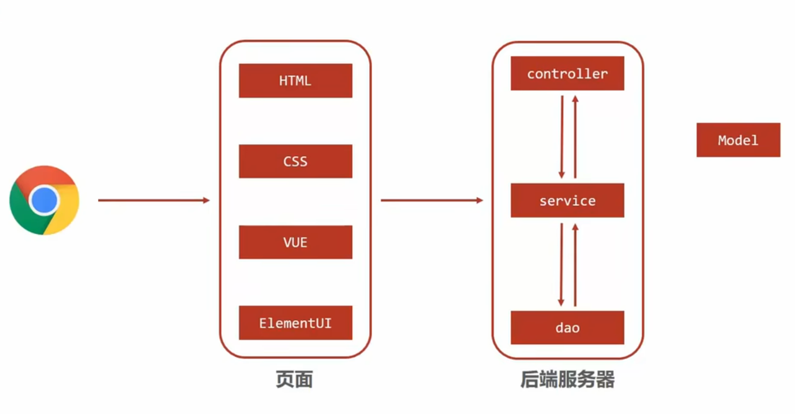

# Spring MVC

Spring MVC (Model-View-Controller) 是 Spring 框架的一部分，是一种**基于 Java 实现 MVC 模型** 的轻量级 Web 应用程序框架。Spring MVC 提供了一种清晰的分离模型，使开发人员可以轻松地开发、测试和维护 Web 应用程序。



浏览器在前端页面中调用后端服务器，后端服务器内则层层调用，最后得到一个包含了前端所需要的数据的Model对象，然后需要把这个对象转换成json的数据格式才能被前端接受。

- 实现方式:
  - 模型（Model）：负责数据和业务逻辑，通常包含数据存储、检索和业务规则。
  - 视图（View）：包含展示逻辑，将模型的数据渲染为用户界面，不包含业务逻辑。
  - 控制器（Controller）：接收用户的输入，调用模型和视图去完成用户的请求。

## 与传统web应用框架的区别

1. 架构设计：
   - 传统 Web 应用：通常使用 Servlets 和 JSP 来处理请求和生成响应。业务逻辑、控制逻辑和视图渲染可能会混合在一起，导致代码复杂且难以维护。
   - Spring MVC：基于 MVC 设计模式，清晰地分离了模型（Model）、视图（View）和控制器（Controller）。这种分离使得代码更加模块化和易于维护。
2. 请求处理：
   - 传统 Web 应用：使用 Servlets 来处理请求，开发者需要手动解析请求参数、调用业务逻辑和生成响应。所有这些逻辑通常都在一个 Servlet 类中实现，代码容易变得冗长和复杂。
   - Spring MVC：使用 DispatcherServlet 作为前端控制器来接收所有请求，并将请求分发给相应的控制器方法。控制器方法通过注解（如 @RequestMapping）来映射 URL 和处理逻辑，简化了请求处理过程。
3. 视图处理：
   - 传统 Web 应用：直接使用 JSP 生成 HTML 响应，业务逻辑和视图逻辑可能会混杂在 JSP 文件中，导致难以维护和测试。
   - Spring MVC：使用视图解析器（如 InternalResourceViewResolver）来解析逻辑视图名称，视图技术可以是 JSP、Thymeleaf 等。视图逻辑与业务逻辑分离，更加清晰和可维护。
4. 依赖注入：
   - 传统 Web 应用：需要手动创建和管理对象的依赖关系，增加了代码的复杂度。
   - Spring MVC：依赖 Spring 的 IoC 容器，通过依赖注入（Dependency Injection）来自动管理对象的依赖关系，减少了样板代码和复杂度。
5. AOP 支持：
   - 传统 Web 应用：如果需要实现跨领域关注点（如日志、事务管理），通常需要手动编写代码来实现，代码散布在多个类中。
   - Spring MVC：利用 Spring 的 AOP 功能，可以轻松地实现跨领域关注点，代码更加简洁和易于维护。
6. 异常处理：
   - 传统 Web 应用：异常处理通常在 Servlet 或 JSP 中处理，代码混乱且难以统一管理。
   - Spring MVC：提供统一的异常处理机制，可以使用 @ExceptionHandler 注解来集中处理异常，代码更加简洁和可维护。
7. 表单处理和数据绑定：
   - 传统 Web 应用：需要手动解析表单参数并将其绑定到 Java 对象，代码繁琐且容易出错。
   - Spring MVC：自动处理表单数据绑定，将请求参数自动绑定到 Java 对象上，大大简化了表单处理过程。

## Controller

### @Controller + @RequestMapping

在类上的@Controller注解会将该类标记为控制器类，它会处理HTTP请求。

@RequestMapping 用于将任意HTTP请求映射到控制器方法上，表示共享映射，如果没有指定请求方式，将接收GET、POST、HEAD、OPTIONS、PUT、PATCH、DELETE、TRACE、CONNECT所有的HTTP请求方式。我们一般不使用共享映射，需要标明请求路径与请求类型。

@GetMapping、@PostMapping、@PutMapping、@DeleteMapping、@PatchMapping 是@RequestMapping 的变体，直接表明了对应的HTTP方法。

@RequestMapping 注解可以在控制器类上和控制器类中的方法上使用。

在类的级别上的注解会将一个特定请求或者请求模式映射到一整个控制器上。之后你还可以另外添加方法级别的注解来进一步指定到处理方法的映射关系。

```java
@RestController
public class UserController {
    // 映射到方法上
    // localhost:8080/user/login
    // 此处通常用 @GetMapping("/user/login") 表明GET请求方式的映射
    @RequestMapping("/user/login")  
    public String login() {
        return "user login";
    }
    
    // 映射到方法上
    // localhost:8080/user/register
    // 此处通常用@PostMapping("/user/login")表明POST请求方式的映射
    @RequestMapping("/user/register")
    public String register() {
        return "user register";
    }
}
```

#### 一个方法同时处理多个url

```java
@RestController
@RequestMapping("/home")
public class IndexController {

    @RequestMapping(value = {
        "",
        "/page",
        "page*",
        "view/*,**/msg"
    })
    String indexMultipleMapping() {
        return "Hello from index multiple mapping.";
    }
}
```

```md
下面这些url都可以被识别：
localhost:8080/home

localhost:8080/home/

localhost:8080/home/page

localhost:8080/home/pageabc

localhost:8080/home/view/

localhost:8080/home/view/view
```

> 路径匹配示例：
> "/resources/ima?e.p ang " - 匹配路径段中的一个字符
"/resources/*.png" - 匹配一个路径段中的零个或多个字符
"/resources/**" - 匹配多个路径段
"/projects/{project}/versions" - 匹配一个路径段并将其捕获为一个变量
"/projects/{project:[a-z]+}/versions" - 用正则表达式匹配并捕获一个变量

#### 使用@RequestParam

```java
@RestController
@RequestMapping("/home")
public class IndexController {

    @RequestMapping(value = "/id")
    // 实现请求参数 id 与 处理方法参数 personId 的绑定。
    String getIdByValue(@RequestParam("id") String personId) {
        System.out.println("ID is " + personId);
        return "Get ID from query string of URL with value element";
    }
    @RequestMapping(value = "/personId")
    String getId(@RequestParam String personId) {
        System.out.println("ID is " + personId);
        return "Get ID from query string of URL without value element";
    }
}
```

##### required属性

表示该属性是不是必须的

```java
@RestController
@RequestMapping("/home")
public class IndexController {
    @RequestMapping(value = "/name")
    String getName(@RequestParam(value = "person", required = true) String personName) {
        return "Required element of request param";
    }
}
```

```java
@RestController
@RequestMapping("/home")
public class IndexController {
    @RequestMapping(value = "/name")
    String getName(@RequestParam(value = "person", required = false) String personName) {
        return "Required element of request param";
    }
}
```

##### default属性

```java
@RestController
@RequestMapping("/home")
public class IndexController {
    @RequestMapping(value = "/name")
    String getName(@RequestParam(value = "person", defaultValue = "John") String personName) {
        return "Required element of request param";
    }
}
```

#### produces 和 consumes属性

```java
@RestController
@RequestMapping("/home")
public class IndexController {
    @RequestMapping(value = "/prod", produces = {
        "application/JSON"
    })
    @ResponseBody
    String getProduces() {
        return "Produces attribute";
    }

    @RequestMapping(value = "/cons", consumes = {
        "application/JSON",
        "application/XML"
    })
    String getConsumes() {
        return "Consumes attribute";
    }
}
```

#### header属性

```java
@RestController
@RequestMapping("/home")
public class IndexController {
    @RequestMapping(value = "/head", headers = {
        "content-type=text/plain"
    })
    String post() {
        return "Mapping applied along with headers";
    }
}
```

指定多个消息头：

```java
@RestController
@RequestMapping("/home")
public class IndexController {
    @RequestMapping(value = "/head", headers = {
        "content-type=text/plain",
        "content-type=text/html"
    }) String post() {
        return "Mapping applied along with headers";
    }
}
```

#### params属性

```java
@RestController
@RequestMapping("/home")
public class IndexController {
    @RequestMapping(value = "/fetch", params = {
        "personId=10"
    })
    String getParams(@RequestParam("personId") String id) {
        return "Fetched parameter using params attribute = " + id;
    }
    @RequestMapping(value = "/fetch", params = {
        "personId=20"
    })
    String getParamsDifferent(@RequestParam("personId") String id) {
        return "Fetched parameter using params attribute = " + id;
    }
}
```

#### 动态url处理

```java
@RestController
@RequestMapping("/home")
public class IndexController {
    @RequestMapping(value = "/fetch/{id}", method = RequestMethod.GET)
    String getDynamicUriValue(@PathVariable String id) {
        System.out.println("ID is " + id);
        return "Dynamic URI parameter fetched";
    }
    @RequestMapping(value = "/fetch/{id:[a-z]+}/{name}", method = RequestMethod.GET)
    String getDynamicUriValueRegex(@PathVariable("name") String name) {
        System.out.println("Name is " + name);
        return "Dynamic URI parameter fetched using regex";
    }
}
```

#### 默认处理方法

```java
@RestController
@RequestMapping("/home")
public class IndexController {
    @RequestMapping()
    String
    default () {
        return "This is a default method for the class";
    }
}
```

### @Controller / @RestController

- @Controller 注解标记的类是传统的控制器类。它用于处理客户端发起的请求，并负责返回适当的视图（View）作为响应。在使用 @Controller 注解标记的类中，默认情况下，方法的返回值会被解析为一个视图名称，并寻找与该名称匹配的视图进行渲染。这意味着返回的结果会被解析为一个 HTML 页面或者模板引擎所需的数据。但是有时候需要将方法的返回值直接作为响应的主体内容，而不是解析为视图。为了实现这个目的，我们可以在方法上使用 @ResponseBody 注解。@ResponseBody 注解表示方法的返回值应该直接写入 HTTP 响应体中，而不是被解析为视图。它告诉 Spring MVC 框架将方法的返回值序列化为特定格式（如 JSON、XML 等）并作为响应的主体内容返回给客户端。
- @RestController 是一个组合注解，它结合了 @Controller 和 @ResponseBody 注解的功能（就相当于把两个注解组合在一起）。在使用 @RestController 注解标记的类中，每个方法的返回值都会以 JSON 或 XML 的形式直接写入 HTTP 响应体中，相当于在每个方法上都添加了 @ResponseBody 注解。

```java
@RestController
@RequestMapping("/home")
public class IndexController {
    @RequestMapping(method = RequestMethod.GET)
    String get() {
        return "Hello from get";
    }
    @RequestMapping(method = RequestMethod.DELETE)
    String delete() {
        return "Hello from delete";
    }
    @RequestMapping(method = RequestMethod.POST)
    String post() {
        return "Hello from post";
    }
    @RequestMapping(method = RequestMethod.PUT)
    String put() {
        return "Hello from put";
    }
    @RequestMapping(method = RequestMethod.PATCH)
    String patch() {
        return "Hello from patch";
    }
}
```

当设计 RESTful API 时，一般的原则是：
如果客户端希望获取数据（例如 JSON、XML），则返回数据。
如果客户端希望展示数据（例如 HTML 页面），则返回视图。

下面是一些示例情况：

- 当你在开发一个单页应用的后端接口时，前端通常会通过 Ajax 请求获取数据（例如 JSON），然后使用 JavaScript 动态更新页面。在这种情况下，你应该返回数据（例如使用 @ResponseBody 注解）。
- 当你需要为前端渲染 HTML 页面时，需要返回视图。视图可以包含动态生成的数据，但最终会经过服务器端模板引擎的处理，形成最终的 HTML 页面。

再以实例说明，更通俗易懂的理解：

- 需要返回视图的实例： 假设你正在开发一个博客应用的后端接口。有一个页面需要显示所有文章的列表，并且希望以 HTML 形式展示。在这种情况下，你可以设计一个 GET 请求的接口 /api/articles，返回一个包含所有文章数据的视图，让前端直接展示这个页面。这里需要返回视图而不是仅返回数据，因为需要服务端渲染整个 HTML 页面。
- 只需要返回数据的实例： 假设正在开发一个电子商务网站，前端使用 React 或 Vue.js 等框架构建。在购物车页面上，需要获取当前用户的购物车数据以便展示。在这种情况下，你可以设计一个 GET 请求的接口 /api/cart，返回一个 JSON 对象，包含当前用户的购物车数据。这里只需要返回数据而不是整个 HTML 页面，因为前端通过 JavaScript 来处理和展示数据。

传统的springMVC一般就需要直接返回视图，而现在新兴的前端技术vue在项目中为前后端分离的架构，前端框架负责处理数据和渲染页面，而后端 API 则负责提供数据即可，所以对返回视图的要求也就比较少了
