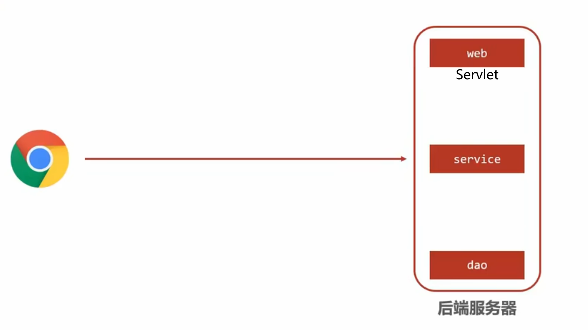
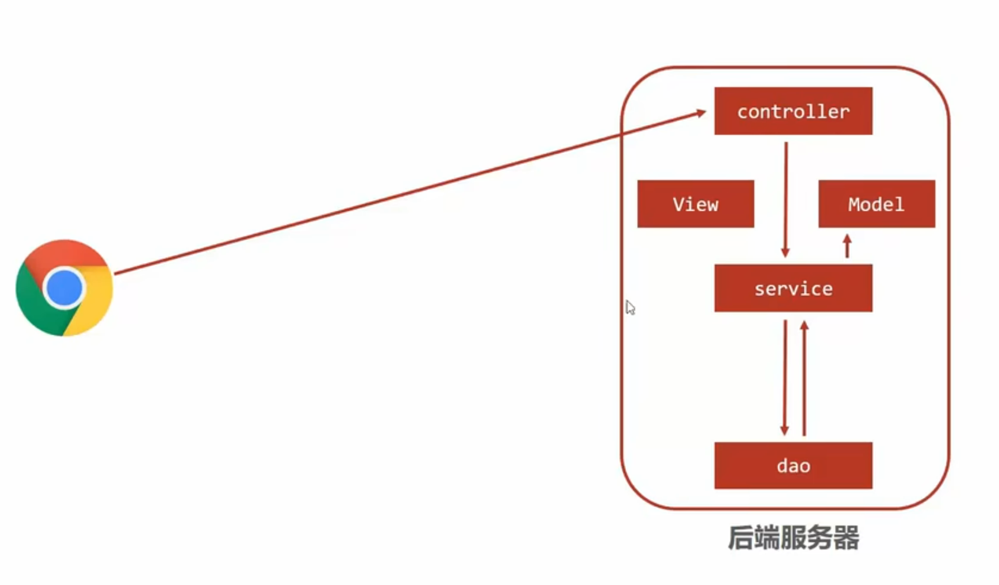

# Spring MVC

Spring MVC (Model-View-Controller) 是 Spring 框架的一部分，是一种**基于 Java 实现 MVC 模型** 的 **轻量级 Web 应用程序框架**。Spring MVC 提供了一种清晰的分离模型，使开发人员可以轻松地开发、测试和维护 Web 应用程序。

## 传统的Web应用程序架构

### 1. Web层

- 主要负责处理HTTP请求和响应。
- 包括Servlet和JSP（JavaServer Pages）。
- Servlet接收客户端请求，调用相应的业务逻辑，处理请求参数，生成响应，并将结果返回给客户端。

### 2. Service层

- 主要负责业务逻辑处理。
- 包括各种业务服务类（Service），它们封装了具体的业务规则和逻辑。
- Service层通常由Web层调用，以处理业务需求。

### 3. DAO层（数据访问层）

- 主要负责数据持久化和数据库访问。
- 包括各种数据访问对象（DAO），它们封装了对数据库的CRUD（创建、读取、更新、删除）操作。
- DAO层通常由Service层调用，以进行数据操作。



在传统的 Web 应用架构中，一个Servlet只能处理一个请求，因此我们就有了 MVC 模式，将 Web 层中的 Servlet拆成了三块：Model-View-Controller。由控制器（Controller）接收客户端请求并调用业务逻辑，然后返回数据模型（Model）。但是模型对象客户端是无法读取的，因此，要么把模型数据转换成其他形式（如 JSON）使得客户端可以间接解析、读取数据，要么生成动态页面（如 JSP 文件）将页面抽取出来与模型结合处理，然后由视图（View）生成最终的输出内容（如 JSP 文件转换成的 HTML 页面 或 JSON 数据）。这样处理下来，一个 controller 就可以处理多个请求了。



现代开发常常使用的是异步调用、前后端分离的形式，而非传统的 MVC。在这种情况下，后端服务器中的 View 会将 Model 中的数据转换成 JSON 格式的数据返回给前端页面，前端页面在发送请求并收到 JSON 数据后，会将数据抽取出来，再按照前端的逻辑组织成完整的页面反馈给浏览器。因此就有了 SpringMVC ，在现代 Spring 框架下的 SpringMVC 中，我们可以使用各种注解（如@ResponseBody，直接将返回的模型数据转换成 JSON，下文会具体介绍），更便捷地进行更符合现代 MVC 框架的开发。


- 实现方式:
  - 模型（Model）：负责数据和业务逻辑，通常包含数据存储、检索和业务规则。
  - 视图（View）：包含展示逻辑，将模型的数据渲染为用户界面，不包含业务逻辑。
  - 控制器（Controller）：接收用户的输入，调用模型和视图去完成用户的请求。

## Controller

### @Controller + @RequestMapping

在类上的`@Controller`和`@RestController`注解会将该类标记为控制器类，它会处理HTTP请求。

`@RequestMapping` 用于将任意HTTP请求映射到控制器方法上，表示共享映射，如果没有指定请求方式，将接收GET、POST、HEAD、OPTIONS、PUT、PATCH、DELETE、TRACE、CONNECT所有的HTTP请求方式。一般不使用共享映射，而是标明请求路径与请求类型。

`@GetMapping`、`@PostMapping`、`@PutMapping`、`@DeleteMapping`、`@PatchMapping` 是`@RequestMapping` 的变体，直接表明了对应的HTTP方法。

`@RequestMapping` 注解可以在控制器类上和控制器类中的方法上使用。

在类的级别上的注解会将一个特定请求或者请求模式映射到一整个控制器上，方法级别的注解会进一步指定从控制器类到类中的处理方法的映射关系。

```java
@RestController
public class UserController {
    @RequestMapping("/user/login")    // 处理发送到该路径的所有类型的HTTP请求
    public String login() {
        return "user login";
    }
    
    @RequestMapping(value = "/user/register", method = RequestMethod.POST)              // 只处理发送到该路径的POST请求
    public String register() {
        return "user register";
    }
}
```

#### 一个方法同时处理多个url

```java
@RestController
@RequestMapping("/apple")
public class AppleController {
    @Autowired
    private Apple apple;

    @GetMapping("/getColor")
    public ResponseEntity<String> getColor() {
        return ResponseEntity.ok(apple.getColor());
    }

    @RequestMapping(value = {
            "",
            "/setColor",
            "setColor*",
            "setColor/*",
            "setColor/**"
    }, method = RequestMethod.POST)
    public ResponseEntity<Void> setColor(@RequestParam String color) {
        apple.setColor(color);
        return ResponseEntity.ok().build();
    }
}
```

- 一个星号 (*)
  - 匹配一个路径段中的任意字符，除了路径分隔符 `/`。
  - 只能匹配当前路径段的内容。如`"setColor*" -> "/setColor123"`，`"setColor/*" -> "setColor/123"`
- 两个星号 (**)
  - ***放在分隔符后***，如`"setColor/**"`，用以匹配零个或多个路径段中的任意字符，包括路径分隔符 `/`。
  - 可以匹配任意深度的路径层次结构。如`"setColor/**" -> "setColor/123/456/789"`。
  - 注意：双星号必须单独放在分隔符后！`"setColor**" -> "setColor123/123/456/789"`是无效的！`"setColor**"`等价于`"setColor*"`。想要上面的那种效果可以使用`"setColor*/**"`。
- 如果要在路径中使用星号匹配，路径的最前面不能有分隔符。

#### 使用@RequestParam

```java
@RestController
@RequestMapping("/apple")
public class AppleController {
    @Autowired
    private Apple apple;

    @RequestMapping(value = {
            "",
            "/setColor",
            "setColor*",
            "setColor/*",
            "setColor/**"
    }, method = RequestMethod.POST)
    public ResponseEntity<Void> setColor(@RequestParam("c") String color) { // 这里传递进来的参数名指定为"c"，如果不指定则默认为对象名color
        apple.setColor(color);
        return ResponseEntity.ok().build();
    }
}
```

##### required属性

- required 是一个布尔类型参数，默认为 true。
- 当 required = true 时，参数是必需的。如果请求中缺少该参数，Spring MVC 会抛出 MissingServletRequestParameterException。
- 当 required = false 时，参数是可选的。如果请求中缺少该参数，则方法仍然会被调用，但参数的值会是 null（如果没有指定 defaultValue）。

```java
@RestController
@RequestMapping("/apple")
public class AppleController {
    @Autowired
    private Apple apple;

    @RequestMapping(value = {
            "",
            "/setColor",
            "setColor*",
            "setColor/*",
            "setColor/**"
    }, method = RequestMethod.POST)
    public ResponseEntity<Void> setColor(@RequestParam(value = "c", required = true) String color) { 
        apple.setColor(color);
        return ResponseEntity.ok().build();
    }
}
```

##### default属性

- defaultValue 是一个字符串，用来指定参数的默认值。
- 当请求中缺少该参数时，如果指定了 defaultValue，则参数会使用该默认值，而不是 null。
- 无论required是否需要，defaultValue都有意义。

```java
@RestController
@RequestMapping("/apple")
public class AppleController {
    @Autowired
    private Apple apple;

    @RequestMapping(value = {
            "",
            "/setColor",
            "setColor*",
            "setColor/*",
            "setColor/**"
    }, method = RequestMethod.POST)
    public ResponseEntity<Void> setColor(@RequestParam(value = "c", required = true, defaultValue = "Red") String color) { 
        apple.setColor(color);
        return ResponseEntity.ok().build();
    }
}
```

#### produces 和 consumes属性

produces 属性用于指定控制器方法生成的响应内容类型，客户端将会根据响应的 Content-Type 头来处理响应数据。
consumes 属性用于指定控制器方法能够处理的请求内容类型，服务器要根据请求的 Content-Type 头来解析请求数据。

```java
@RestController
@RequestMapping("/apple")
public class AppleController {
    @Autowired
    private Apple apple;

    @PostMapping(value = "/setApple", consumes = "application/json", produces = "application/json")
    public Apple setApple(@RequestBody Apple newApple) {
        apple.setColor(newApple.getColor());
        apple.setWeight(newApple.getWeight());
        return apple;
    }
}
```

`consumes = "application/json"` 表示该方法只能处理 Content-Type 为 application/json 的请求。
`produces = "application/json"` 表示该方法返回的响应内容类型为 application/json。

#### headers属性

```java
@RestController
@RequestMapping("/apple")
public class AppleController {
    @Autowired
    private Apple apple;

    @RequestMapping(value="/getColor", headers = "X-Header=myHeaderValue")      // 发送的请求中的headers必须有X-Header=myHeaderValue，否则不处理
    public ResponseEntity<String> getColor() {
        return ResponseEntity.ok(apple.getColor());
    }
}
```

指定多个消息头时，所有指定的消息头都要包含在HTTP请求内，否则不处理。

```java
@RestController
@RequestMapping("/apple")
public class AppleController {
    @Autowired
    private Apple apple;

    @RequestMapping(value="/getColor", headers = {
            "X-Header=myHeaderValue",
            "Y-Header=myValue"
    })      // 同时指定了两个消息头，必须两个都有才处理
    public ResponseEntity<String> getColor() {
        return ResponseEntity.ok(apple.getColor());
    }
}
```

#### 动态url处理

```java
@RestController
@RequestMapping("/items")
public class ItemController {

    @GetMapping("/{itemId}")
    public String getItem(@PathVariable String itemId) {       
        return "Item ID: " + itemId;
    }


    // 可以使用name属性指定路径中的占位符与变量名的对应关系，否则占位符要和变量名一致
    @GetMapping("/{category}/{id}")
    public String getItemByCategory(@PathVariable String category, @PathVariable(name = "id") String itemId) {
        return "Category: " + category + ", Item ID: " + itemId;
    }
}
```

### @Controller / @RestController

- `@Controller` 注解标记的类是传统的控制器类。它用于处理客户端发起的请求，并负责返回适当的视图（View）作为响应。在使用 `@Controller` 注解标记的类中，默认情况下，方法的返回值会被解析为一个视图名称，并寻找与该名称匹配的视图进行渲染。这意味着返回的结果会被解析为一个 HTML 页面或者模板引擎所需的数据。但是有时候需要将方法的返回值直接作为响应的主体内容，而不是解析为视图。为了实现这个目的，我们可以在方法上使用 `@ResponseBody` 注解。`@ResponseBody` 注解表示方法的返回值应该直接写入 HTTP 响应体中，而不是被解析为视图。它告诉 Spring MVC 框架将方法的返回值序列化为特定格式（如 String、JSON、XML 等）并作为响应的主体内容返回给客户端。
- produces 属性与 `@ResponseBody` 可以结合使用，这样更加明确了返回的内容类型，确保客户端和服务器之间的契约更为清晰。
- `@RestController` 是一个组合注解，它结合了` @Controller `和 `@ResponseBody` 注解的功能（就相当于把两个注解组合在一起）。在使用 `@RestController` 注解标记的类中，每个方法的返回值都会以 JSON 或 XML 的形式直接写入 HTTP 响应体中，相当于在每个方法上都添加了 `@ResponseBody` 注解。

上面的例子中用的都是`@RestController`，因此都没有使用`@ResponseBody`，下面的例子就需要在每一个方法前加上该注解

```java
@Controller
@RequestMapping("/home")
public class IndexController {

    @RequestMapping(method = RequestMethod.GET)
    @ResponseBody       // 需要@ResponseBody
    String get() {
        return "Hello from get";
    }

    @RequestMapping(method = RequestMethod.DELETE)
    String delete() {
        return "Hello from delete";     // 如果没有找到名为“Hello from delete”的视图，方法就会报错404
    }

}
```

#### 什么时候需要视图

当设计 RESTful API 时，一般的原则是：
如果客户端希望获取数据（例如 JSON、XML），则返回数据。
如果客户端希望展示数据（例如 HTML 页面），则返回视图。

下面是一些示例情况：

- 当你在开发一个单页应用的后端接口时，前端通常会通过 Ajax 请求获取数据（例如 JSON），然后使用 JavaScript 动态更新页面。在这种情况下，你应该返回数据（例如使用 @ResponseBody 注解）。
- 当你需要为前端渲染 HTML 页面时，需要返回视图。视图可以包含动态生成的数据，但最终会经过服务器端模板引擎的处理，形成最终的 HTML 页面。

再以实例说明，更通俗易懂的理解：

- 需要返回视图的实例： 假设你正在开发一个博客应用的后端接口。有一个页面需要显示所有文章的列表，并且希望以 HTML 形式展示。在这种情况下，你可以设计一个 GET 请求的接口 /api/articles，返回一个包含所有文章数据的视图，让前端直接展示这个页面。这里需要返回视图而不是仅返回数据，因为需要服务端渲染整个 HTML 页面。
- 只需要返回数据的实例： 假设正在开发一个电子商务网站，前端使用 React 或 Vue.js 等框架构建。在购物车页面上，需要获取当前用户的购物车数据以便展示。在这种情况下，你可以设计一个 GET 请求的接口 /api/cart，返回一个 JSON 对象，包含当前用户的购物车数据。这里只需要返回数据而不是整个 HTML 页面，因为前端通过 JavaScript 来处理和展示数据。

传统的 MVC 一般就需要直接返回视图，而现在新兴的前端技术 vue 在项目中为前后端分离的架构，前端框架负责处理数据和渲染页面，而后端 API 则负责提供数据即可，所以对返回视图的要求也就比较少了
