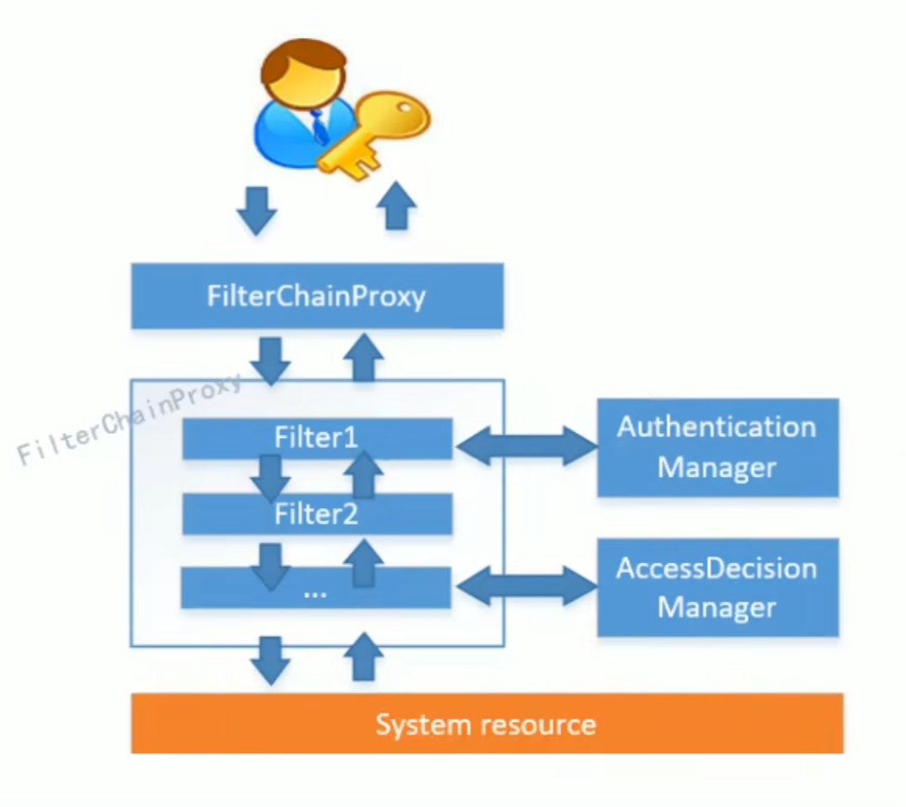
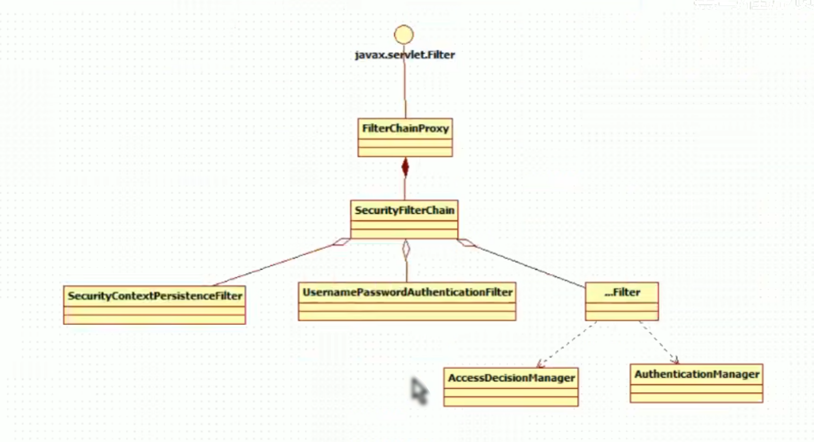
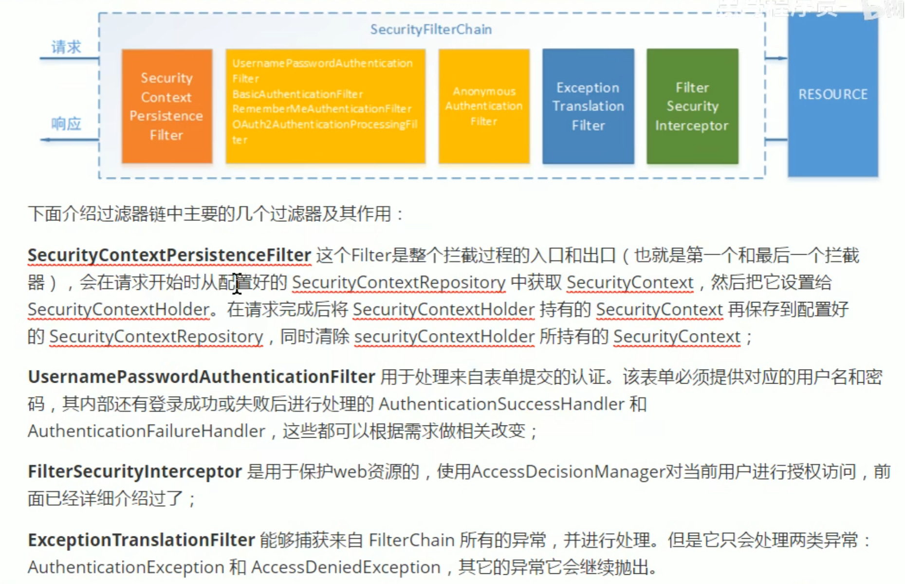
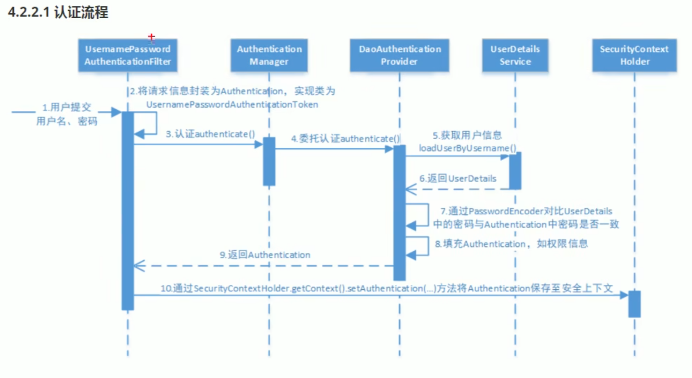
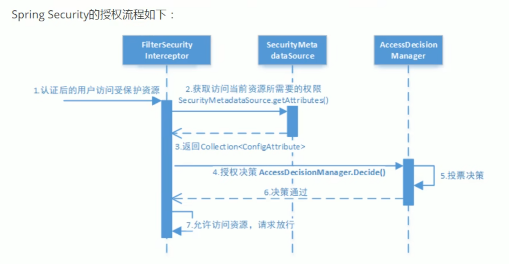
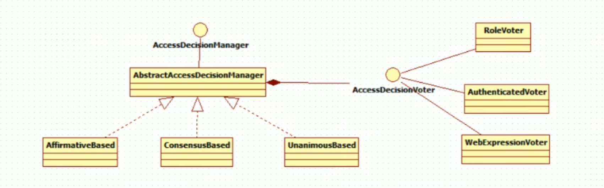

# Spring Security OAuth2.0

## 原理

### Filter

Filter 也称之为过滤器，它是 Servlet 技术中最激动人心的技术之一，web 开发人员通过 Filter 技术，对 web 服务器管理的所有 web 资源进行拦截，从而实现一些特殊的功能。例如实现URL级别的权限访问控制、过滤敏感词汇、压缩响应信息等一些高级功能。
Servlet API 中提供了一个 Filter 接口，开发 web 应用时，如果编写的 Java 类实现了这个接口，则把这个 java 类称之为过滤器 Filter。通过 Filter 技术，开发人员可以实现用户在访问某个目标资源之前，对访问的请求和响应进行拦截，Filter接口源代码：

```java
public abstract interface Filter{
    public abstract void init(FilterConfig paramFilterConfig) throws ServletException;
    public abstract void doFilter(ServletRequest paramServletRequest, ServletResponse paramServletResponse, 
            FilterChain paramFilterChain  //注意这里传入的filterChain
        ) throws IOException, ServletException;
    public abstract void destroy();
}
```

那么Filter是如何实现拦截的呢？(Filter的工作原理)

Filter接口中有一个 doFilter 方法，当我们编写好 Filter，并配置对哪个 web 资源进行拦截后，web 服务器每次在调用 web 资源的 service 方法之前，
都会先调用一下 filter 的 doFilter 方法，因此，在该方法内编写代码可达到如下目的：

- 调用目标资源之前，让一段代码执行。
- 是否调用目标资源（即是否让用户访问 web 资源）。
- 调用目标资源之后，让一段代码执行。

web 服务器在调用 filter 的 doFilter 方法时，会传递一个 FilterChain 对象进来，它也提供了一个 doFilter 方法。那么什么是 FilterChain 呢？FilterChain 中的 doFilter 方法和 Filter 中的有什么区别呢？

当一个请求到达 Web 应用时，如果该请求与一个或多个过滤器相关联，这些过滤器会按照定义的顺序形成一个过滤器链，FilterChain 是由容器实现的一个接口，串联起所有的 filter。每个过滤器在执行其任务后，需要调用 FilterChain.doFilter 方法来将请求传递给该过滤器链中的下一个过滤器。如果当前过滤器是链中的最后一个，那么 doFilter 方法会将请求传递给目标资源，比如一个 Servlet。

因此也就是说，如果要在这个过滤器中放行这个请求，就调用 FilterChain 的 doFilter 方法，否则就进行拒绝逻辑。

### Spring Security

Spring Security 是一个强大且高度可定制的安全框架，它所解决的问题就是 **安全访问控制**，也就是对所有进入系统的请求进行拦截，校验每个请求是否能够访问它所期望的资源。
根据前边知识的学习，我们知道可以通过 Filter 或 AOP 等技术来实现，Spring Security 对 Web 资源的保护正是靠 Filter 实现的，所以我们要从这个 Filter 来入手，逐步深入 Spring Security 原理。
当初始化 Spring Security 时，会创建一个名为 SpringSecurityFilterChain 的 Servlet 过滤器，类型为 org.springframework.security.web.FilterChainProxy，它实现了 javax.servlet.Filter，因此外部的请求会经过此类，下图是 Spring Security 过滤器链结构图:



拦截用户请求的其实是多个 Filter，也就是一个 Filter 链，因为不光要校验用户的身份，还要校验用户的权限等，而 Filter 又会委托给 Manager 来进行校验。
FilterChainProxy 是一个代理，真正起作用的是 FilterChainProxy 中SecurityFilterChain 所包含的各个 Filter，同时这些 Filter 作为 Bean 被 Spring 管理，它们是 Spring Security 的核心，各有各的职责，但他们并不直接处理用户的认证，也不直接处理用户的授权，而是把它们交给了 Manager 进行处理。



下面是对 SecurityFilterChain 的说明



#### 认证流程



其中 AuthenticationProvider 是整个流程中最关键的部分，由它来认证 web 表单中的用户名和密码是否正确匹配，认证成功后返回一个 Authentication 对象，里面包含了身份信息，这个身份信息是一个 Object，大多数情况下可以转换为 UserDetails。一般来说，我们不需要去自定义 AuthenticationProvider，但是它调用的 UserDetailsService 可以自定义。

UserDetailsService 负责根据用户名提取用户信息 UserDetails，然后 AuthenticationProvider 会对比 UserDetails 中的用户密码与用户提交的密码，因此可以通过将自定义的 UserDetailsService 公开为 bean 来自定义身份验证。

此外，我们还可以自定义 PasswordEncoder。它的作用是，在上面 AuthenticationProvider 比对用户密码之前，先将用户明文输入的密码进行加密编码，这么做的原因是，数据库中不可能存储明文密码，肯定是存储加密后的密码，因此就必须让用户输入的明文密码经过同样的加密方式后再去比较，才能知道它们是否相等。

下面我们先来自定义一个 UserDetailsManager，它继承了 UserDetailsService。后面再自定义 PasswordEncoder。

##### 创建自定义的 UserDetailsManager 类

自定义的 UserDetailsManager 需要实现以下两个类:

```java
public class DBUserDetailsManager implements UserDetailsManager, UserDetailsPasswordService
```

要实现基于数据库的用户认证流程，最关键的要实现的方法就是 `loadUserByUsername(String username)`，也就是从数据库中根据用户名获取用户信息
先通过传入的 `username` 去数据库中找到这个实体对象，需要处理返回的实体对象是不是 `null`，如果是 `null` 则手动抛出 `UsernameNotFoundException(username)`，不是 `null` 的话需要创建 `org.springframework.security.core.userdetails.User` 对象，参数列表见下

```java
public User(String username, 
            String password, 
            boolean enabled,    //用户账号是否启用
            boolean accountNonExpired, //用户账号是否过期
            boolean credentialsNonExpired, //用户凭证是否过期
            boolean accountNonLocked, //用户是否未被锁定
            Collection<? extends GrantedAuthority> authorities //权限列表
            )
```

这个自定义的 `UserDetailsManager` 同样需要被 Spring 管理，因此要么在其他配置类中被创建为 Bean:

```java
//@Configuration注解标识的类中声明了@Bean方法，Spring容器可以使用这些方法来注入Bean
//@Bean是在方法上的，这个方法返回的对象会成为由Spring管理的Bean
//而@Component是在类上的，意味着这个类会被Spring管理成为Bean对象
//Spring会根据Bean的类型（UserDetailsService）来查找合适的Bean。
//如果你的@Bean配置与框架的默认配置相同类型，且没有额外的标识（如 @Primary 或 @Qualifier）
//则你定义的Bean会被用来替代默认的Bean。
@Configuration
public class WebSecurityConfig {
    @Bean
    public UserDetailsService userDetailsService(){
        return new DBUserDetailsManager();
    }
}
```

要么直接在 `UserDetailsManager` 类上标注 `@Component`:

```java
@Component
public class DBUserDetailsManager implementsUserDetailsManager, UserDetailsPasswordService
```

##### 创建自定义的 PasswordEncoder

首先最简单的就是不进行加密的 PasswordEncoder: NoOpPasswordEncoder，使用它的话，AuthenticationProvider 会将 *未经处理的表单中用户输入的明文密码* 与 *UserDetails 中的来自数据库的密码* 直接进行字符串比较。

实际项目中推荐使用 BCryptPasswordEncoder, Pbkdf2PasswordEncoder, SCryptPasswordEncoder 等。

Spring Security中默认使用的就是 BCryptPasswordEncoder

```java
@Bean
public PasswordEncoder passwordEncoder() {
    return new BCryptPasswordEncoder();
}
```

BCrypt 的特点是，每次加密都使用随机生成的盐值，因此同一个明文密码，每次加密的结果都不一样，但是校验都是可以通过的（暂时没去了解为什么，后面再说）

另外再介绍一下 PasswordEncoder 类

```java
public interface PasswordEncoder {
    // 输入 CharSequence，返回加密后的 String
    // CharSequence 是更通用的接口（String、StringBuilder 等均实现它），提供灵活性。
    String encode(CharSequence rawPassword); 
    boolean matches(CharSequence rawPassword, String encodedPassword);
    // 其他方法...
}
```

因此，自定义的 PasswordEncoder 也是可以实现的，可以实现 PasswordEncoder 接口，重写 encode() 和 matches() 方法，也就是可以在其中使用自定义的加密算法

#### 授权流程

上面所说的认证，指的是确认你作为用户所拥有的身份，那么这里的授权指的就是判断用户所拥有的身份是否有足够的权限去获取他想要的资源，有则授权，无则拒绝



显然，其中 AccessDecisionManager 是最终作决定的部分，用户权限与访问资源所需的权限的对比就在这里进行。AccessDecisionManager 是一个接口，其中有一个 decide() 方法

```java
void decide(Authentication authentication, Object object, Collection<ConfigAttribute> configAttributes) 
throws AccessDeniedException, InsufficientAuthenticationException;
```

这里着重说一下 decide() 的参数：

- authentication: 要访问资源的访问者的身份信息
- object: 要访问的受保护的资源，web 请求对应 FilterInvocation
- configAttributes: 受保护资源的访问策略，通过 SecurityMetadataSource 获取

AccessDecisionManager 中有一个成员变量是 AccessDecisionVoter 的数组，decision 方法中就是会将这些 voter 的投票情况记录下来，然后进行一些逻辑操作，最终得到是否放行的结论

AccessDecisionManager 有三个实现类: AffirmativeBased、ConsensusBased 和 UnanimousBased



AffirmativeBased 的逻辑是:
(1) 只要有 AccessDecisionVoter 的投票为ACCESS_GRANTED则同意用户进行访问;
(2) 如果全部弃权也表示通过
(3) 如果没有一个人投赞成票，但是有人投反对票，则将抛出AccessDeniedException.
Spring security默认使用的是AffirmativeBased.

ConsensusBased 的逻辑是:
(1) 如果赞成票多于反对票则表示通过。
(2) 反过来，如果反对票多于赞成票则将抛出 AccessDeniedException。
(3) 如果赞成票与反对票相同且都不等于0,并且属性allowIfEqualGrantedDeniedDecisions 的值为 true,
则表示通过，否则将抛出异常 AccessDeniedException。该参数的值默认
为 true。
(4)如果所有的 AccessDecisionVoter 都弃权了,则将视参数allowIfAllAbstainDecisions的值而定,如果
该值为 true 则表示通过，否则将抛出异常 AccessDeniedException。该参数的值默认为 false.

最后一个 UnanimousBased 简单来说就是一票否决，那么 AffirmativeBased 可以说就是一票通过，ConsensusBased 可以说就是少数服从多数，平局看参数
