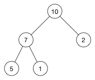
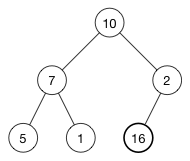
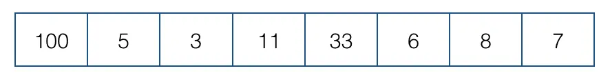
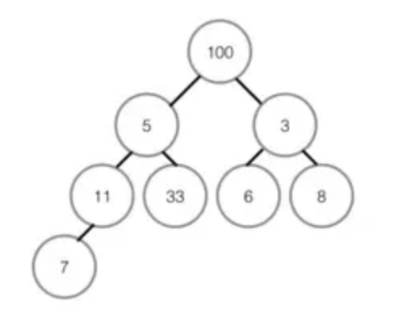
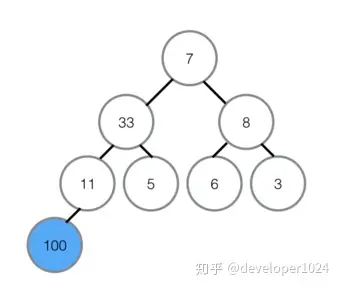
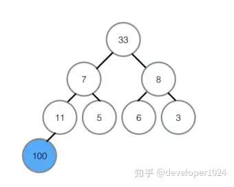
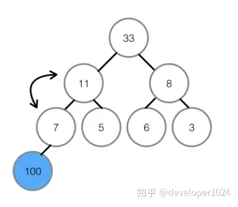
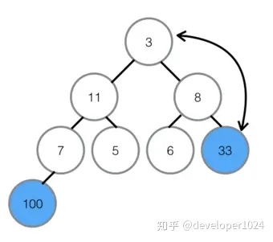
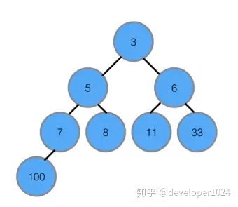

# 堆

## 基本概念

1、完全二叉树：若二叉树的深度为h，则除第h层外，其他层的结点全部达到最大值，且第h层的所有结点都集中在左子树。

2、满二叉树：满二叉树是一种特殊的的完全二叉树，所有层的结点都是最大值。

## **什么是堆**

堆(heap)是计算机科学中一类特殊的数据结构的统称。堆通常是一个可以被看做一棵树的数组对象。堆总是满足下列性质：
    - 堆中某个节点的值总是不大于或不小于其父节点的值；
    - 堆总是一棵完全二叉树。

将根节点最大的堆叫做最大堆或大根堆，根节点最小的堆叫做最小堆或小根堆。常见的堆有二叉堆、斐波那契堆等。

堆是非线性数据结构，有两个直接后继，但堆可以直接用数组顺序存储，无需指针或链表结构。

定义：n个元素的序列`{k1,k2,ki,…,kn}`，当且仅当满足下关系时，称之为堆。
`(ki <= k2i, ki <= k2i + 1)`或者`(ki >= k2i, ki >= k2i + 1)`, 其中`i = 1,2,3,4...n/2`

若将和此次序列对应的一维数组看成是一个完全二叉树，则堆的含义表明，完全二叉树中所有非终端结点的值均不大于（或不小于）其左、右孩子结点的值。由此，若序列`{k1,k2,…,kn}`是堆，则堆顶元素（或完全二叉树的根）必为序列中n个元素的最小值（或最大值）。
注意：在二叉树中，若当前节点的下标为 `i`， 则其父节点的下标为 `i/2`，其左子节点的下标为 `i*2`，其右子节点的下标为`i*2+1`；

## 堆的插入

每次插入都是将先将新数据放在数组最后，由于从这个新数据的父结点到根结点必然为一个有序的序列，现在的任务是将这个新数据插入到这个有序序列中——这就类似于直接插入排序中将一个数据并入到有序区间中。

我们通过一个插入例子来看看插入操作的细节。我们将数字 16 插入到这个堆中：

第一步是将新的元素插入到数组的尾部，相应的树变成了：

显然现在堆属性不满足，为了恢复堆属性，我们需要交换 16 和 2。但 10 也比 16 小。因此继续交换新节点和它的父节点，直到它的父节点比它大或者新节点到达树的顶部。

## 堆的删除

堆中每次都只能删除堆顶元素，但为了便于重建堆，实际的操作是将最后一个数据的值赋给根结点，然后再从根结点开始进行一次从上向下的调整。调整时先在左右子结点中找最小的，如果父结点比这个最小的子结点还小说明不需要调整了，反之将父结点和它交换后再考虑后面的结点。相当于根结点数据的“下沉”过程。

## 堆排序

堆排序（Heapsort）是指利用堆这种数据结构所设计的一种排序算法。堆积是一个近似完全二叉树的结构，并同时满足堆积的性质：即子结点的键值或索引总是小于（或者大于）它的父节点。

1. 基本思想
利用大顶堆(小顶堆)堆顶记录的是最大关键字(最小关键字)这一特性，使得每次从无序中选择最大记录(最小记录)变得简单。
    > ① 将待排序的序列构造成一个最大堆，此时序列的最大值为根节点
    > ② 依次将根节点与待排序序列的最后一个元素交换
    > ③ 再维护从根节点到该元素的前一个节点为最大堆，如此往复，最终得到一个递增序列
2. 实现逻辑
    > ① 先将初始的R[0, n-1]建立成最大堆，此时是无序堆，而堆顶是最大元素。
    > ② 再将堆顶R[0]和无序区的最后一个记录R[n-1]交换，由此得到新的无序区R[0, n-2]和有序区R[n-1]，且满足R[0, n-2].keys ≤ R[n-1].key
    > ③ 由于交换后新的根R[0]可能违反堆性质，故应将当前无序区R[0, n-2]调整为堆。然后再次将R[0, n-2]中关键字最大的记录R[0]和该区间的最后一个记录R[n-2]交换，由此得到新的无序区R[0, n-3]和有序区R[n-2, n-1]，且仍满足关系R[0, n-2].keys≤R[n-2, n-1].keys，同样要将R[0, n-3]调整为堆。
    > ④ 直到无序区只有一个元素为止。
3. 如何调整为堆
    
    ① 我们将数组从上至下按顺序排列，转换成二叉树：一个无序堆。每一个三角关系都是一个堆，上面是父节点，下面两个分叉是子节点，两个子节点俗称左孩子、右孩子；
    
    ② 转换成无序堆之后，我们要努力让这个无序堆变成最大堆(或是最小堆)，即每个子堆里都实现父节点的值都大于任何一个子节点的值。
    ③ 从最后一个子堆开始，即根节点为 ***R[n/2 - 1]*** 的子堆；首先对比左右孩子，即左孩子 ***R[(n/2 - 1) * 2 + 1]***，右孩子 ***R[(n/2 - 1) * 2 + 2]***，左孩子的值比父节点的值小所以不需要交换，没有右孩子。如果发生交换，要检测子节点是否为其他堆的父节点，如果是，***递归*** 进行同样的操作。
    ④ 第二次检查根节点为 ***R[(n/2 - 1) - 1]*** 的子堆，即前一个子堆，取较大的子节点，右孩子8胜出，和父节点比较，右孩子8大于父节点3，升级做父节点，与3交换位置，3的位置没有子节点，这个堆建成最大堆。
    ⑤ 剩下的过程和上面一样，至此最大堆创建完成。
4. 进行堆排序。该步骤其实就相当于上面"堆删除"的步骤，只是将删除的堆顶元素和最后一个元素交换，然后把堆的元素个数视为 n-1，不是真正删除
    ①首先将堆顶元素100交换至最底部7的位置，7升至堆顶，100所在的底部位置即为有序区，有序区不参与之后的任何对比。

    

    ②在7升至顶部之后，对顶部重新做最大堆调整，左孩子33代替7的位置。

    

    ③在7被交换下来后，下面还有子节点，所以需要继续与子节点对比，左孩子11比7大，所以11与7交换位置，交换位置后7下面为有序区，不参与对比，所以本轮结束，无序区再次形成一个最大堆。

    

    ④将最大堆堆顶33交换至堆末尾，扩大有序区；

    

    ⑤不断建立最大堆，并且扩大有序区，最终全部有序。

    

为什么使用大顶堆从 M 个元素中查找最小的 N 个元素效率比小顶堆更高
堆结构：
    - 大顶堆的堆顶是当前 N 个最小元素中的最大值。当遍历 M 个元素时，如果遇到的元素比堆顶小，说明堆顶不在最小的 N 个元素中，可以将堆顶移除，并将新元素插入堆中。
操作效率：
    - 大顶堆在维护 N 个最小元素时，最多只需 O(log N) 的时间来执行插入和删除操作。整个过程的复杂度是 O(M log N)。
    相对而言，使用小顶堆时，为了找到最小的 N 个元素，可能需要先将所有元素放入堆中，再进行排序，复杂度为 O(M log M)，这在元素数量较大时效率低下。
