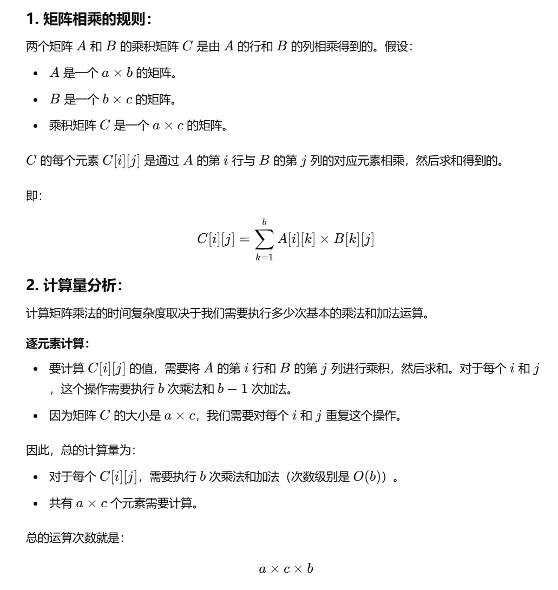
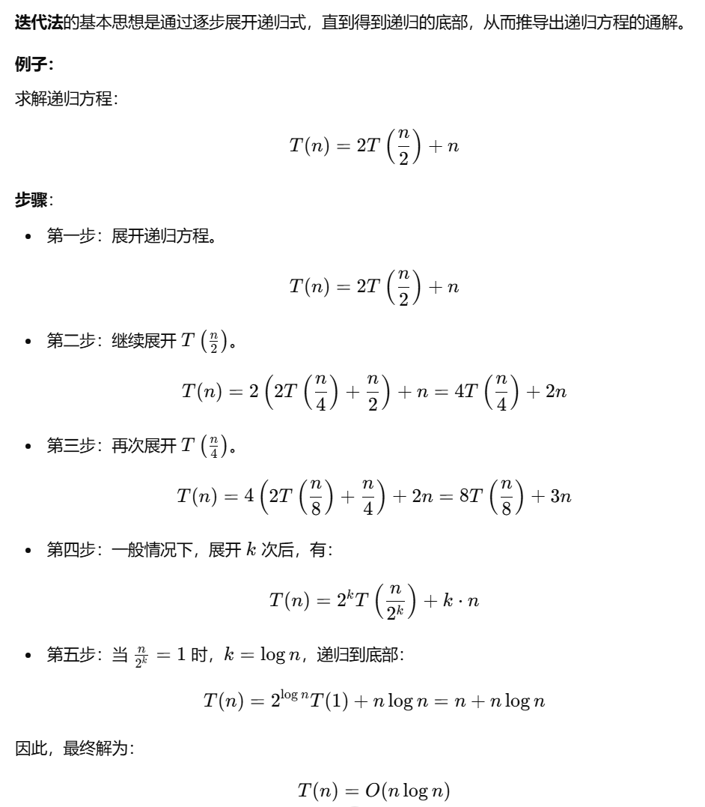
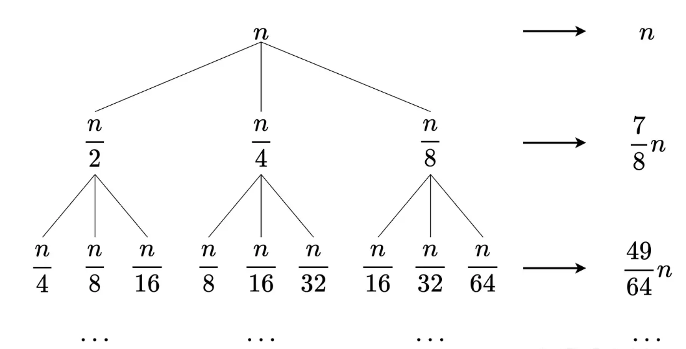
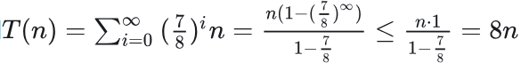
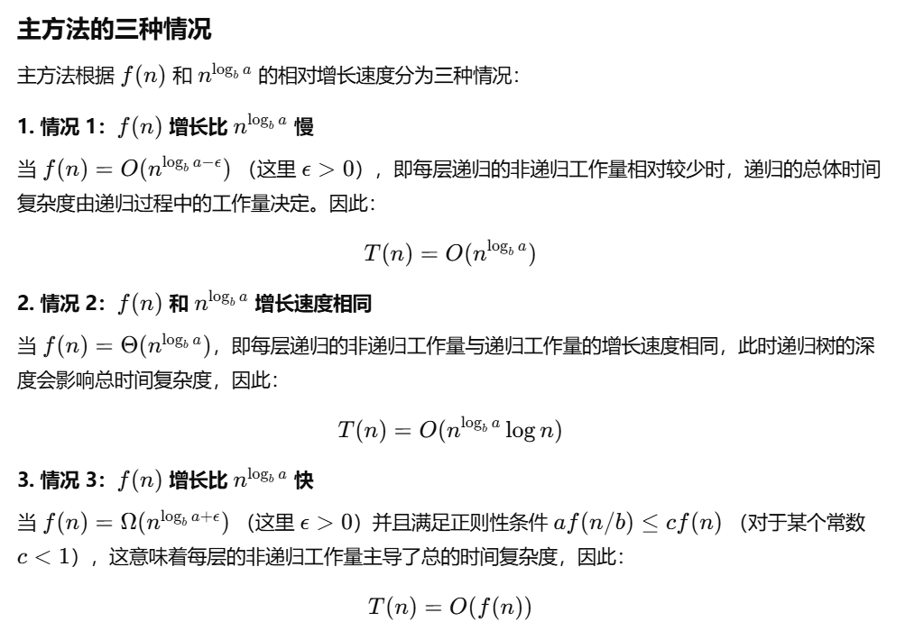
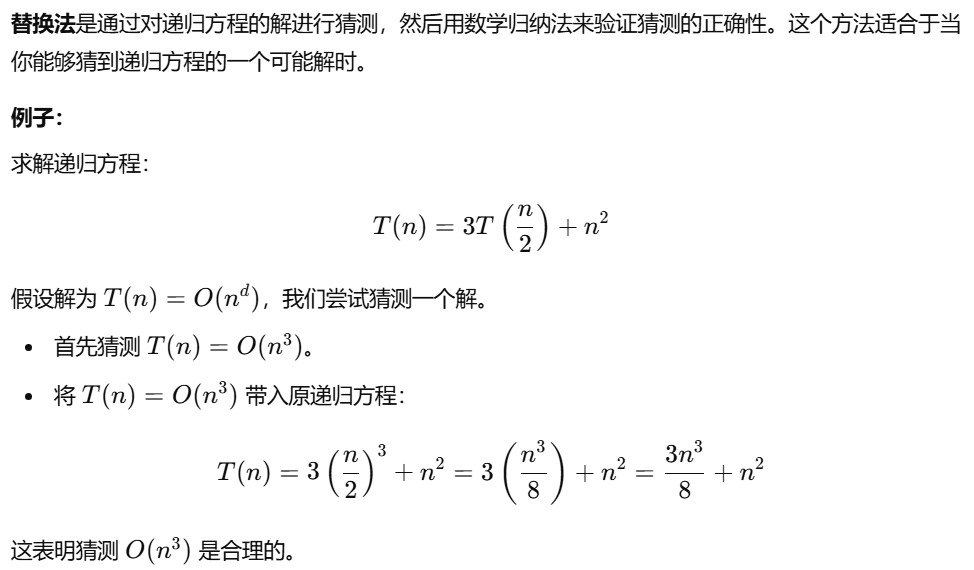

# 常见时间复杂度

O(1): 常数时间，独立于输入规模，如访问数组元素。
O(log n): 对数时间，通常出现在那些通过逐步缩小问题规模的算法中，最常见的例子是二分查找。每次迭代中问题规模减少的比率决定了对数的底数，通常是2。
O(n): 线性时间，常见于简单循环遍历。
O(n log n): 线性对数时间，线性对数时间复杂度代表一种算法，它在每一层递归中都执行线性时间的操作，但递归的深度是对数级别的。常见于归并排序、堆排序、希尔排序、快速排序的平均情况。
O(n^2): 二次时间，常见于双重嵌套循环。
O(2^n): 指数时间，常见于递归算法如斐波那契数列的朴素递归实现。

## 矩阵相乘时间复杂度

a\*b, b\*c的两矩阵相乘共需要a\*c\*b次运算

## 例题

1. 给定一个整数sum，从有N个有序元素的数组中查找元素a、b，使得 a+b 的结果最接近sum，最快的平均时间复杂度是？
A. O(n^2)
B. O(nlogn)
C. O(n)
D. O(logn)
解析：应该为O（n）时间，2个指针从数组的开始位置和结束位置移动，和小于sum，left++，和大于sum，right--。更新最小的差值，和2个指针的值，移动时更新。差值为0，则停止。
2. 二分查找树里查询一个关键字的最坏时间复杂度为？
注意不是二分查找，是二分查找树。二分查找树最差情况退化为链表，时间复杂度为O(n)

## 递归方程求时间复杂度

1. 迭代法
2. 递归树法
3. 主方法
4. 替换法

### 迭代法

### 递归树法

设有递归方程：T(n) = T(n/2) + T(n/4) + T(n/8) + n

递归树：

递归树的做法是计算每一层的和，然后将这些和加起来，得到

### 主方法

主方法的递归形式：T(n) = aT(bn) + f(n)
其中：

- 𝑎 是子问题的个数；
- 𝑏 是输入规模的缩小因子，即每次递归时，问题规模减小到 𝑛/𝑏；
- f(n) 是递归时每层的非递归部分的工作量。

### 替换法

