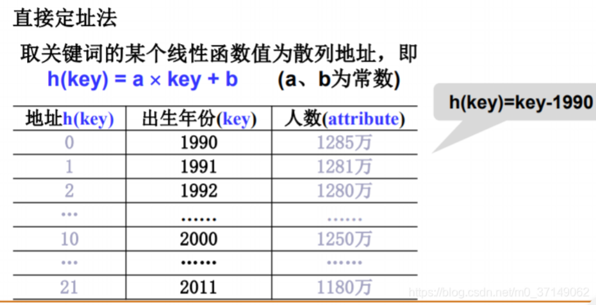
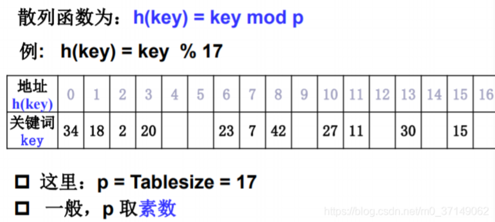
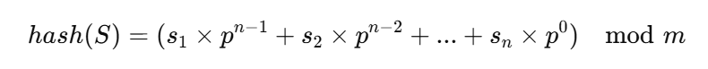
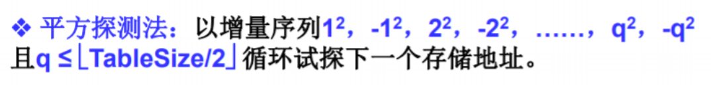

# 查找

## 散列表

在查找数据对象时，由函数h对给定值key计算出地址，将key与该地址单元中数据对象关键字进行比较，确定查找是否成功。因此，散列法又称为“关键字-地址转换法”。散列方法中使用的计算函数称为散列函数（也称哈希函数），按这个思想构造的表称为散列表，所以它是一种存储方法。

**装填因子**：一般情况下，设散列表空间大小为m，填入表中的元素个数是n,则称α=n/m为散列表的装填因子，例如大小为17，元素为11，装填因子为0.65.实用时，常见散列表大小设计使得α=0.5~0.8为宜。

装填因子是表示Hsah表中元素的填满的程度，装填因子越大，填入得越满，好处是空间利用率高了，但冲突的机会加大了；反之，加载因子越小，填入得越空，好处是冲突的机会减小了，但空间浪费多了。
冲突的机会越大，则查找的成本越高，反之查找的成本越小，因而查找时间就越小。
因此，必须在"冲突的机会"与"空间利用率"之间寻找一种平衡与折衷。这种平衡与折衷本质上是数据结构中有名的"时-空"矛盾的平衡与折衷。

**同义词**：映射到同一散列地址上的关键字称为同义词

**散列函数的构造方法**：一个“好”的散列函数一般应考虑下列两个因素：

- 计算简单，以便提高转换速度
- 关键词对应的地址空间分布均匀，以尽量减少冲突。即对于关键词集合中的任何一个关键字，经散列函数映射到地址集合中任何一个地址的概率是基本相等的。

### 数字关键词的散列构造

#### 直接定址法

取关键词的某个线性函数值为散列地址，即 h(key)=a * key + b (a、b为常数)
这类函数计算简单，分布均匀，不会产生冲突，但要求地址集合与关键词集合大小相同，因此，对于较大的关键词集合不适用。所以在现实应用中并不常用



#### 除留取余法

现实应用中比较常用的方法是除留取余法。假设散列表长为TableSize **(TableSize的选取，通常由关键词集合的大小n和允许最大装填因子α决定，一般将TableSize取为n/α)**，选择一个正整数p<=TableSize,散列函数为 h(key)=key % p
该方法选取合适的p很重要，一般选取p为小于或等于散列表长TableSize的某个最大素数比较好。用素数求得的余数作为散列地址，比较均匀分布在整个地址空间上的可能性较大。



#### 数字分析法

这种方法的核心就是利用数字的某些特征构造散列函数。例如，对于数字197，如果取其各位数字相加的和为1+9+7=25，就将25作为散列地址，或对于手机号码，取手机号的最后四位数字作为散列地址等。

### 字符串的散列构造

1. 简单加权求和法
    - 这是最基本的方法，将字符串中的每个字符的ASCII值相加，然后对一个固定的表大小取模。虽然简单，但容易发生冲突。
    - 步骤：
        - 将字符串看作是字符序列S=s1,s2,...,sn。
        - 定义一个固定的散列表大小 𝑚，例如 1009。
        - 对每个字符求其 ASCII 值，然后将所有字符的 ASCII 值相加：hash(S)=(s1+s2+...+sn) mod m
    - 优点：简单易实现
    - 缺点：容易产生冲突，散列结果分布不均匀。
2. 乘幂散列法
    - 这是一个常见的字符串哈希函数，它通过给每个字符赋予不同的权重来减少冲突。
    - 
    - 其中 𝑝 是一个质数（常用31或37），𝑚 是散列表的大小。
    - 步骤：
        - 选择一个质数 𝑝，例如 31。
        - 选择一个大的模数 𝑚（通常选择大于散列表大小的质数）。
        - 依次遍历字符串，按公式累加计算每个字符的加权值。
    - 优点：避免了简单加权求和法中的大量冲突
    - 缺点：计算复杂度稍高，且乘法会有溢出的风险（需要用大数或取模处理）。
    - 实例

    ```java
    int hash = 0;
    int p = 31;
    int m = 1000000007;
    int p_pow = 1;

    for (int i = 0; i < str.length(); i++) {
        hash = (hash + (str.charAt(i) - 'a' + 1) * p_pow) % m;
        p_pow = (p_pow * p) % m;
    }
    ```

### 处理冲突的方法

1. 开放定址法
通过探查其他空闲位置来存储发生冲突的元素，有以下几种常见的方式：
    - 线性探测：当发生冲突时，依次检查后续的存储位置，直到找到空位。
    - 二次探测：探测的步长不是固定的，而是通过二次方来确定位置，即探测距离按平方增加。
    
    - 双重散列：使用第二个哈希函数来 ***计算探测的步长***，以避免线性或二次探测中的“聚集”问题。
2. 链地址法（拉链法）
每个哈希表的槽位中保存一个链表，所有散列到同一槽位的元素都会被存储在该链表中。插入时新元素会被添加到链表中，查询时在链表中进行线性查找。
3. 再哈希法
当发生冲突时，使用另一个哈希函数 ***生成新的地址***，直到找到空位。

### 性能分析

有以下三个因素：

- 散列函数是否均匀
- 处理冲突的方法
- 散列表的装填因子α

总体来说，由于链地址法是唯一一个能让各个冲突之间一定毫无影响的方法，因此链地址法性能最优，优于开放定址法，而开放定址法的性能优于再哈希法。

## HashMap

- HashMap底层采用Entry数组来存储key-value对,每一个键值对组成了一个Entry实体,Entry类实际上是一个单向的链表结构,它具有Next指针,可以连接下一个Entry实体。
- HashMap每次扩容的容量都是之前容量的2倍。
- HashMap不保存插入顺序。

### 底层实现

在 JDK 1.7 及之前：`HashMap.Entry<K,V>` 是链表结构的节点，包含了以下字段：

```java
final int hash;
final K key;
V value;
Entry<K,V> next;  // 链表的下一个节点
```

在 JDK 1.8 及以后：HashMap 仍然有类似的结构，不过 Entry 被更名为 Node，并增加了树形结构的优化机制。对于链表部分，Node 对象中仍然有 next 字段：

```java
public static interface Entry<K,V> {
    K getKey();
    V getValue();
    V setValue(V value);
    // 其他方法...
}

static class Node<K,V> implements Map.Entry<K,V> {
    final int hash;
    final K key;
    V value;
    Node<K,V> next;  // 链表的下一个节点
    // 省略其他方法...
}
```
