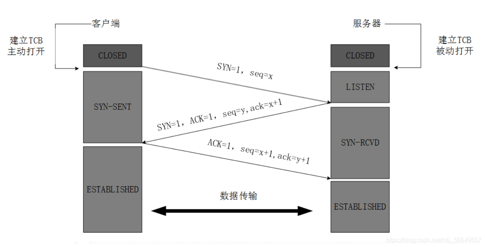
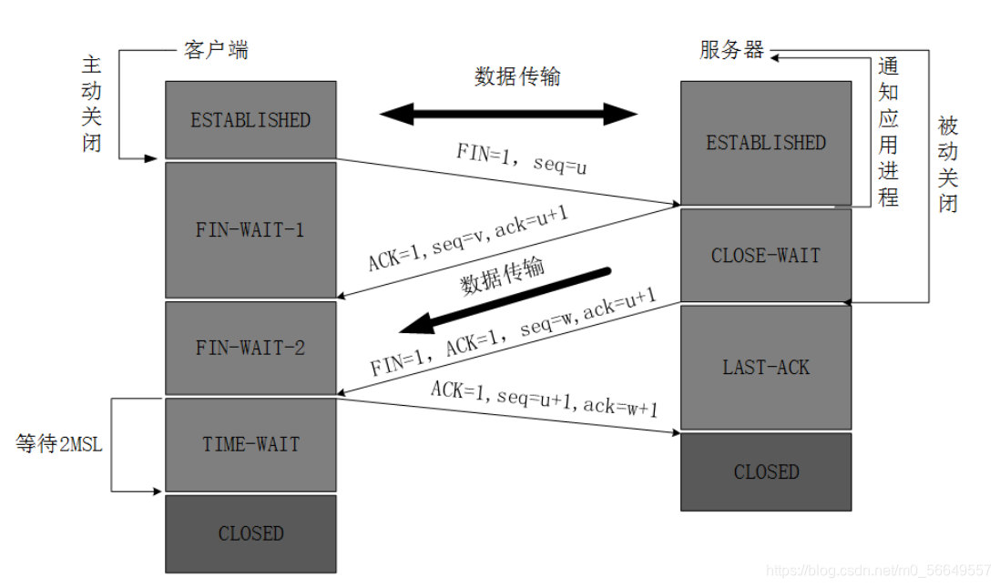

# 网络

## TCP/IP四层模型

1. 应用层（Application Layer）：
   - 负责处理用户的请求和网络应用程序的数据。
   - 定义了用于不同网络服务的具体协议，如HTTP（超文本传输协议）、FTP（文件传输协议）、SMTP（简单邮件传输协议）等。
   - 应用层协议会将用户的请求转换为可以通过网络传输的数据格式。例如，当你在浏览器中输入一个网址并发起请求时，就会根据HTTP协议会生成一个HTTP请求消息。
2. 传输层（Transport Layer）
   - 职责：确保数据在端到端（即发送方和接收方的应用程序之间）的可靠传输。TCP和UDP就是传输层协议。
   - 功能：
      - 端口寻址：通过端口号识别发送方和接收方主机上的特定应用程序。
      - 连接管理：对于TCP协议，建立和维护端到端的连接，确保数据按序、可靠地传输。
      - 流量控制：调整数据传输速率以匹配接收方的处理能力。
      - 错误检测与修复：检测传输过程中的错误，并请求重传损坏或丢失的数据段。
3. 网络层（Network Layer）
   - 职责：负责将数据包从源主机路由到目的主机。核心协议是IP协议，它定义了数据包的格式和在网络中的传输方式。IP协议使用IP地址来标识网络中的设备，并通过路由选择数据包的传输路径。
   - 功能：
     - 逻辑寻址：使用IP地址标识网络中的设备。
     - 路由选择：确定数据包从源到目的地的最佳路径。
     - 数据包转发：在网络中的路由器和其他网络设备之间转发数据包。
     - 分段和重组：如果需要，将数据包分割成较小的单元以适应网络的最大传输单元（MTU），并在目的地进行重组。
4. 链路层（Link Layer）
   - 职责：在相邻的网络设备之间传输帧，并确保物理层面上的可靠传输。
   - 功能：
     - 物理寻址：使用MAC地址在局域网内标识设备。
     - 帧封装：将网络层的数据包封装成帧，添加必要的链路层头部和尾部信息。
     - 错误检测与修正：检测帧在传输过程中的错误，如CRC校验，并在必要时进行修正。
     - 介质访问控制：管理多个设备如何共享同一物理媒介，例如以太网使用CSMA/CD协议。

## TCP 的三次握手和四次挥手

### seq（Sequence Number，序列号）

- 序列号是用于标识发送数据的顺序的一个编号。
- TCP连接中的每个字节都会分配一个序列号，表示该字节在整个数据流中的位置。
- 发送方使用序列号来确保数据按顺序传输，并且接收方能够检测是否有数据包丢失或是否按序到达。
- 在数据传输开始时，发送方会为该连接初始化一个随机的初始序列号。

### SYN标志（SYN Flag，同步标志）

- TCP头部中的一个控制位，表示希望/同意建立连接，并且本报文希望双方可以同步序列号seq。
- 三次握手的第一步和第二步都需要使用SYN标志：
  - 第一次握手：客户端发送带有SYN标志的报文，表示希望建立连接，并告诉服务器自己的初始序列号。
  - 第二次握手：服务器响应一个带有SYN和ACK标志的报文，同意连接，并告知客户端自己的初始序列号。
- SYN标志在握手结束后关闭，不用于正常数据传输。

### ack（Acknowledgment Number，确认号）

- 确认号用于告诉对方已经成功接收到了数据，并且告诉对方自己期望接收的下一个字节的序列号，即表示本报文的发送方已经接收了对方所有的序列号在此之前的数据。

### ACK标志（ACK Flag，确认标志）

- TCP头部中的另一个控制位，用于标识当前数据包是否是一个确认（Acknowledgment）数据包。
- 当ACK标志置位（为1）时，表示该报文段包含有效的确认号，接收方要根据这个确认号来更新连接的状态。
- ACK标志在连接建立（SYN包后）、数据传输和连接关闭阶段都会被使用。

### FIN标志（FIN Flag，结束标志）

FIN标志用于表示当前报文段发送方已经没有数据要发送了，请求关闭连接或确认关闭连接。

### 人话解释三次握手

- 第一次握手：客户端发送带有SYN标志的报文，表示希望建立连接，并告诉服务器自己的初始序列号`seq=x`，希望服务器和客户端同步。
- 第二次握手：服务器告诉对方我同意建立连接（SYN=1）并且确认收到了你的序列号（ACK=1），希望接收对方下一个序列号为 x+1 的数据（`ack=x+1`），最后告诉客户端自己的初始序列号`seq=y`，希望和客户端同步。
- 第三次握手：客户端告诉对方我收到了你的序列号（ACK=1），并且希望接收下一个序列号为 y+1 的数据（`ack=y+1`），最后给出本报文中数据的序列号`seq=x+1`。

### 人话解释四次挥手

张三：好的，那我先走了
李四：好的，那你走吧
李四：那我也走了？
张三：好的，你走吧
