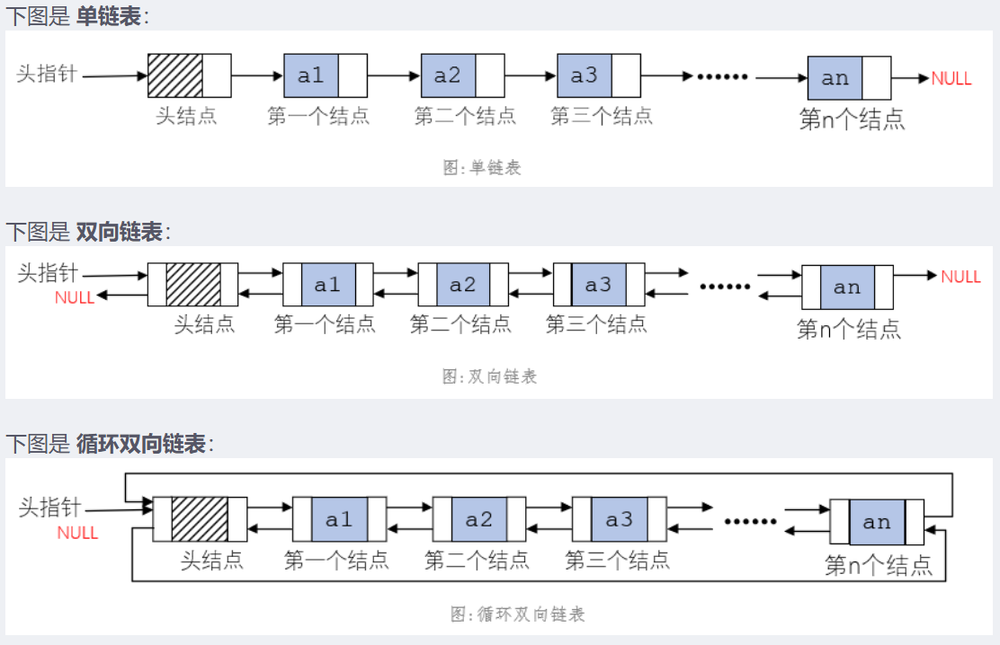
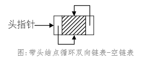

# 链表

1. **单->双向->循环双向链表**

**循环双向链表：** 在单链表的每个结点中，再设置一个指向其前驱结点的指针域。且第一个结点(或有则为头结点)的前驱指针指向最后一个结点，最后一个结点的后继指针指向第一个结点(或有则为头结点)。
**循环双向链表的特点：**
    1. 循环双向链表可以反向访问到链表的结点，因为它有指向前一个结点的指针prior，也具备了循环链表的特点，可以在链表的任意位置访问其他结点；
    2. 带有头结点的循环双向链表为空链表时，头结点的两个指针域都指向头结点。
    此时，头指针list存放了头结点的地址，头结点的两个指针域也都存放了头结点的地址，所以会有list->next->next==list，不管list->后面接几个next，都会指向头结点。
    
    3. 带有头结点的循环双向链表为非空链表时：
    头结点的前驱指针域指向最后一个结点，后驱指针域指向第一个结点；
    最后一个结点的前驱指针域指向前一个结点，后驱指针域指向头结点；
    其他结点的前驱指针域指向前一个结点，后驱指针域指向后一个结点；
