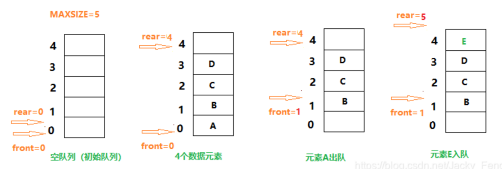
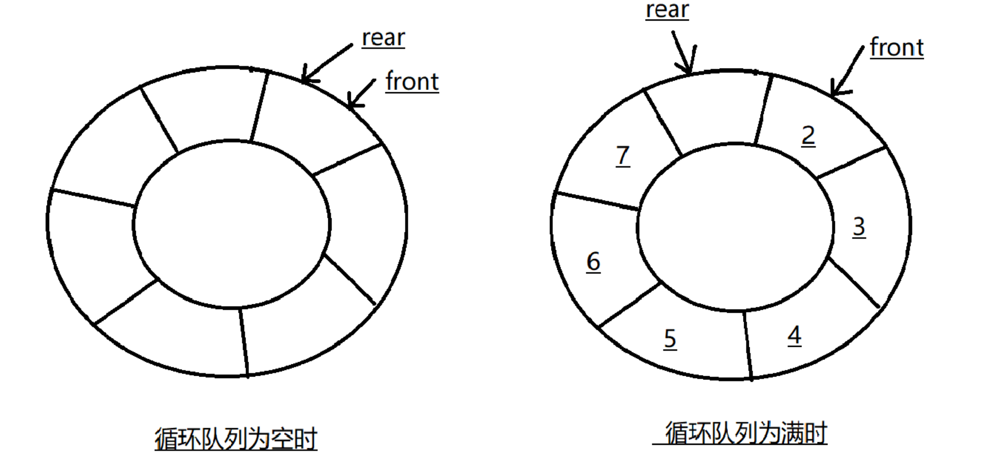

# 队列

队列也是一种线性表，其特殊性在于队列的基本操作是线性表的子集。队列按“先进先出”的规则进行操作，故称其为操作受限的线性表。
队列中允许插入的一端称为队尾（rear），允许删除的一端称为队头(front)。向队列中插入新的数据元素称为入队，新入队的元素就成为了队列的队尾元素。从队列中删除队头元素称为出队，其后继元素成为新的队头元素。

队列作为一种特殊的线性表，也同样存在两种存储结构：顺序存储结构和链式存储结构，可以分别用数组和链表来实现队列。

## 顺序队列

用一组地址连续的存储单元，依次存放从队头到队尾的数据元素，称为顺序队列。
需要附设两个指针：队头指针（front）和队尾指针（rear），分别指向队头元素和队尾元素。

假溢出：rear = maxsize - 1，但 front != 0

假溢出的原因是顺序队列进行队头出队、队尾入队，造成数组前面会出现空闲单元未被充分利用。

## 循环队列

为了解决 **假溢出** 现象，使得队列的存储空间得到充分利用，一个巧妙的方法就是将顺序队列的数组看成一个头尾相接的循环结构。

队列的头尾使用取模的方式，使得队头队尾在逻辑上看上去相接的顺序存储结构称为循环队列。
删除元素：front = (front - 1) % maxsize
加入元素：rear = (rear + 1) % maxsize

问题：当循环队列为空或满时，都是队尾指针等于队头指针，即rear == front。当rear == front时，该是判满还是判空呢？

解决方案：

方案一：设置一个计数器，开始时计数器设为0，新元素入队时，计数器加1；元素出队，计数器减1。当计数器 == MAXSIZE时，队满；计数器 == 0时，队空。此时 front 与 rear 相等。

方案二：保留一个元素空间，当 rear 所指向的 **空闲单元** 的后继单元是 front 元素所指向的单元时，队满。这种方法会浪费一个单元。



队满的条件为 (rear+1) % MAXSIZE == front；
队空的条件为 rear == front

## 链队列

采用链式存储结构实现的队列称为链队列。
为了使操作更加方便，使队头指向链队列的头结点，队尾指向最后一个结点。

## 例题

1. 计算队列中元素个数的公式为？
(m + r - f) mod m
2. 栈与队列如何相互模拟？
    - 栈模拟队列：

    ```java
    import java.util.Stack;

    class MyQueue {
        private Stack<Integer> stack1;
        private Stack<Integer> stack2;

        public MyQueue() {
            stack1 = new Stack<>();
            stack2 = new Stack<>();
        }

        public void push(int x) {
            stack1.push(x);
        }

        public int pop() {
            if (stack2.isEmpty()) {
                while (!stack1.isEmpty()) {
                    stack2.push(stack1.pop());
                }
            }
            return stack2.pop();
        }

        public int peek() {
            if (stack2.isEmpty()) {
                while (!stack1.isEmpty()) {
                    stack2.push(stack1.pop());
                }
            }
            return stack2.peek();
        }

        public boolean empty() {
            return stack1.isEmpty() && stack2.isEmpty();
        }
    }
    ```

    - 队列模拟栈：

    ```java
    import java.util.LinkedList;
    import java.util.Queue;

    class MyStack {
        private Queue<Integer> queue1;
        private Queue<Integer> queue2;

        public MyStack() {
            queue1 = new LinkedList<>();
            queue2 = new LinkedList<>();
        }

        public void push(int x) {
            queue1.offer(x);
        }

        public int pop() {
            while (queue1.size() > 1) {
                queue2.offer(queue1.poll());
            }
            int top = queue1.poll();
            Queue<Integer> temp = queue1;
            queue1 = queue2;
            queue2 = temp;
            return top;
        }

        public int top() {
            while (queue1.size() > 1) {
                queue2.offer(queue1.poll());
            }
            int top = queue1.peek();
            queue2.offer(queue1.poll());
            Queue<Integer> temp = queue1;
            queue1 = queue2;
            queue2 = temp;
            return top;
        }

        public boolean empty() {
            return queue1.isEmpty();
        }
    }
    ```
